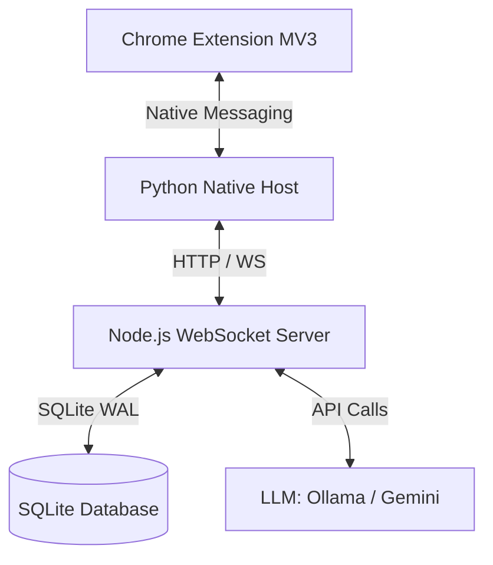

# MASTER CONTEXT - BẢN ĐỒ NGỮ CẢNH TỔNG THỂ
## AI FACEPOSTGROUP SYSTEM

> **Tài liệu dành cho:** Lead Architect & Swarm Coordinators
> **Trạng thái:** Hoạt động (Active)
> **Mục tiêu:** Cung cấp bức tranh toàn cảnh về kiến trúc hệ thống, danh mục đặc tả (Spec), ánh xạ mã nguồn và các quyết định thiết kế cốt lõi (Architectural Decisions) của dự án tự động hóa tương tác Facebook AI.

---

## 1. DANH MỤC TÀI LIỆU ĐẶC TẢ (SPECS REGISTRY)

Dưới đây là danh mục 10 tài liệu đặc tả cốt lõi của dự án `AI_facepostgroup`, đóng vai trò là điểm neo kiến thức (Semantic Anchors) cho toàn bộ hệ thống.

| Mã Spec | Tên Đặc Tả (Specification Title) | Mô Tả Ngắn Gọn | Đường Dẫn File (File Path) |
|---|---|---|---|
| **Spec 00** | Shared Types & Hiến pháp kỹ thuật | Định nghĩa types dùng chung và hiến pháp kỹ thuật, WebSocket message protocols. | `specs/facepost_00_shared_types.md` |
| **Spec 01** | Tự động hóa trình duyệt & Extension MV3 | manifest.json, background.js, content.js, dom_compressor.js, offscreen, popup UI. | `specs/facepost_01_chrome_extension.md` |
| **Spec 02** | Vòng lặp AI Agent Brain (Self-healing) | Thiết kế agent_loop.js, prompt_templates.js, vòng lặp tự phục hồi lỗi. | `specs/facepost_02_ai_agent_brain.md` |
| **Spec 03** | Local Dashboard App & Server backend | Thiết kế server.js, db.js, campaign_manager.js, quản lý nick, proxy, spintax. | `specs/facepost_03_dashboard_app.md` |
| **Spec 04** | Hệ thống Anti-Detection | react_state_patcher.js, human_simulator.js, proxy_rotator.js, launcher. | `specs/facepost_04_anti_detection.md` |
| **Spec 05** | Vòng lặp Agent loop Orchestrator chính | Điều phối lệnh chạy tự động và giao tiếp Dashboard <-> Extension <-> LLM. | `specs/facepost_05_agent_loop.md` |
| **Spec 06** | Checkpoint Handler & Tự phục hồi | Tự động phát hiện và xử lý Pop-up Checkpoint của Facebook để ngủ/hibernate. | `specs/facepost_06_checkpoint_handler.md` |
| **Spec 07** | Dashboard UI & Styling Neon | CSS Styling neon, React components hiển thị live grid, health gauge, log terminal. | `specs/facepost_07_dashboard_ui.md` |
| **Spec 08** | AI Content Engine & Interaction Manager | Persona Store, trích xuất văn phong mẫu, kiểm soát độ người, trả lời bình luận. | `specs/facepost_08_content_engine.md` |
| **Spec 09** | Kiến trúc Hybrid Extension ("Extension Đôi") | Giải pháp phân tách CWS Diplomat (bản sạch) và GitHub Ghost (full agentic). | `specs/facepost_09_hybrid_extension.md` |

---

## 2. BẢN ĐỒ ÁNH XẠ PHÂN HỆ & MÃ NGUỒN (MODULE TO CODE MAPPING)

Bảng dưới đây ánh xạ các phân hệ nghiệp vụ chính của hệ thống tới các file mã nguồn thực tế đang triển khai trong dự án:

| Phân hệ (Module) | File mã nguồn chính | Vai trò & Chức năng trong hệ thống |
|---|---|---|
| **Core Database** | `dashboard/db.js` `dashboard/schema.sql` | Khởi tạo kết nối SQLite, quản lý schema, cấu hình WAL mode (`PRAGMA journal_mode=WAL`). |
| **Persona Store** | `src/content_engine/persona_store.js` `src/content_engine/persona_extractor.js` | Lưu trữ cấu hình tính cách (Persona), sinh prompt mẫu và trích xuất writing fingerprint. |
| **Web Server & WS** | `dashboard/server.js` `dashboard/src/websocket/wsServer.js` | Lắng nghe kết nối WebSocket từ extension và python host, định tuyến bản tin điều khiển. |
| **Chrome Extension** | `extension/manifest.json` `extension/background.js` `extension/content.js` `extension/popup.js` | Chạy trong trình duyệt Chrome. `content.js` quét DOM Facebook và điền câu trả lời. |
| **Native Messaging** | `native_host/hermes_proxy_host.py` `native_host/install_native_host.bat` | Lắng nghe stdin/stdout từ Chrome Extension để thực hiện các thao tác proxy/hệ thống. |
| **LLM Connector** | `dashboard/src/content_engine/content_generator_llm.js` | Client tích hợp API Ollama và Google Gemini API, hỗ trợ retry logic và fallback tự động. |
| **Scheduler & Queue** | `dashboard/campaign_manager.js` `dashboard/proxy_rotator.js` | Quản lý hàng đợi tin bài, xoay proxy và lập lịch để bypass cơ chế phát hiện spam. |
| **Comment Agent** | `dashboard/src/interaction_manager/comment_reply_agent.js` | Trí tuệ cốt lõi xử lý bình luận của người dùng và quyết định kịch bản trả lời phù hợp. |

---

## 3. TÓM TẮT TECH STACK CHÍNH

Hệ thống được thiết kế theo mô hình **Hybrid Automation Architecture** kết hợp giữa ứng dụng cục bộ và mở rộng trình duyệt:

1. **Backend Engine**:
   - **Node.js**: Nền tảng thực thi chính cho server điều phối cục bộ, sử dụng thư viện `ws` để duy trì kết nối WebSocket thời gian thực với độ trễ thấp.
2. **Database Layer**:
   - **SQLite**: Được cấu hình ở chế độ **WAL (Write-Ahead Logging)** mode. Lựa chọn này giúp hệ thống hoạt động cực nhanh trong môi trường cục bộ (single-user / multi-thread), cho phép đọc song song với ghi mà không gây nghẽn hoặc khóa cơ sở dữ liệu (`database is locked`).
3. **Browser Automation**:
   - **Chrome Extension Manifest V3 (MV3)**: Đảm bảo tương thích với các quy định bảo mật mới nhất của Google Chrome. Sử dụng Service Workers để chạy ngầm và Content Scripts để thao tác trực tiếp trên giao diện Facebook Web.
4. **Local Host Bridge**:
   - **Python Native Messaging Host**: Giải pháp bắc cầu bảo mật. Python nhận tin nhắn nhị phân trực tiếp từ Chrome Extension thông qua luồng vào/ra tiêu chuẩn (stdin/stdout), cho phép Extension tương tác trực tiếp với các tài nguyên hệ thống nằm ngoài Sandbox của trình duyệt.
5. **AI Reasoning Engine**:
   - **Ollama**: Chạy local (mô hình Llama 3 / Qwen) phục vụ cho việc xử lý dữ liệu nhạy cảm, bảo vệ quyền riêng tư và hoạt động không cần Internet.
   - **Google Gemini API**: Fallback đám mây hiệu năng cao, sử dụng cho các tác vụ phân tích ý định (intent analysis) và sinh nội dung chất lượng cao.

---

## 4. CÁC QUYẾT ĐỊNH KIẾN TRÚC CỐT LÕI (ARCHITECTURAL DECISIONS)

### AD-01: Kiến Trúc Định Tuyến Hybrid LLM (Ollama & Gemini)
- **Bối cảnh**: Hệ thống cần hoạt động ổn định kể cả khi không có kết nối internet hoặc khi cần xử lý lượng lớn dữ liệu mà không tốn chi phí API token.
- **Quyết định**: Áp dụng cơ chế hybrid. Mặc định các tác vụ phân loại bình luận cơ bản sẽ gửi tới Ollama (Local). Các tác vụ phức tạp (như xử lý khủng hoảng truyền thông, bình luận tiêu cực nghiêm trọng) hoặc khi GPU cục bộ bị quá tải sẽ tự động fallback sang Google Gemini API.

### AD-02: SQLite WAL (Write-Ahead Logging) Mode làm Cấu trúc Lưu trữ
- **Bối cảnh**: Chrome Extension, Python Host và Node.js Server đều có nhu cầu đọc/ghi cơ sở dữ liệu SQLite đồng thời, dễ dẫn đến lỗi nghẽn `SQLITE_BUSY`.
- **Quyết định**: Kích hoạt chế độ WAL mode (`PRAGMA journal_mode=WAL;`). Điều này cho phép nhiều tiến trình đọc dữ liệu đồng thời trong khi một tiến trình khác đang thực hiện ghi, nâng cao đáng kể thông lượng I/O của hệ thống.

### AD-03: Giao Tiếp Bắc Cầu Qua Python Native Messaging Host
- **Bối cảnh**: Chrome Extension bị giới hạn nghiêm ngặt bởi chính sách bảo mật Sandbox của trình duyệt, không thể trực tiếp ghi file cấu hình hoặc gọi các tiến trình hệ thống khác.
- **Quyết định**: Triển khai một Python host đăng ký trực tiếp với Chrome làm ứng dụng Native Messaging. Extension sẽ gửi bản tin dạng JSON qua stdin của Python, Python sẽ thực thi tác vụ hệ thống rồi trả kết quả về stdout.

### AD-04: Stateless WebSocket Server để Điều Phối Bản Tin
- **Bối cảnh**: Cần duy trì kênh kết nối hai chiều giữa Dashboard quản trị và các trình duyệt đang chạy automation.
- **Quyết định**: Xây dựng Node.js WebSocket server theo kiến trúc stateless (không lưu trạng thái). Mỗi bản tin đi qua server bắt buộc phải đính kèm `routing_key` (chứa ID của tài khoản/Extension tương ứng) để server thực hiện forward ngay lập tức mà không cần cache lại trạng thái session phức tạp.

### AD-05: Tự Động Hóa DOM Trực Tiếp Qua Content Script (Anti-Bot Bypass)
- **Bối cảnh**: Facebook sử dụng các thuật toán phát hiện bot tiên tiến (quét các biến môi trường của Puppeteer/Selenium như `navigator.webdriver`).
- **Quyết định**: Hoàn toàn không sử dụng các framework headless browser thông thường. Tác vụ tự động hóa được thực thi trực tiếp bằng Content Script chạy dưới dạng tiện ích mở rộng (Extension) chính thống của người dùng. Tương tác chuột và bàn phím được giả lập thông qua các API trình duyệt tiêu chuẩn (`dispatchEvent`).

### AD-06: Mã Hóa AES-256 Cục Bộ Cho Dữ Liệu Nhạy Cảm (Local Security Encryption)
- **Bối cảnh**: Token Facebook, Cookie và mật khẩu Persona lưu trữ dưới máy cục bộ có nguy cơ bị rò rỉ nếu máy của người dùng bị nhiễm phần mềm độc hại.
- **Quyết định**: Toàn bộ dữ liệu nhạy cảm lưu trữ trong bảng `accounts` của SQLite phải được mã hóa bằng thuật toán AES-256-GCM. Khóa giải mã được sinh ra động từ một salt duy nhất kết hợp với ID thiết bị (Machine ID) phần cứng của người dùng, đảm bảo dữ liệu không thể bị đọc trộm nếu copy file DB sang máy khác.

### AD-07: Semantic DOM Compression (Nén DOM thô trước khi gửi LLM)
- **Bối cảnh**: DOM của Facebook cực kỳ phức tạp và chứa nhiều thẻ rác (lên đến hàng megabyte), làm tràn ngữ cảnh (context window) của LLM và gây tốn kém token.
- **Quyết định**: Triển khai `dom_compressor.js` chạy ở Content Script. Nó lọc 95% thẻ không tương tác (div, span rỗng, svg), chỉ giữ lại các interactive elements và thông tin thuộc tính cốt lõi để nén Snapshot DOM xuống dưới **2KB** trước khi chuyển đến AI Agent.

### AD-08: React State Simulation & Behavioral Jittering (Giả lập React state và hành vi chuột/bàn phím người thật)
- **Bối cảnh**: Khi điền văn bản và di chuyển chuột tự động, nếu không mô phỏng chính xác sự kiện của React và hành vi sinh học của con người, nút "Đăng" của Facebook sẽ bị vô hiệu hóa hoặc hệ thống chống bot của Facebook sẽ quét checkpoint.
- **Quyết định**: Triển khai `react_state_patcher.js` để dispatch các synthetic events (`input` và `change` kèm bubbles) để đánh lừa event loop của React. Kết hợp `human_simulator.js` để tạo độ trễ gõ phím ngẫu nhiên (40ms - 180ms) và vẽ đường di chuyển chuột theo đường cong Bezier.

### AD-09: Hybrid Extension Architecture (CWS Diplomat vs GitHub Ghost)
- **Bối cảnh**: Chrome Web Store áp dụng quy trình kiểm duyệt tự động nghiêm ngặt và cấm hoàn toàn các extension có tính năng tự động hóa (automation behavior).
- **Quyết định**: Phân nhánh extension thành hai phiên bản: CWS Diplomat (bản sạch chỉ hỗ trợ sync nhóm thụ động và content assistant để phân phối qua Store) và GitHub Ghost (full agentic power, load unpacked). Dashboard sẽ thực hiện smart routing dựa trên `extension_mode` và verify HMAC signature.

### AD-10: Multimodal Vision Verification (QA Tier 4) & Visual Evidence
- **Bối cảnh**: Giao diện Facebook thay đổi liên tục, và logic DOM thông thường không thể nhận biết được các lỗi giao diện như layout bị vỡ hoặc modal/quảng cáo che khuất nút bấm tương tác.
- **Quyết định**: Tích hợp bước kiểm định thị giác ở QA Tier 4. Tự động chụp màn hình tại runtime và gửi hình ảnh đến Vision API của LLM để kiểm tra trực quan độ sáng của nút Đăng, sự xuất hiện của modal chặn, và đóng gói bằng chứng dưới dạng `visual_evidence`.

---

## 5. QUY TẮC NÉN NGỮ CẢNH SAU MỖI QA CHECKPOINT TUẦN (CONTEXT COMPRESSION RULES)

Để tránh phình to Context Window (Context Bloated) của Leader và các Sub-agents khi dự án kéo dài, hệ thống quy định luật "Nén và Lưu Trữ" (Compress & Archive) như sau:

1. **Phân loại tài liệu Spec**:
   - **Active Spec (Đang phát triển):** Giữ nguyên đầy đủ chi tiết thiết kế, pseudocode, ASCII wireframes, và kịch bản lỗi để Coding Agent đọc kỹ.
   - **Stable Spec (Đã hoàn thành E2E PASS - Có dấu `[x]` trên Tracker):**
     - Tách toàn bộ Interface Contract (TypeScript JSDoc, API endpoint, WebSocket schema) chuyển sang `specs/facepost_00_shared_types.md`.
     - Nội dung chi tiết thực thi (code mẫu, mô tả dài dòng) trong spec sub-file gốc sẽ được nén lại (chỉ giữ lại mô tả tóm tắt tầm 20 dòng) và di chuyển phần text cũ vào thư mục `.opus/archive/` hoặc `specs/archive/`.
     - *Kết quả:* Leader (Architect) khi boot phiên sẽ không nạp các spec sub-file đã hoàn thành, mà chỉ cần đọc `Spec 00` (đã chứa interface ổn định) -> Tiết kiệm 70% Token.

2. **Chu kỳ dọn dẹp bộ nhớ (Memory Cleanup Routine)**:
   - Sau mỗi Round hoặc khi Tracker cập nhật thêm 3 features hoàn tất, Leader phải tự động chạy:
     - Lệnh dọn dẹp token dư thừa trong context.
     - Rà soát `master_context.md` để rút gọn bản đồ ánh xạ, chỉ giữ lại contract interface của các module đã đóng.
   - Khi context vượt quá 80% ngưỡng tối ưu của LLM, Architect phải chủ động trigger quy trình nén và tái cấu trúc tài liệu lưu trữ để đảm bảo hiệu suất suy luận không bị suy giảm.

---

## 📦 Quy Tắc Kiểm Soát Phiên Bản & Bảo Mật (Version Control & Security)

### Nguyên tắc cốt lõi
- **Git-First:** Dự án phải có `.git/` trước khi viết bất kỳ dòng code nào.
- **Versioned Specs:** Tất cả Specs (00-09) phải có `Version` header, bump khi sửa.
- **Zero-Secret Commit:** Cấm tuyệt đối commit `.env`, `*.pem`, `*.key`. Chỉ commit `.env.example`.

### Checklist Pre-Commit (dành cho QA/Auditor Agent)
| # | Kiểm tra | Lệnh | Fail Action |
|---|---|---|---|
| 1 | `.gitignore` tồn tại | `test -f .gitignore` | REJECT commit |
| 2 | Không có `.env` trong staged | `git diff --cached --name-only \| grep '.env$'` | REJECT commit |
| 3 | Không hardcode secrets | `grep -rn 'sk-\|password=\|secret=' src/` | REJECT + flag AP-22 |
| 4 | Commit message chuẩn | Regex: `^(feat|fix|docs|refactor|test)(\(.+\))?: .+` | Yêu cầu viết lại |

### Architectural Decision AD-11: Git-First Execution
- **Quyết định:** Mọi bước thực thi code phải bắt đầu từ Git repo đã khởi tạo.
- **Lý do:** Đảm bảo traceability, rollback capability, và bảo mật credentials.
- **Tham chiếu:** `facepost_rules_of_project.md` Section 6, `AGENTS.md` Section V.
