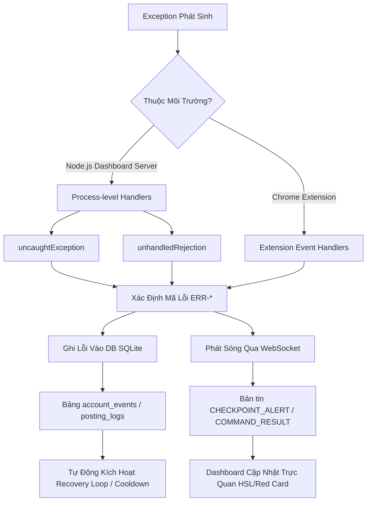

# 📜 BẢNG ĐĂNG KÝ MÃ LỖI CHUẨN HÓA HERMES
## (Hermes Standard Error Code Registry)

Tài liệu này định nghĩa hệ thống phân loại, chuẩn hóa mã lỗi (Error Codes) và cơ chế xử lý ngoại lệ (Exception Handling) đồng nhất giữa Dashboard Server (Node.js/SQLite) và Chrome Extension (Background/Content Scripts) thuộc hệ thống Hermes.

---

## 1. TIỀN TỐ MÃ LỖI THEO PHÂN HỆ (ERROR CODE PREFIXES)

Mã lỗi trong hệ thống Hermes được đặt theo quy chuẩn: `ERR-[PHÂN_HỆ]-[STT]` để dễ dàng nhận biết nguồn gốc lỗi trong quá trình giám sát thời gian thực. Mọi lỗi phát sinh phải thuộc một trong các nhóm phân hệ dưới đây:

| Tiền tố | Phân hệ (Subsystem) | Mô tả phạm vi lỗi |
|:---|:---|:---|
| **DOM** | DOM Manipulation | Lỗi định vị phần tử, tương tác nút bấm, nhập liệu hoặc phân tích cấu trúc DOM Facebook. |
| **NET** | Network & Protocol | Lỗi kết nối WebSocket, xác thực HMAC, Native Messaging hoặc timeout phản hồi mạng. |
| **AI** | AI Brain Integration | Lỗi phân tích JSON từ LLM, LLM timeout, vượt hạn mức (rate limit/quota) của Ollama/Gemini. |
| **CHK** | Facebook Checkpoint | Lỗi phát hiện tài khoản bị khóa checkpoint (SĐT, OTP, CAPTCHA, Photo, Cooldown). |
| **PRX** | Proxy Routing | Lỗi xác thực proxy, proxy chết, từ chối kết nối proxy hoặc định tuyến IP. |
| **SYS** | System & Database | Lỗi ghi/đọc SQLite (DB locked), lỗi profile thư mục Chrome, giới hạn dung lượng tệp tin. |
| **CE** | Content Engine | Lỗi sinh nội dung, trích xuất Persona, thiếu bài mẫu hoặc tương tác bình luận (Spec 08). |
| **HYB** | Hybrid Extension | Lỗi chế độ bảo mật (Ghost/Diplomat), sai lệch HMAC Extension, vi phạm Safe Mode (Spec 09). |

---

## 2. BẢNG MÃ LỖI CHI TIẾT (SYSTEM ERROR CODES REGISTRY)

Dưới đây là danh sách đầy đủ tất cả mã lỗi hệ thống từ `ERR-DOM-01` đến `ERR-SYS-19`, các mã lỗi của phân hệ **Content Engine** (`ERR-CE-*`) và **Hybrid Extension** (`ERR-HYB-*`).

```gfm-table
| Error Code | Module | Tên Lỗi (Name) | Mô Tả Chi Tiết (Description) | Mức Độ (Severity) | Chiến Lược Khắc Phục / Retry (Mitigation / Retry Strategy) |
|:---|:---|:---|:---|:---|:---|
| **ERR-DOM-01** | DOM | Element Not Found | Không tìm thấy bộ chọn phần tử (CSS selector) hoặc fingerprint trong DOM Facebook hiện tại. | `RECOVERABLE` | Thử lại (Retry) tối đa 3 lần, mỗi lần cách nhau 2 giây. Nếu vẫn thất bại → Ghi nhật ký cảnh báo và bỏ qua hành động (skip). |
| **ERR-DOM-02** | DOM | DOM Snapshot Empty/Timeout | Quá trình chụp ảnh DOM (Snapshot) trả về kết quả rỗng hoặc bị timeout (quá thời hạn). | `RECOVERABLE` | Tải lại trang (Reload), thử lại tối đa 2 lần. Nếu vẫn thất bại → Nâng cấp mức độ lên `FATAL` cho phiên chạy hiện tại. |
| **ERR-REA-03** | DOM | React State Update Failed | Tiến trình cập nhật trạng thái React State trong giao diện Dashboard bị ném lỗi, khiến nút bấm bị đóng băng. | `RECOVERABLE` | Thực hiện render lại component; nếu tiếp tục lỗi → Ghi log chi tiết lên server và bắt buộc làm mới tab trình duyệt (Refresh). |
| **ERR-DOM-05** | DOM | Group Search Failed | Không tìm thấy nhóm mục tiêu khi tìm kiếm trên Facebook hoặc không thể định vị nhóm sau khi tìm kiếm. | `RECOVERABLE` | Bỏ qua nhóm hiện tại (Skip group), giải phóng khóa (Release lock), cập nhật trạng thái nhóm trong DB thành `SEARCH_FAILED` để hiển thị cảnh báo đỏ trên UI, người dùng xử lý thủ công. |
| **ERR-NET-01** | NET | WS HMAC Auth Failed | Giao thức xác thực HMAC của kết nối WebSocket bị từ chối (thường do sai lệch `SHARED_SECRET`). | `FATAL` | Đóng kết nối lập tức. Yêu cầu tạo lại khóa bí mật `SHARED_SECRET` và kiểm tra cấu hình môi trường phía máy chủ. |
| **ERR-NET-02** | NET | WebSocket Disconnected | Kết nối WebSocket giữa Dashboard Server và Chrome Extension bị ngắt đột ngột. | `RECOVERABLE` | Tự động kết nối lại (Auto-reconnect) bằng thuật toán exponential backoff: 1s, 2s, 4s, 8s... tối đa 60 giây. |
| **ERR-NET-03** | NET | Native Messaging No Response | Ứng dụng Native Messaging Host trên máy trạm Windows không có phản hồi khi Extension gửi yêu cầu. | `FATAL` | Khởi động lại (Restart) tiến trình Host ứng dụng cục bộ, gửi cảnh báo âm thanh và pop-up cho người dùng. |
| **ERR-NET-04** | NET | WS Response Timeout | Yêu cầu truyền qua WebSocket không nhận được phản hồi từ phía đối tác trong thời gian giới hạn (mặc định 30s). | `RECOVERABLE` | Hủy yêu cầu cũ, kiểm tra trạng thái hoạt động của kênh truyền và thực hiện gửi lại yêu cầu (Retry command). |
| **ERR-AI-04** | AI | LLM JSON Parse Fail | Phản hồi của LLM không thể phân tách thành cấu trúc JSON hợp lệ (Malformed JSON) sau khi sinh nội dung. | `RECOVERABLE` | Gửi lại yêu cầu tới LLM kèm theo hậu tố chỉ thị nghiêm ngặt: *"Return ONLY valid JSON"*, thử lại tối đa 2 lần. |
| **ERR-AI-05** | AI | LLM Timeout | LLM không trả về kết quả trong thời gian cấu hình tối đa (Gemini > 30s, Ollama cục bộ > 60s). | `RECOVERABLE` | Thử lại 1 lần với thời gian chờ nâng lên 45s. Nếu vẫn timeout → Chuyển sang cơ chế tạo nội dung rule-based dự phòng. |
| **ERR-AI-06** | AI | LLM Rate Limit | API của nhà cung cấp dịch vụ LLM báo lỗi vượt hạn mức yêu cầu hoặc hết dung lượng hạn ngạch (HTTP 429). | `RECOVERABLE` | Tạm dừng 60 giây rồi thử lại. Nếu thất bại 3 lần liên tiếp → Tự động chuyển đổi sang endpoint API dự phòng (Gemini/Ollama). |
| **ERR-PRX-07** | PRX | Proxy Auth Failed | Proxy được gán cấu hình trả về mã lỗi xác thực HTTP 407 hoặc sai thông tin đăng nhập. | `FATAL` | Đánh dấu Proxy này là `BAD` trong DB để loại bỏ, tự động xoay vòng (Rotate) sang proxy khác. Cảnh báo nếu số proxy còn lại < 3. |
| **ERR-PRX-08** | PRX | Proxy Connection Refused | Máy chủ Proxy từ chối thiết lập kết nối mạng hoặc phản hồi quá chậm. | `RECOVERABLE` | Đổi sang proxy tiếp theo trong danh sách và chạy lại. Nếu 3 proxy liên tiếp đều lỗi → Tạm dừng phiên chạy 30 phút. |
| **ERR-CHK-09** | CHK | Phone Checkpoint | Facebook yêu cầu xác minh danh tính qua mã xác thực OTP số điện thoại, Video Selfie, thiết bị tin cậy hoặc checkpoint hành vi (Behavioral). | `FATAL` | Kích hoạt Sleep & Hibernate: lập tức tắt Chrome process của tài khoản để giải phóng slot worker, cập nhật trạng thái account thành `HIBERNATE_AWAITING_MANUAL`, gửi cảnh báo WebSocket. Sau khi người dùng respawn Chrome và xử lý thủ công thành công, nếu thuộc loại checkpoint từ trung bình trở lên (CRITICAL/HIGH/MEDIUM), bắt buộc ép Cooldown Storm (cooldown ngẫu nhiên 12-24 giờ) và tắt Chrome process để phòng ngừa checkpoint lặp. |
| **ERR-CHK-10** | CHK | CAPTCHA Detected | Facebook hiển thị màn hình hCaptcha hoặc văn bản CAPTCHA yêu cầu giải mã để tiếp tục hành động. | `FATAL` | Tạm dừng phiên làm việc (`AWAITING_MANUAL`), gửi cảnh báo WebSocket hỗ trợ người dùng tự giải hoặc kích hoạt API giải CAPTCHA tự động (nếu có). Sau khi giải xong, ép Cooldown Storm (cooldown ngẫu nhiên 12-24 giờ) để phòng tránh bão Checkpoint. |
| **ERR-CHK-11** | CHK | Photo Verification | Facebook yêu cầu tải lên ảnh chân dung hoặc ảnh giấy tờ tùy thân để xác minh tài khoản (CHK_PHOTO_IDENTITY). | `FATAL` | Kích hoạt Sleep & Hibernate: lập tức tắt Chrome process của tài khoản để giải phóng slot worker, cập nhật trạng thái account thành `HIBERNATE_AWAITING_MANUAL`, gửi cảnh báo WebSocket. Sau khi người dùng xử lý xong, ép Cooldown Storm (cooldown ngẫu nhiên 12-24 giờ) và tắt Chrome process. |
| **ERR-CHK-12** | CHK | Account Locked | Tài khoản Facebook bị khóa tạm thời hoặc dính cảnh báo cooldown hạn chế tần suất hoạt động (CHK_COOLDOWN). | `RECOVERABLE` | Đọc thời gian cooldown từ giao diện Facebook, cập nhật DB về trạng thái `COOLDOWN` (hoặc `COOLDOWN_STORM` nếu bị ép do bão checkpoint), lên lịch tự động chạy lại khi hết `cooldown_until`, giải phóng worker slot. |
| **ERR-ACT-13** | ACT | Max Iterations Reached | Phiên làm việc lặp lại vượt quá số lượng vòng lặp tối đa cho phép cho một nhiệm vụ cụ thể. | `INFO` | Tự động đóng phiên chạy một cách an toàn (Gracefully terminate), lên lịch phân bổ lại thời gian chạy cho tác vụ. |
| **ERR-ACT-14** | ACT | Session Timeout | Thời gian chạy của toàn bộ phiên vượt quá giới hạn cấu hình an toàn (mặc định tối đa 120 giây). | `INFO` | Dừng luồng xử lý an toàn, đánh dấu trạng thái phiên là `COMPLETED_TIMEOUT` để bảo toàn tiến trình đã chạy. |
| **ERR-ACT-15** | ACT | Content Policy Violation | Facebook hiển thị cảnh báo vi phạm tiêu chuẩn cộng đồng hoặc chính sách nội dung trên giao diện đăng bài. | `RECOVERABLE` | Tự động click đóng cảnh báo (Auto-dismiss), ghi nhận cảnh báo vi phạm vào DB, tiếp tục tiến trình đăng bài với delay thêm 5 phút (nếu là cảnh báo nhẹ) hoặc 10 phút sau giải quyết thủ công. |
| **ERR-SYS-16** | SYS | Database Write Failed | Lỗi ghi dữ liệu vào SQLite do cơ sở dữ liệu đang bị khóa (Busy/Locked) bởi tiến trình song song khác. | `FATAL` | Thử lại tối đa 3 lần với thời gian chờ tăng dần. Nếu vẫn thất bại → Báo cáo quản trị viên và tạm đệm sự kiện vào bộ nhớ (Memory). |
| **ERR-SYS-17** | SYS | Chrome Profile Not Found | Thư mục hồ sơ (Chrome Profile Directory) của tài khoản bị mất, bị hỏng hoặc đang bị chiếm dụng bởi tiến trình khác. | `FATAL` | Báo cáo lỗi cho người dùng qua giao diện, bỏ qua tài khoản này trong các chiến dịch tiếp theo cho đến khi profile được tạo lại. |
| **ERR-SYS-18** | SYS | Image Too Large | Tệp tin ảnh đính kèm để đăng tải vượt quá giới hạn tối đa hệ thống cho phép (10MB). | `FATAL` | Từ chối tải lên tệp tin, ghi nhật ký lỗi hệ thống và hiển thị thông báo lỗi trực quan trên giao diện soạn thảo chiến dịch. |
| **ERR-SYS-19** | SYS | Image Chunk Out Of Order | Các mảnh phân đoạn ảnh (Chunks) truyền từ Extension về Dashboard Server bị lệch số thứ tự hoặc bị mất gói. | `RECOVERABLE` | Xóa bộ đệm phân đoạn ảnh hiện tại (Reset chunk buffer) và gửi yêu cầu truyền lại phân đoạn bị lỗi cho Extension. |
| **ERR-CE-01** | CE | Insufficient Post Samples | Không đủ dữ liệu bài đăng mẫu để tiến hành trích xuất Persona (yêu cầu tối thiểu 3 bài viết mẫu). | `FATAL` | Trả về mã lỗi 400 lỗi yêu cầu, hiển thị thông báo yêu cầu người dùng bổ sung thêm bài viết mẫu trên giao diện. |
| **ERR-CE-02** | CE | Gemini Invalid JSON | Gemini API trả về cấu trúc nội dung không đúng định dạng JSON chuẩn khi thực hiện trích xuất Persona. | `RECOVERABLE` | Tự động thực hiện gửi lại yêu cầu trích xuất tối đa 1 lần. Nếu vẫn lỗi → Trả về thông báo lỗi chi tiết cho người dùng. |
| **ERR-CE-03** | CE | Gemini API HTTP Error | Kết nối tới API của Gemini gặp lỗi đường truyền hoặc lỗi dịch vụ từ phía Google (HTTP 500/503). | `FATAL` | Trả về mã lỗi HTTP tương ứng, thông báo cho người dùng kiểm tra lại API Key hoặc trạng thái kết nối máy chủ Google. |
| **ERR-CE-04** | CE | Persona ID Not Found | Persona ID được chỉ định cho bài đăng hoặc chiến dịch không tìm thấy trong cơ sở dữ liệu SQLite. | `FATAL` | Trả về mã phản hồi HTTP 404. Cập nhật lại cấu hình chiến dịch để liên kết với một Persona hợp lệ. |
| **ERR-CE-10** | CE | Prompt Too Short | Nội dung chỉ dẫn (Prompt) của người dùng quá ngắn (dưới 5 ký tự), không đủ dữ liệu đầu vào cho LLM. | `INFO` | Chặn gửi yêu cầu ngay tại giao diện người dùng (Client-side validation) và hiển thị thông tin hướng dẫn viết prompt phù hợp. |
| **ERR-CE-11** | CE | Content Gen Failed | Mô hình AI liên tục sinh nội dung thất bại hoặc không đạt yêu cầu lọc từ ngữ cấm sau 3 lần thử lại. | `RECOVERABLE` | Đánh dấu thuộc tính `humanReviewRequired = true` cho bài đăng để chuyển sang trạng thái chờ phê duyệt thủ công từ người dùng. |
| **ERR-CE-20** | CE | Ext Not Connected for Reply | Kết nối WebSocket của Chrome Extension bị mất tại thời điểm hệ thống cố gắng gửi phản hồi bình luận (Comment Reply). | `FATAL` | Hủy thao tác gửi phản hồi bình luận hiện tại, lưu trạng thái lỗi, và kiểm tra thiết lập kết nối của tài khoản đó. |
| **ERR-CE-21** | CE | Reply Failed on Facebook | Hành động điền văn bản và gửi phản hồi bình luận thất bại trên giao diện DOM của Facebook. | `FATAL` | Lưu log lỗi DOM chi tiết kèm ảnh chụp màn hình (nếu có), đánh dấu trạng thái tương tác bình luận này là `FAILED`. |
| **ERR-HYB-01** | HYB | Ghost HMAC Mismatch | Extension ở chế độ Ghost Mode gửi yêu cầu kết nối WebSocket nhưng chữ ký xác thực HMAC bị sai hoặc bị thiếu. | `FATAL` | Từ chối kết nối lập tức, đóng WebSocket với mã đóng `4001` (Unauthorized), ghi log cảnh báo và chặn kết nối lại trong 10 giây. |
| **ERR-HYB-02** | HYB | Sensitive Command Blocked | Extension chạy ở chế độ Diplomat (Safe Mode) cố gắng gửi lệnh có tính chất can thiệp sâu (như click, type). | `FATAL` | Chặn thực thi lệnh, ghi cảnh báo vào log hệ thống, đánh dấu group chiến dịch hiện tại là `FAILED` nhưng giữ nguyên kết nối WS. |
| **ERR-HYB-03** | HYB | Invalid Extension ID | Giá trị Extension ID truyền lên trong bản tin chào hỏi (HELLO) bị rỗng hoặc không khớp với danh sách trắng của hệ thống. | `FATAL` | Đóng kết nối WebSocket lập tức với mã đóng `4001`, ghi nhận sự kiện vi phạm an ninh hệ thống vào tệp log của máy chủ. |
| **ERR-HYB-04** | HYB | Extension Mode Mismatch | Chế độ chạy của Extension (`extension_mode`) khác biệt với các tính năng (features) được máy chủ cấp phép. | `RECOVERABLE` | Ghi cảnh báo mức WARNING vào log hệ thống, tự động điều chỉnh và chỉ sử dụng tập hợp tính năng tối thiểu được cho phép. |
| **ERR-HYB-05** | HYB | Sensitive Action Guard | Người dùng thực hiện nhấp nút can thiệp nhạy cảm trên giao diện Dashboard khi tài khoản đang chạy ở chế độ an toàn (SAFE). | `INFO` | Kích hoạt bộ chặn của giao diện (UI Guard), hiển thị tooltip cảnh báo *"Chỉ hỗ trợ Ghost Mode"*, ngăn chặn gửi yêu cầu API lên máy chủ. |
```

---

## 3. CƠ CHẾ XỬ LÝ LỖI MẶC ĐỊNH (DEFAULT EXCEPTION HANDLER)

Hệ thống Hermes áp dụng chiến lược xử lý ngoại lệ đa tầng (multi-tiered) để đảm bảo không xảy ra hiện tượng nuốt lỗi âm thầm (silent swallow) và duy trì sự ổn định của dịch vụ 24/7.



### 3.1. Phân Phối Trình Xử Lý Trên Dashboard Server (Node.js)

Phía Dashboard Server sử dụng các sự kiện toàn cục của đối tượng `process` để bắt các ngoại lệ chưa được xử lý nhằm ngăn chặn crash tiến trình chính:

```javascript
// src/shutdown.js
const logger = require('./utils/logger');
const { gracefulShutdown } = require('./services/shutdownHandler');

// Xử lý các ngoại lệ đồng bộ chưa được bọc try-catch
process.on('uncaughtException', (err) => {
    logger.fatal(`[UNCAUGHT_EXCEPTION] Lỗi nghiêm trọng chưa xử lý: ${err.stack}`);
    // Ghi nhận lỗi ERR-SYS-16 hoặc mã thích hợp, tiến hành tắt server an toàn
    gracefulShutdown('UNCAUGHT_EXCEPTION');
});

// Xử lý các Promise bị reject mà không có catch block
process.on('unhandledRejection', (reason, promise) => {
    logger.error(`[UNHANDLED_REJECTION] Promise bị từ chối không bắt: ${reason}`);
    // Log lỗi nhưng không crash tiến trình đối với các lỗi mạng thông thường
});
```

### 3.2. Quy Tắc Ghi Nhật Ký Lỗi Vào Cơ Sở Dữ Liệu (Database Logging)

Mọi mã lỗi được bắt bởi các Handler bắt buộc phải được chuyển đổi thành cấu trúc chuẩn và ghi vào SQLite để phục vụ việc tính toán Điểm Sức Khỏe Tài Khoản (Account Health Score).

1. **Bảng dữ liệu đích:** 
   - Lỗi liên quan đến tài khoản, proxy và checkpoint ghi vào bảng `account_events`.
   - Lỗi liên quan đến tiến trình đăng bài ghi vào bảng `posting_logs`.

2. **Cấu trúc bản ghi ghi nhận lỗi:**
   ```javascript
   function insertAccountEvent(db, { accountId, eventType, eventData, errorCode, severity }) {
     db.prepare(`
       INSERT INTO account_events (account_id, event_type, event_data, error_code, severity, created_at)
       VALUES (?, ?, ?, ?, ?, datetime('now'))
     `).run(accountId, eventType, JSON.stringify(eventData || {}), errorCode, severity || 'INFO');

     // Tự động gọi Javascript Callback để cập nhật điểm sức khỏe và kiểm tra threshold
     updateHealthScore(accountId, db);
   }
   ```

### 3.3. Quy Tắc Phát Sóng Log Lỗi Lên Dashboard Server (WebSocket Broadcast)

Để giao diện Dashboard cập nhật trạng thái lỗi trực quan cho người vận hành ngay lập tức:

1. **Bản tin Cảnh Báo Checkpoint (`CHECKPOINT_ALERT`):**
   Được phát sóng tới toàn bộ giao diện UI Client khi phát hiện mã lỗi thuộc phân hệ `ERR-CHK-*`:
   ```json
   {
     "event": "CHECKPOINT_ALERT",
     "payload": {
       "accountId": "acc_007",
       "accountName": "Tài Khoản Test 1",
       "checkpointType": "CHK_PHONE_OTP",
       "checkpointLabel": "Xác minh SĐT (OTP)",
       "severity": "FATAL",
       "detectedAt": "2026-06-16T05:13:00Z",
       "pageUrl": "https://facebook.com/checkpoint/",
       "chromeTabId": 12,
       "message": "Phát hiện màn hình xác thực OTP. Cần xử lý thủ công."
     }
   }
   ```

2. **Bản Tin Kết Quả Lệnh (`COMMAND_RESULT`):**
   Được gửi từ Extension về Server để báo cáo kết quả của một hành động tự động:
   ```json
   {
     "type": "COMMAND_RESULT",
     "commandId": "cmd_9921a",
     "success": false,
     "errorCode": "ERR-DOM-01",
     "errorDetail": "Không tìm thấy nút 'Đăng bài' trên giao diện Facebook Group",
     "executionMs": 4500
   }
   ```

3. **Cập Nhật Điểm Số Sức Khỏe (Health Score Adjustment):**
   Mỗi khi ghi nhận mã lỗi vào `account_events`, hàm `updateHealthScore()` sẽ tính lại điểm:
   - Gặp lỗi `ERR-CHK-*` → Điểm sức khỏe trừ thẳng 10 điểm.
   - Điểm sức khỏe tụt dưới 20 → Đánh dấu `auto_disabled = 1` trong bảng `accounts`, ngắt hoạt động tài khoản tạm thời để bảo toàn tài sản.
