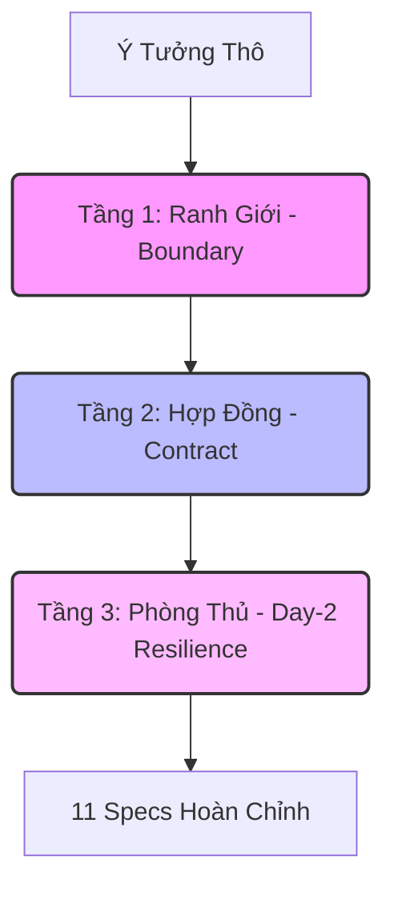

# 📜 BẢN THIẾT KẾ QUY TRÌNH SINH ĐẶC TẢ HỆ THỐNG 11 PHÂN HỆ (11-SPEC GENERATION BLUEPRINT)

Tài liệu này quy trình hóa phương pháp đặt câu hỏi phản biện chéo để từ một **Ý tưởng thô sơ (Raw Idea)** ban đầu, hệ thống AI có thể tự động bóc tách, phản biện và xây dựng thành một **Bộ đặc tả kiến trúc 11 Phân hệ (11-Spec Architecture)** hoàn chỉnh, không có khe hở vận hành.

---

## 📌 PHẦN I: TRIẾT LÝ "BẺ KHÓA RANH GIỚI" (THE SYSTEMIC BOUNDARY PHILOSOPHY)

Khi nhận một prompt ngắn từ Người dùng (Ví dụ: *"Viết phần mềm Windows + Chrome Extension đăng bài Facebook né checkpoint dùng AI"*), một LLM thông thường chỉ tạo ra 3-4 tài liệu đặc tả sơ sài vì nó bị giới hạn trong **"Tư duy bề mặt" (Surface Thinking)**. Nó chỉ nghĩ đến những gì người dùng nhìn thấy trực tiếp (UI, Database cơ bản, nút bấm).

Để mở rộng ra **11 phân hệ chi tiết**, chúng ta phải ép AI tư duy qua **3 Tầng Ranh Giới (Three Boundary Layers)**:

1. **Tầng Ranh Giới (Boundary Layer - Nơi các thế giới giao nhau):**
   * Nếu ứng dụng có cả phần mềm chạy trên OS (Windows/macOS) và Extension chạy trong trình duyệt, chúng nói chuyện với nhau bằng cách nào? 
   * Trình duyệt đóng vai trò sandbox cực kỳ nghiêm ngặt, làm sao vượt qua sandbox đó để truy cập tài nguyên hệ thống (ổ đĩa, camera, HWID)?
2. **Tầng Hợp Đồng (Contract Layer - Sự nhất quán dữ liệu):**
   * Khi các ngôn ngữ khác nhau (ví dụ: Node.js ở backend, TypeScript ở Extension, Python ở AI Server) giao tiếp, làm sao để cấu trúc dữ liệu không bị lệch lệch nhịp?
   * Một thay đổi nhỏ ở cấu trúc tin nhắn gửi đi từ Extension có làm sập server local không?
3. **Tầng Phòng Thủ & Vận Hành (Day-2 Resilience - Thực tế khốc liệt):**
   * Chuyện gì xảy ra khi mạng bị đứt, API Key hết hạn, tài khoản bị checkpoint, hệ điều hành khởi động lại, hay ứng dụng bị diệt virus quét nhầm?
   * Làm sao để vá một lỗi nhỏ (chỉ vài dòng code) mà không bắt khách hàng tải lại toàn bộ file cài đặt 100MB?

---

## 🔄 PHẦN II: QUY TRÌNH 4 BƯỚC THỰC THI (THE 4-STEP PROTOCOL)

Để áp dụng cẩm nang này cho bất kỳ ý tưởng mới nào, hãy thực hiện theo 4 bước sau:

*   **Bước 1 (Idea Deconstruction):** Bóc tách ý tưởng thô thành các từ khóa về: Nền tảng (Platform), Đối tượng tương tác (Target), Yêu cầu an toàn/Chống chặn (Security/Anti-detection), và Khâu tích hợp AI (AI Role).
*   **Bước 2 (Subagents Activation):** Chạy 11 Subagents tương ứng dưới đây. Mỗi Subagent nhận ý tưởng thô và bộ câu hỏi tương ứng để tự động sinh ra bản thảo spec của phân hệ đó.
*   **Bước 3 (Technology Grounding):** Ép các tác tử thảo luận chọn Stack công nghệ dựa trên 3 tiêu chí: *Chi phí vận hành tối thiểu (Zero-cost hosting/API)*, *Khả năng biên dịch và chạy local độc lập*, và *Tốc độ phát triển*.
*   **Bước 4 (Adversarial Audit):** Cho các tác tử phản biện chéo nhau (Ví dụ: Tác tử UI so khớp cổng kết nối với Tác tử Local Server; Tác tử Chống Bot kiểm tra xem cách Tác tử FSM gọi lệnh click có bị lộ vân tay tự động hóa không).

---

## 🧠 PHẦN III: 11 BỘ PROMPT - CÂU HỎI KÍCH HOẠT TƯ DUY CỦA 11 SUBAGENTS

Dưới đây là 11 bộ câu hỏi (prompts) chi tiết và tổng quát nhất. Khi có ý tưởng mới, hãy chuyển từng bộ prompt này cho các LLM Subagent để bóc tách spec chi tiết.

---

### 🛡️ SUBAGENT 00: HỢP ĐỒNG GIAO TIẾP & KIỂU DỮ LIỆU CHUNG (SHARED CONTRACTS & TYPES)
> **Mission:** Định nghĩa ngôn ngữ chung và cấu trúc dữ liệu nhất quán giữa tất cả các phân hệ của hệ thống phân tán/lai (Hybrid/Distributed).

#### 1. Câu hỏi Kiến trúc Tổng quát
* Hệ thống gồm những tiến trình độc lập nào (Ví dụ: CLI, Web UI, Extension, Local Server, Cloud API)? Chúng giao tiếp với nhau bằng giao thức gì (WebSockets, IPC, REST API, gRPC)?
* Làm thế nào để định nghĩa một Hợp đồng dữ liệu (Schema/Contract) duy nhất mà tất cả các phân hệ (dù viết bằng các ngôn ngữ khác nhau) đều phải tuân thủ?
* Khi có sự thay đổi về phiên bản hợp đồng (API versioning), làm sao để hệ thống không bị đổ vỡ dây chuyền? Có cơ chế tương thích ngược (Backward Compatibility) nào được thiết lập?

#### 2. Đi sâu Công nghệ & Ngôn ngữ
* Ngôn ngữ/Công cụ nào sẽ được dùng để định nghĩa kiểu dữ liệu (TypeScript Interfaces, JSON Schema, Protocol Buffers, Rust Types)? Làm thế nào để tự động sinh code (codegen) ra các ngôn ngữ khác từ file định nghĩa chung?
* Làm sao để kiểm thử (validate) tính đúng đắn của dữ liệu ngay tại ranh giới nhận tin (Runtime Validation) để chống các cuộc tấn công như Prototype Pollution (JavaScript) hoặc SQL/Command Injection?
* Đối với các tệp tin đa phương tiện hoặc dữ liệu nhị phân lớn (hình ảnh, video, âm thanh), hợp đồng truyền nhận sẽ truyền trực tiếp dưới dạng Base64, Stream chunk, hay truyền qua đường dẫn file local? Giới hạn dung lượng tối đa là bao nhiêu và xử lý rò rỉ bộ nhớ ra sao?

#### 3. Thực tế Ứng dụng & Kịch Bản Lỗi (Day-2 Failure)
* Chuyện gì xảy ra nếu gói tin JSON bị phân mảnh hoặc bị mất kết nối giữa chừng trong quá trình truyền qua WebSocket? Làm sao để tái lập trạng thái của tin nhắn bị gián đoạn?
* Làm thế nào để xác thực tính chính danh của tin nhắn truyền giữa các phân hệ (Ví dụ: Làm sao Local Server biết tin nhắn WebSocket thực sự gửi từ Extension của mình chứ không phải từ một script giả mạo của hacker)? Có cần cơ chế chữ ký số HMAC-SHA256 kèm Timestamp chống tấn công Replay Attack không?

---

### 🌐 SUBAGENT 01: NHÂN LÕI TIỆN ÍCH TRÌNH DUYỆT (BROWSER EXTENSION ENGINE)
> **Mission:** Thiết kế lõi tương tác DOM trực tiếp trên trình duyệt, quản lý vòng đời Extension và cơ chế giao tiếp luồng ngầm dưới các rào cản kỹ thuật của Manifest V3.

#### 1. Câu hỏi Kiến trúc Tổng quát
* Extension cần tương tác với những trang web nào? Nhiệm vụ chính là gì (cào dữ liệu, điền form, click nút, lắng nghe sự kiện mạng)?
* Theo chuẩn Manifest V3, Service Worker (Background Script) sẽ bị trình duyệt tắt ngầm sau một thời gian không hoạt động (thường là 30 giây). Làm sao để thiết kế cơ chế giữ kết nối liên tục (Keep-Alive) cho luồng xử lý ngầm này?
* Làm thế nào để phân chia nhiệm vụ giữa: Content Script (chạy trong ngữ cảnh trang web nhưng bị hạn chế quyền), Service Worker (có toàn quyền extension nhưng không chạm được DOM), và Popup/Options Page (UI)?

#### 2. Đi sâu Công nghệ & Ngôn ngữ
* Extension sẽ được viết bằng Vanilla JS/TS hay dùng framework (React, Vue, Plasmo)? Tại sao?
* Cơ chế Inject mã nguồn vào trang đích để thực hiện tự động hóa là gì? Làm thế nào để cách ly ngữ cảnh thực thi (Isolated World) tránh việc mã độc trên trang web đọc được dữ liệu nhạy cảm hoặc API Key trong Extension?
* Làm sao để xử lý bất đồng bộ khi tương tác với trang web: Đợi một phần tử DOM xuất hiện (Wait-for-Selector), xử lý khi trang web tải chậm, xử lý khi cấu trúc DOM thay đổi bất ngờ (DOM mutation)?

#### 3. Thực tế Ứng dụng & Kịch Bản Lỗi (Day-2 Failure)
* Nếu trình duyệt Chrome cập nhật phiên bản mới làm thay đổi chính sách bảo mật (ví dụ: cấm dùng `eval()` hoặc cấm fetch API ngoài nguồn được khai báo), kiến trúc Extension sẽ tự điều chỉnh thế nào?
* Khi chạy hàng chục tài khoản/tab đồng thời, làm sao Extension quản lý và dọn dẹp bộ nhớ (garbage collection), tránh việc phình tab gây treo trình duyệt?

---

### 🧠 SUBAGENT 02: BỘ NÃO AI & ĐỊNH TUYẾN MÔ HÌNH (AI BRAIN & LLM ROUTER)
> **Mission:** Xây dựng hệ thống điều phối trí tuệ nhân tạo, tối ưu hóa chi phí sử dụng API miễn phí/giá rẻ, định tuyến động và chống tràn hạn ngạch (Quota).

#### 1. Câu hỏi Kiến trúc Tổng quát
* Hệ thống cần AI giải quyết các tác vụ cụ thể nào (phân tích sắc thái, viết lại nội dung, giải captcha, phân loại dữ liệu)? Tác vụ nào cần mô hình lớn (Frontier Models như GPT-4o/Gemini Pro) và tác vụ nào chỉ cần mô hình nhỏ/nhanh (DeepSeek/Gemini Flash/Llama-3)?
* Làm thế nào để thiết kế một "LLM Router" có khả năng tự động phân phối cuộc gọi API đến đúng model phù hợp nhất với ngữ cảnh để tối ưu hóa chi phí?
* Làm thế nào để tích hợp đồng thời nhiều nhà cung cấp API (Gemini API, OpenRouter, NVIDIA NIM, Local LLM) vào một Pool điều phối duy nhất?

#### 2. Đi sâu Công nghệ & Ngôn ngữ
* Làm sao để quản lý danh sách API Key (ApiKeyPool) an toàn? Làm thế nào để luân chuyển (rotate) key, tự động kiểm tra trạng thái sống/chết của key mà không làm nghẽn tiến trình xử lý chính?
* Thiết kế prompt dạng cấu trúc như thế nào (ví dụ: ép trả về JSON Schema) để hệ thống parser ở backend luôn đọc được kết quả ổn định từ LLM mà không bị lỗi cú pháp?
* Có cần sử dụng Semantic Cache (Lưu trữ kết quả dựa trên độ tương đồng ngữ nghĩa của câu hỏi) để tránh việc gọi API trùng lặp cho các câu hỏi tương tự nhau, giúp tiết kiệm 90% chi phí gọi API không?

#### 3. Thực tế Ứng dụng & Kịch Bản Lỗi (Day-2 Failure)
* Khi bị dính lỗi Rate Limit (HTTP 429 - Too Many Requests), giải thuật Fallback và Retry sẽ hoạt động thế nào (Exponential Backoff, Jitter, switch sang key khác hoặc nhà cung cấp khác)?
* Làm thế nào để chống lại Prompt Injection - kịch bản người dùng cuối cố tình nhập các câu lệnh độc hại phá hoại logic hệ thống hoặc moi khóa API Key được giấu trong prompt gốc?

---

### 💾 SUBAGENT 03: MÁY CHỦ LOCAL & QUẢN TRỊ DỮ LIỆU (LOCAL SERVER & STORAGE)
> **Mission:** Thiết kế máy chủ cục bộ (Local Host), cơ sở dữ liệu nhúng hiệu năng cao và giải pháp bảo mật dữ liệu khách hàng dưới môi trường phân tán không có máy chủ trung tâm.

#### 1. Câu hỏi Kiến trúc Tổng quát
* Máy chủ local đóng vai trò gì trong hệ thống (chạy các luồng ngầm, lưu trữ dữ liệu, cung cấp API cục bộ cho UI và Extension)?
* Làm thế nào để đảm bảo máy chủ local hoạt động ổn định trên nhiều phiên bản hệ điều hành khác nhau của người dùng mà không cần cấu hình phức tạp (Zero-configuration)?
* Làm sao để lưu trữ dữ liệu cục bộ (như tài khoản, mật khẩu, lịch sử hoạt động) một cách bảo mật nhất, phòng trường hợp máy tính của người dùng bị nhiễm mã độc đọc trộm file?

#### 2. Đi sâu Công nghệ & Ngôn ngữ
* Lựa chọn ngôn ngữ viết Backend local là gì (Node.js Express, Go, Rust, Python Fastify)? Tại sao?
* Cơ sở dữ liệu nhúng nào phù hợp (SQLite, NeDB, DuckDB, LevelDB)? Nếu dùng SQLite, làm sao cấu hình chế độ WAL (Write-Ahead Logging) để hỗ trợ ghi dữ liệu đồng thời cao từ nhiều luồng mà không bị lỗi khóa DB (`database is locked`)?
* Cơ chế mã hóa dữ liệu nhạy cảm (như cookie trình duyệt, mật khẩu đăng nhập) là gì? Nếu dùng mã hóa AES-256-GCM, khóa giải mã (Key) sẽ được sinh ra từ đâu? Làm sao sử dụng Hardware ID (HWID) độc bản của từng máy khách hàng để làm muối (salt) sinh khóa, đảm bảo file DB bị copy sang máy khác cũng không thể giải mã được?

#### 3. Thực tế Ứng dụng & Kịch Bản Lỗi (Day-2 Failure)
* Chuyện gì xảy ra nếu tiến trình máy chủ local bị treo hoặc bị hệ điều hành tắt đột ngột do thiếu RAM? Làm sao để tự động khôi phục lại trạng thái của các luồng công việc đang chạy dở dang?
* Khi số lượng dữ liệu log tích lũy lên tới hàng triệu dòng, làm sao để dọn dẹp (auto-vacuum) và nén DB để không làm phình dung lượng ổ cứng của khách hàng?

---

### 🕵️ SUBAGENT 04: KỸ THUẬT CHỐNG PHÁT HIỆN & MÔ PHỎNG HÀNH VI (ANTI-DETECTION)
> **Mission:** Thiết kế các kỹ thuật che giấu dấu vết tự động hóa, vượt qua các hệ thống phát hiện bot (Anti-Bot) tiên tiến và mô phỏng hành vi sinh trắc học của con người.

#### 1. Câu hỏi Kiến trúc Tổng quát
* Nền tảng đích (Ví dụ: Facebook, Google, Cloudflare) phát hiện hành vi tự động hóa dựa trên những yếu tố nào (Vân tay trình duyệt - Fingerprint, Tốc độ tương tác, Tọa độ click chuột, Lịch sử kết nối)?
* Làm thế nào để mỗi tài khoản/tiến trình chạy tự động hóa hoàn toàn độc lập về môi trường mạng và dấu vết hệ thống, giống như đang chạy trên các thiết bị thật khác nhau?

#### 2. Đi sâu Công nghệ & Ngôn ngữ
* Làm sao để vượt qua các biến số phát hiện tự động hóa của Chrome (như `navigator.webdriver`, `chrome.runtime`, WebGL/Canvas Fingerprinting)? Có cần chỉnh sửa mã nguồn của trình duyệt (Custom Chromium) hay dùng CDP (Chrome DevTools Protocol) để gỡ bỏ các cờ tự động hóa?
* Thiết kế giải thuật mô phỏng hành vi di chuyển chuột như thế nào? Làm thế nào để sinh ra các đường cong di chuột ngẫu nhiên (Bezier Curves) kết hợp với phân phối Gaussian để mô phỏng sự rung tay của con người?
* Thiết kế giải thuật gõ phím (typing simulation) ra sao? Làm sao để tốc độ gõ phím giữa các chữ cái dao động ngẫu nhiên theo phân phối chuẩn, có cả hành vi gõ sai và xóa đi viết lại (backspace/mistake simulation)?

#### 3. Thực tế Ứng dụng & Kịch Bản Lỗi (Day-2 Failure)
* Làm sao để phát hiện và ngăn chặn rò rỉ địa chỉ IP thật của máy khách hàng thông qua WebRTC (WebRTC IP Leak) hoặc rò rỉ DNS (DNS Leak) khi họ đang dùng Proxy/VPN?
* Khi hệ thống phòng thủ của nền tảng đích đột ngột cập nhật cơ chế phát hiện bot mới giữa đêm, làm thế nào để ứng dụng lập tức kích hoạt "Chế độ ngủ đông" (Maintenance Mode) trên toàn hệ thống máy khách để bảo vệ tài khoản của họ khỏi bị quét hàng loạt?

---

### 🔄 SUBAGENT 05: VÒNG LẶP TỰ ĐỘNG HÓA & QUẢN LÝ LUỒNG (AUTOMATION LOOP & FSM)
> **Mission:** Thiết kế máy trạng thái hữu hạn (FSM) điều phối vòng lặp tự động hóa đa tài khoản, xử lý tranh chấp tài nguyên và chống nghẽn hiệu năng.

#### 1. Câu hỏi Kiến trúc Tổng quát
* Làm thế nào để mô tả các trạng thái hoạt động của một luồng tự động hóa dưới dạng Máy trạng thái hữu hạn (Finite State Machine - FSM)? Có những trạng thái chính nào (Idle, Init, Processing, Checkpoint, Success, Failed)?
* Làm sao để điều phối hàng chục tài khoản chạy đồng thời (Parallel Processing) mà không gây quá tải CPU/RAM trên máy khách hàng?
* Cơ chế phân bổ tài nguyên dùng chung giữa các luồng (như băng thông mạng, pool proxy, tài khoản AI) được thiết kế thế nào để tránh xung đột (Race Condition)?

#### 2. Đi sâu Công nghệ & Ngôn ngữ
* Ngôn ngữ viết động cơ FSM là gì? Có nên sử dụng các thư viện quản lý FSM có sẵn hay tự viết mã nguồn để tối ưu hiệu năng?
* Làm sao để triển khai cơ chế khóa tài nguyên (Locking Mechanism / Mutex) khi nhiều luồng cùng muốn truy cập vào một tài nguyên duy nhất (ví dụ: 2 luồng cùng lúc muốn sử dụng chung một proxy)?
* Thiết kế hàng đợi công việc (Job Queue) thế nào? Làm thế nào để phân cấp độ ưu tiên của các tác vụ (Priority Queue) và xử lý kịch bản nghẽn hàng đợi (Queue Congestion)?

#### 3. Thực tế Ứng dụng & Kịch Bản Lỗi (Day-2 Failure)
* Làm sao để tránh kịch bản "Vòng lặp chết chóc" (Deadlock) khi Luồng A đợi Luồng B nhả tài nguyên, trong khi Luồng B lại đang đợi Luồng A? Có cơ chế tự động hủy bỏ tác vụ khi quá thời gian (Task Timeout) không?
* Chuyện gì xảy ra nếu người dùng cố tình can thiệp thủ công vào trình duyệt (như tắt tab, tự click chuột) khi luồng tự động hóa đang chạy? FSM sẽ phát hiện sự can thiệp này và xử lý thế nào để không bị mất dấu trạng thái?

---

### ⚠️ SUBAGENT 06: XỬ LÝ ĐIỂM NGHẼN & KHÓA TÀI KHOẢN (CHECKPOINT & EXCEPTION HANDLER)
> **Mission:** Thiết kế hệ thống tự động nhận diện và vượt qua các rào cản xác thực (Captcha, 2FA, OTP) và các lỗi chặn tài khoản (Checkpoint).

#### 1. Câu hỏi Kiến trúc Tổng quát
* Khi tài khoản bị nền tảng khóa hoặc yêu cầu xác thực (Checkpoint), làm sao hệ thống phát hiện ra ngay lập tức? Có những loại checkpoint phổ biến nào và quy trình xử lý tự động cho từng loại ra sao?
* Làm sao để lưu trữ lịch sử các sự cố checkpoint để làm dữ liệu phân tích (Telemetry), từ đó điều chỉnh tốc độ hoặc cấu hình tự động hóa cho an toàn hơn?

#### 2. Đi sâu Công nghệ & Ngôn ngữ
* Tích hợp với các dịch vụ giải mã Captcha/Image Recognition qua API như thế nào? Có cơ chế giải captcha local (sử dụng mô hình ONNX/TensorFlow Lite nhúng trực tiếp trong ứng dụng local) để tiết kiệm chi phí cho khách hàng không?
* Làm sao để tự động lấy mã bảo mật hai lớp (2FA - TOTP)? Thuật toán sinh mã OTP từ chuỗi Secret Key sẽ được triển khai local như thế nào để không bị lộ thông tin mật?
* Nếu checkpoint yêu cầu xác thực qua OTP gửi về số điện thoại (SMS OTP) hoặc Email, hệ thống sẽ kết nối với các API thuê sim code hay API đọc hòm thư ảo (temp mail) ra sao?

#### 3. Thực tế Ứng dụng & Kịch Bản Lỗi (Day-2 Failure)
* Trong kịch bản xấu nhất là tài khoản bị khóa vĩnh viễn (Spam/FAQ/Disable), hệ thống sẽ dọn dẹp dữ liệu của tài khoản đó như thế nào để tránh lãng phí tài nguyên của máy khách?
* Làm sao để cookie và session của tài khoản bị checkpoint không bị rò rỉ ra ngoài khi gửi yêu cầu giải xác thực đến các dịch vụ bên thứ ba?

---

### 🖥️ SUBAGENT 07: GIAO DIỆN ĐIỀU KHIỂN & IPC BRIDGE (DASHBOARD UI & BRIDGE)
> **Mission:** Thiết kế giao diện người dùng tối giản nhưng thẩm mỹ cao, hiển thị log thời gian thực hiệu năng cao và thiết lập cầu nối IPC bảo mật giữa Renderer và OS.

#### 1. Câu hỏi Kiến trúc Tổng quát
* Giao diện cần hiển thị những thông tin cốt lõi nào (Trạng thái các luồng, Quản lý tài khoản, Cấu hình chiến dịch, Báo cáo hiệu năng)?
* Làm thế nào để hiển thị hàng nghìn dòng log trực tiếp (Real-time Logs Stream) từ hàng chục luồng chạy ngầm lên màn hình mà không làm đơ hoặc lag trình duyệt UI?
* Khi nhúng UI vào một Wrapper Desktop (như Electron/Tauri), làm sao để giao diện tương tác được với hệ điều hành (lấy HWID, đọc/ghi file local, gọi terminal) mà vẫn đảm bảo an toàn tuyệt đối?

#### 2. Đi sâu Công nghệ & Ngôn ngữ
* Lựa chọn stack frontend là gì (React + Vite, Vue, Svelte, Tailwind CSS)? Tại sao?
* Làm thế nào để thiết lập một IPC (Inter-Process Communication) Bridge tuyệt đối an toàn? Làm sao để cấu hình `preload.js` phơi bày APIs (`window.electronAPI`) ở dạng tối thiểu (Least Privilege), ngăn chặn lỗ hổng Remote Code Execution (RCE) nếu frontend bị tấn công XSS?
* Làm sao để render log hiệu năng cao? Có nên dùng kỹ thuật Virtual List (chỉ render các dòng log đang hiển thị trên màn hình) như `react-window` hoặc `react-virtualized` không?

#### 3. Thực tế Ứng dụng & Kịch Bản Lỗi (Day-2 Failure)
* Thiết kế cơ chế Beggar Popup (giới hạn tính năng / bắt mua bản quyền) như thế nào để chống bẻ khóa (Crack)? Nếu người dùng sửa code JS ở frontend để ẩn popup, làm sao backend local vẫn chặn các API thực thi cốt lõi?
* Làm thế nào để giao diện tự động thu nhỏ xuống khay hệ thống (System Tray) và gửi thông báo hệ sinh thái (System Notifications) khi có sự kiện quan trọng (như hoàn thành chiến dịch hoặc tài khoản bị lỗi)?

---

### 📝 SUBAGENT 08: ĐỘNG CƠ TỐI ƯU NỘI DUNG AI (CONTENT EVASION ENGINE)
> **Mission:** Thiết kế giải thuật biến đổi nội dung bằng AI giúp lách các bộ lọc lọc thư rác (NLP/Spam Filter) của nền tảng đích.

#### 1. Câu hỏi Kiến trúc Tổng quát
* Các bộ lọc spam của mạng xã hội phát hiện nội dung trùng lặp dựa trên những thuật toán nào (ví dụ: So khớp chuỗi ký tự, Đo khoảng cách văn bản Jaccard Similarity, Nhận diện cấu trúc câu NLP)?
* Làm thế nào để từ một nội dung gốc ban đầu, hệ thống có thể tạo ra hàng nghìn phiên bản khác nhau mà vẫn giữ nguyên ý nghĩa thông điệp và văn phong tự nhiên?

#### 2. Đi sâu Công nghệ & Ngôn ngữ
* Thuật toán "Write-to-Replace" (Thay thế cụm từ thông minh bằng AI) hoạt động thế nào? Làm sao thiết lập prompt để bắt LLM chỉ thay thế các từ đồng nghĩa hoặc đảo cấu trúc câu mà không thay đổi định dạng định sẵn (như link, thẻ hashtag)?
* Làm sao tích hợp từ điển tiếng lóng địa phương (Slang Grounding Dictionary) vào nội dung sinh ra để tăng tính tự nhiên? Cơ chế CRUD từ điển này lưu ở SQLite local hoạt động ra sao?
* Làm thế nào để tính toán độ trùng lặp văn bản giữa các bài viết đã tạo (ví dụ: dùng giải thuật MinHash hoặc LSH - Locality-Sensitive Hashing) ngay tại máy khách trước khi đăng bài, nhằm đảm bảo không có 2 bài viết nào có độ tương đồng vượt quá 60%?

#### 3. Thực tế Ứng dụng & Kịch Bản Lỗi (Day-2 Failure)
* Nếu LLM gặp lỗi và sinh ra nội dung bị hỏng cấu trúc (ví dụ: chứa các đoạn chat của AI như "Here is your rewritten text:"), làm sao bộ lọc Regular Expression (Regex) hoặc bộ Parser của hệ thống phát hiện và loại bỏ trước khi đăng lên?
* Làm thế nào để tối ưu hóa việc gọi AI viết bài để tránh tiêu tốn token vô ích khi người dùng tạo chiến dịch quá lớn?

---

### 🎭 SUBAGENT 09: THIẾT KẾ EXTENSION HỖN HỢP & LÁCH DUYỆT STORE (HYBRID EXTENSION)
> **Mission:** Thiết kế kiến trúc Extension hai chế độ (Dual-Mode) nhằm vượt qua các vòng quét tĩnh/động nghiêm ngặt của Chrome Web Store.

#### 1. Câu hỏi Kiến trúc Tổng quát
* Tại sao các Extension tự động hóa mạnh mẽ thường bị Google từ chối (Reject) khi đưa lên Chrome Web Store? Làm thế nào để giải quyết mâu thuẫn giữa việc cần các quyền năng mạnh mẽ (như can thiệp DOM sâu, kết nối WebSocket local) và chính sách bảo mật của Google?
* Thiết kế kiến trúc "Lai/Kép" (Hybrid) gồm 2 chế độ:
  1. **Chế độ Ngoại giao (Diplomat Mode):** Cực kỳ sạch sẽ, tuân thủ mọi chính sách, dùng để đưa lên Store chính thức.
  2. **Chế độ Bóng ma (Ghost Mode):** Chứa các mã nguồn can thiệp sâu, cài qua chế độ nhà phát triển (Developer Mode) hoặc nạp thủ công.
* Hai chế độ này sẽ chia sẻ chung mã nguồn và cấu hình như thế nào?

#### 2. Đi sâu Công nghệ & Ngôn ngữ
* Ở chế độ Diplomat, Extension sẽ kết nối với ứng dụng local qua WebSocket và chỉ đóng vai trò "nghe lời thụ động" (Passive Listener). Làm sao để Google quét tĩnh (Static Analysis) không phát hiện ra hành vi tự động hóa tiềm ẩn?
* Ở chế độ Ghost, làm sao để đóng gói mã nguồn và hướng dẫn người dùng cài đặt một cách dễ dàng nhất (ví dụ: tự động giải nén thư mục Extension và mở trang cài đặt Extension trong Chrome)?
* Cơ chế bắt tay (Handshake) xác thực giữa Extension (cả hai chế độ) và Local Server dùng giải thuật gì (ví dụ: HMAC với mã bí mật được sinh ngẫu nhiên khi khởi động ứng dụng)?

#### 3. Thực tế Ứng dụng & Kịch Bản Lỗi (Day-2 Failure)
* Chuyện gì xảy ra nếu Google quét động (Dynamic Analysis) và phát hiện Extension đang kết nối với một cổng port local kỳ lạ? Làm sao để cổng kết nối này được sinh ngẫu nhiên (Dynamic Port Allocation) mỗi lần chạy để tránh bị đưa vào danh sách đen?
* Nếu Extension trên Store bị Google gỡ bỏ (Takedown) đột ngột, làm sao hệ thống local lập tức tự động chuyển hướng người dùng sang cài đặt phiên bản Ghost Mode dự phòng để không làm gián đoạn công việc của họ?

---

### 📦 SUBAGENT 10: ĐỐNG GÓI DESKTOP, CI/CD & CẬP NHẬT ĐỘC LẬP (DESKTOP PACKAGE & OTA)
> **Mission:** Thiết kế giải pháp đóng gói phần mềm Windows tự động hóa, cấu hình cài đặt không lỗi, cơ chế cập nhật vá lỗi từng phần (Patch OTA) và vượt qua các cảnh báo bảo mật hệ điều hành.

#### 1. Câu hỏi Kiến trúc Tổng quát
* Làm thế nào để đóng gói toàn bộ ứng dụng (gồm backend local, frontend UI, và Extension Ghost Mode) vào một tệp cài đặt duy nhất (.exe) cho Windows?
* Làm sao để giải quyết vấn đề cảnh báo bảo mật Windows SmartScreen ("Windows protected your PC") khi người dùng cài đặt ứng dụng không có chữ ký số bản quyền đắt tiền?
* Khi cần vá một lỗi nhỏ ở file JavaScript ở backend hoặc CSS ở frontend, làm sao để cập nhật tức thì cho người dùng mà không bắt họ phải tải lại toàn bộ bộ cài đặt Electron nặng hơn 100MB?

#### 2. Đi sâu Công nghệ & Ngôn ngữ
* Lựa chọn công cụ đóng gói nào (Electron Builder, Tauri, NW.js)? Cấu hình NSIS installer ra sao để cài đặt ứng dụng vào thư mục an toàn (như `LocalAppData/Programs`) tránh yêu cầu quyền Administrator cao của Windows (gây khó chịu cho người dùng)?
* Làm thế nào để tự động rebuild các Native Modules của Node.js (ví dụ: thư viện C++ `better-sqlite3`) phù hợp với môi trường Electron runtime thông qua `electron-rebuild`?
* Thiết kế cơ chế "Cập nhật bản vá từng phần" (Modular Patch Update) hoạt động thế nào? Làm sao dùng file `update-manifest.json` chứa mã hash SHA-256 của từng file trong thư mục cài đặt, so sánh với phiên bản trên server, tải các file thay đổi dạng `.zip`, giải nén ghi đè lên file cũ nhưng bảo tồn file cấu hình `.env` và database `.sqlite` của khách hàng?

#### 3. Thực tế Ứng dụng & Kịch Bản Lỗi (Day-2 Failure)
* Chuyện gì xảy ra nếu quá trình tải bản vá OTA bị mất điện hoặc mất mạng giữa chừng gây lỗi file (Corrupted File)? Làm sao để thiết kế cơ chế khôi phục cài đặt gốc (Rollback / Safe Mode) để ứng dụng vẫn khởi động được bằng phiên bản cũ an toàn?
* Làm sao để tận dụng các dịch vụ lưu trữ miễn phí chất lượng cao (như GitHub Releases, Cloudflare R2 Free Tier) để làm CDN lưu trữ bộ cài đặt và các bản vá cập nhật với chi phí bằng 0?

---

## 🛠️ PHẦN IV: HƯỚNG DẪN ÁP DỤNG THỰC TẾ (HOW TO DEPLOY PROMPTS)

Khi muốn sinh specs cho một dự án mới (Ví dụ: *"Hệ thống tự động cào tin tức bằng AI, phân tích tâm lý đám đông và gửi tín hiệu trade coin qua Telegram"*), hãy copy đoạn lệnh sau và gửi cho LLM:

> ### 📝 MASTER PROMPT KHỞI CHẠY SINH SPECS
> *"Tao muốn xây dựng một dự án có ý tưởng thô như sau: **[MÔ TẢ Ý TƯỞNG THÔ VÀO ĐÂY]**.*
>
> *Hãy đóng vai trò là một Kiến trúc sư Hệ thống và Tổng điều phối Swarm. Sử dụng tài liệu **11-Spec Generation Blueprint** để bóc tách ý tưởng này thành 11 tài liệu đặc tả kỹ thuật chi tiết.*
>
> *Hãy bắt đầu bằng cách trả lời tao 5 câu hỏi cốt lõi của **Tác tử 00 (Shared Contracts & Types)** và đề xuất cấu trúc dữ liệu thô dạng JSON Schema cho hệ thống này. Sau khi tao duyệt, chúng ta sẽ lần lượt đi qua các tác tử tiếp theo."*

Bằng cách này, LLM sẽ bị ép đi vào quy trình tư duy có cấu trúc, đào sâu từng ngóc ngách kỹ thuật từ cơ chế giao tiếp, chống lỗi, bảo mật cho đến khâu phân phối phát hành, giúp tạo ra những đặc tả kỹ thuật có chất lượng và độ sâu tương đương với bộ 11 specs mà chúng ta đã dày công xây dựng cho dự án Facepost!
