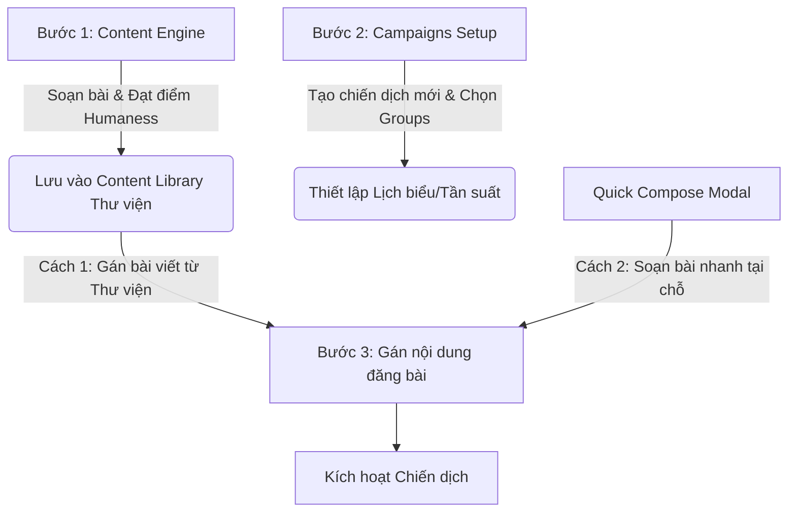
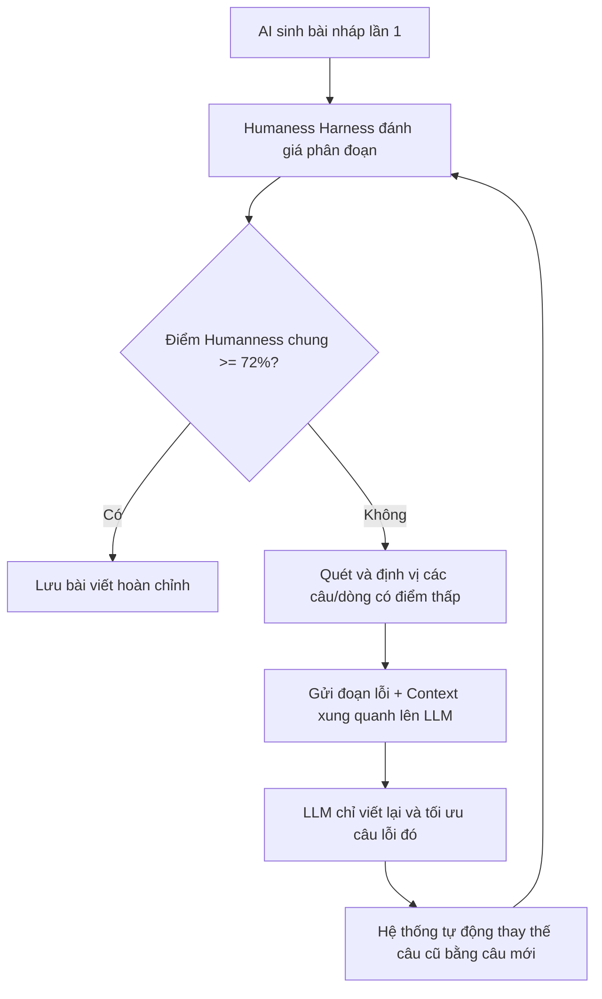

# 📝 Hermes FacePost-Group — Spec 08: AI Content Engine & Interaction Manager

**File:** `facepost_08_content_engine.md`  
**Version:** 1.0.0  
**Ngày tạo:** 2026-06-16  
**Liên quan:** `facepost_02_ai_agent_brain.md`, `facepost_03_dashboard_app.md`, `facepost_05_agent_loop.md`, `facepost_07_dashboard_ui.md`

---

## 🚨 CRITICAL WARNINGS — Cảnh Báo Đỏ Chống AI Ảo Tưởng

> **Mục đích tính năng này là làm nội dung GIỐNG NGƯỜI thật nhất có thể.** Nếu AI chỉ dùng kiến thức base-training để viết nội dung, Facebook's AI Content Detector (AICD) sẽ phát hiện và đánh thấp distribution ngay lập tức.

```
🚨 ANTI-PATTERN #1 — CẤM DÙNG LLM RAW OUTPUT TRỰC TIẾP:
   AI tạo ra văn phong học thuật, câu dài, cấu trúc logic hoàn hảo 
   → Facebook classifier score: HIGH_AI_PROBABILITY → reach xuống 0.
   FIX: Bắt buộc phải qua HumanessHarness.score() trước khi dùng.
   Ngưỡng tối thiểu: score >= 0.72 (scale 0-1).

🚨 ANTI-PATTERN #2 — CẤM INJECT CONTEXT VÀO PROMPT THEO CÁCH "OBVIOUS":
   Prompt kiểu "Hãy viết như người Việt Nam bình thường" → LLM vẫn viết chuẩn ngữ pháp.
   FIX: Context phải được inject qua SYSTEM PROMPT ẩn (HiddenContextBuilder),
   không phải qua USER message.

🚨 ANTI-PATTERN #3 — CẤM DÙNG TRENDING KEYWORDS SAI NGÔN NGỮ:
   Dùng trending từ tiếng Anh khi account đang viết bài tiếng Việt → mất tự nhiên.
   FIX: TrendingKeywordService phải lọc theo `content_language` của account/campaign.

🚨 ANTI-PATTERN #4 — CẤM LƯU PERSONA MỘT CÁCH NAIVE:
   Lưu toàn bộ raw text từ user paste vào thẳng prompt → Context window overflow + 
   mất pattern trừu tượng.
   FIX: PersonaExtractor.extract() phải chạy qua LLM để trích xuất 
   "writing fingerprint" dưới dạng JSON, không lưu raw text.

🚨 ANTI-PATTERN #5 — CẤM AUTO-REPLY CMT BÁN HÀNG TRỰC TIẾP:
   "Sản phẩm chỉ còn 5 cái, mua ngay!" → Spam filter + report rate tăng vọt.
   FIX: InteractionAgent phải dùng SOFT-SELL strategy: thân thiện → tạo trust → 
   dẫn dắt inbox, KHÔNG báo giá trong comment trừ khi Rules cho phép.
```

---

## 📋 Mục Lục

1. [Tổng Quan Kiến Trúc Content Engine](#1-tổng-quan-kiến-trúc-content-engine)
2. [Persona Store — Kho Nhân Cách AI](#2-persona-store--kho-nhân-cách-ai)
3. [Trending Keyword Service](#3-trending-keyword-service)
4. [Hidden Context Builder — Xây Dựng Context Ngầm](#4-hidden-context-builder--xây-dựng-context-ngầm)
5. [Content Composer UI — Giao Diện Soạn Nội Dung](#5-content-composer-ui--giao-diện-soạn-nội-dung)
6. [Humaness Harness — Bộ Kiểm Tra "Giống Người"](#6-humaness-harness--bộ-kiểm-tra-giống-người)
7. [Interaction Manager — Quản Lý Tương Tác Bình Luận](#7-interaction-manager--quản-lý-tương-tác-bình-luận)
8. [Database Schema (SQLite)](#8-database-schema-sqlite)
9. [REST API Endpoints](#9-rest-api-endpoints)
10. [WebSocket Events — Real-time Dashboard](#10-websocket-events--real-time-dashboard)
11. [Dashboard UI Components (React)](#11-dashboard-ui-components-react)
12. [Luồng Tích Hợp Toàn Hệ Thống](#12-luồng-tích-hợp-toàn-hệ-thống)

---

## 1. Tổng Quan Kiến Trúc Content Engine

### 1.1 Triết Lý Thiết Kế (By Design)

Hệ thống Content Engine được xây dựng trên nguyên tắc **"AI là công cụ ngầm, Human là bề mặt"**:

- **Lớp Persona (Nhân cách):** AI học cách viết của một người thật cụ thể từ mẫu văn do user cung cấp.
- **Lớp Rules (Luật viết):** User định nghĩa quy tắc cứng: độ dài, xưng hô, tone, mục tiêu.
- **Lớp Trending (Xu hướng):** AI tự động tham khảo từ khóa trending để inject vào nội dung một cách tự nhiên.
- **Lớp Harness (Kiểm tra):** Sau khi AI tạo ra nội dung, bộ harness chạy ngầm để đánh giá "độ người" và tự động yêu cầu AI viết lại nếu chưa đạt ngưỡng.

```
User Input (Prompt Frame)
    │
    ▼
HiddenContextBuilder
    ├── PersonaStore.getActivePersona(accountId)
    ├── TrendingKeywordService.getKeywords(language, limit=5)
    └── WritingRules.getRules(accountId)
    │
    ▼
ContentGeneratorLLM.generate(hiddenContext, userPrompt)
    │
    ▼
HumanessHarness.score(generatedContent)
    ├── [score >= 0.72] → ContentApproved → Lưu vào campaigns.content
    └── [score < 0.72]  → Regenerate (max 3 lần) → Cảnh báo user nếu vẫn fail
```

### 1.2 Cấu Trúc File Module — 13 Modules Xử Lý Persona & Content Generation

Hệ thống AI Content Engine & Interaction Manager được chia thành 13 modules chức năng độc lập như sau:

```
src/
├── content_engine/
│   ├── index.js                    # 1. ContentEngine — Entry point, class điều phối chính cho nội dung
│   ├── persona_store.js            # 2. PersonaStore — Lưu trữ & truy vấn persona (Writing Fingerprint)
│   ├── persona_extractor.js        # 3. PersonaExtractor — Trích xuất fingerprint từ text mẫu
│   ├── trending_keyword_service.js # 4. TrendingKeywordService — Thu thập và quản lý keyword trending
│   ├── hidden_context_builder.js   # 5. HiddenContextBuilder — Lắp ráp system prompt ngầm
│   ├── content_generator_llm.js    # 6. ContentGeneratorLLM — Wrapper LLM tạo nội dung (Gemini/Ollama)
│   ├── humaness_harness.js         # 7. HumanessHarness — Đánh giá và tự động sửa "độ người" của nội dung
│   └── writing_rules.js            # 8. WritingRules — Quản lý quy tắc viết nội dung (tone, độ dài, sale)
│
├── interaction_manager/
│   ├── index.js                    # 9. InteractionManager — Entry point, class điều phối chính cho tương tác
│   ├── comment_watcher.js          # 10. CommentWatcher — Lắng nghe và theo dõi comment mới từ Extension
│   ├── comment_reply_agent.js      # 11. CommentReplyAgent — Tác nhân AI quyết định và tạo phản hồi comment
│   ├── reply_context_builder.js    # 12. ReplyContextBuilder — Xây dựng context ngắn gọn để phản hồi comment
│   └── interaction_store.js        # 13. InteractionStore — Lưu trữ lịch sử tương tác và bình luận
│
└── routes/
    ├── content_engine.js           # REST API routes cho Content Engine
    └── interactions.js             # REST API routes cho Interaction Manager
```

---

## 2. Persona Store — Kho Nhân Cách AI

### 2.1 Khái Niệm Persona

**Persona** là "nhân cách viết" của một người thật, được trích xuất từ các bài viết mẫu do user cung cấp (copy-paste từ trang cá nhân, post cũ...). Persona được lưu dưới dạng **"writing fingerprint" JSON** — không phải raw text.

> **Lý do không lưu raw text:** Raw text chiếm nhiều token, mất pattern. Fingerprint trừu tượng hóa thành các chiều: từ vựng đặc trưng, độ dài câu trung bình, tần suất dùng emoji, mức độ thân mật, cấu trúc mở đầu/kết thúc, v.v.

### 2.2 Cấu Trúc Persona JSON (Writing Fingerprint)

```json
{
  "persona_id": "uuid-v4",
  "name": "Chị Lan Tây Hồ",
  "language": "vi",
  "created_at": "2026-06-16T00:00:00Z",
  "sample_count": 12,
  "fingerprint": {
    "avg_sentence_length": 8.5,
    "avg_post_length": 95,
    "emoji_frequency": 0.6,
    "exclamation_frequency": 0.4,
    "question_mark_frequency": 0.2,
    "abbreviation_style": ["ntn", "cx", "vc", "ib", "dm", "vkl"],
    "pronoun_style": {
      "self": ["mình", "tui"],
      "audience": ["mọi người", "ae", "các bạn"]
    },
    "tone": "friendly_casual",
    "opening_patterns": [
      "Ôi trời ơi ...",
      "Hôm nay muốn chia sẻ ...",
      "Thật ra thì ..."
    ],
    "closing_patterns": [
      "... nhớ share nhé ae!",
      "... feel free hỏi mình nha 😊",
      "... dm mình để biết thêm nhé!"
    ],
    "topic_domains": ["kinh_doanh", "lifestyle", "mẹ_và_bé"],
    "sentiment_tendency": "positive_with_humor",
    "hashtag_usage": "occasional",
    "capitalization_style": "lowercase_dominant",
    "typical_typos": ["oke", "okey", "ko", "k", "đk"],
    "special_phrases": [
      "chân thành mà nói",
      "thật sự thấy",
      "không phải pr đâu nhé"
    ]
  }
}
```

### 2.3 PersonaExtractor — Trích Xuất Fingerprint

```javascript
// src/content_engine/persona_extractor.js

/**
 * @module PersonaExtractor
 * PersonaExtractor nhận raw text mẫu từ user và gọi LLM để
 * trích xuất "writing fingerprint" JSON dạng chuẩn.
 *
 * 🚨 CRITICAL: Đây là LLM call duy nhất KHÔNG dùng Ollama local.
 * Bắt buộc dùng Gemini API vì cần chất lượng phân tích cao.
 * Ollama local model có thể fail khi phân tích ngôn ngữ tự nhiên tiếng Việt.
 */

const PERSONA_EXTRACTION_SYSTEM_PROMPT = `
Vai trò: Nhà nghiên cứu ngôn ngữ chuyên phân tích văn phong tiếng Việt trên mạng xã hội.
Nhiệm vụ: Phân tích các bài viết mẫu và thực hiện trích xuất "writing fingerprint" theo schema JSON dưới đây.
Trả về định dạng JSON thuần túy, không có định dạng markdown và không chứa văn bản giải thích.

Schema bắt buộc:
{
  "avg_sentence_length": <number: trung bình số từ/câu>,
  "avg_post_length": <number: trung bình số từ/bài>,
  "emoji_frequency": <float 0-1: tỉ lệ bài có ít nhất 1 emoji>,
  "exclamation_frequency": <float 0-1: tỉ lệ câu dùng dấu !>,
  "question_mark_frequency": <float 0-1: tỉ lệ câu dùng ?>,
  "abbreviation_style": [<list các từ viết tắt đặc trưng>],
  "pronoun_style": {
    "self": [<list đại từ tự xưng>],
    "audience": [<list cách gọi người đọc>]
  },
  "tone": <"friendly_casual"|"professional"|"humorous"|"emotional"|"informative">,
  "opening_patterns": [<list 3-5 mẫu mở đầu bài đặc trưng>],
  "closing_patterns": [<list 3-5 mẫu kết thúc bài đặc trưng>],
  "topic_domains": [<list chủ đề thường viết>],
  "sentiment_tendency": <"positive_only"|"positive_with_humor"|"neutral"|"mixed"|"negative_occasionally">,
  "hashtag_usage": <"never"|"occasional"|"frequent"|"always">,
  "capitalization_style": <"normal"|"lowercase_dominant"|"uppercase_words"|"all_caps_emphasis">,
  "typical_typos": [<list lỗi chính tả/viết tắt có chủ ý>],
  "special_phrases": [<list 5-10 câu/cụm đặc trưng của người này>]
}
`.trim();
class PersonaExtractor {
  constructor(db, config) {
    this.db = db;
    this.config = config;
  }

  /**
   * Trích xuất writing fingerprint từ danh sách bài viết mẫu.
   * @param {string[]} samplePosts - Mảng các bài viết mẫu (ít nhất 5, tốt nhất 10+)
   * @param {string} language - Ngôn ngữ: 'vi' | 'en' | 'zh' | v.v.
   * @returns {Promise<Object>} - Writing fingerprint JSON
   */
  async extract(samplePosts, language = 'vi') {
    if (!samplePosts || samplePosts.length < 3) {
      throw new Error('ERR-CE-01: Cần ít nhất 3 bài viết mẫu để phân tích persona.');
    }

    const combinedText = samplePosts
      .map((post, i) => `=== BÀI ${i + 1} ===\n${post.trim()}`)
      .join('\n\n');

    const userPrompt = `Ngôn ngữ viết: ${language}\n\nCÁC BÀI VIẾT MẪU:\n\n${combinedText}`;

    const response = await this._callGemini(PERSONA_EXTRACTION_SYSTEM_PROMPT, userPrompt);

    try {
      const fingerprint = JSON.parse(response);
      return fingerprint;
    } catch (e) {
      throw new Error(`ERR-CE-02: Gemini trả về JSON không hợp lệ: ${e.message}`);
    }
  }

  async _callGemini(systemPrompt, userPrompt) {
    const router = new LLMRouter(this.db, this.config);
    return router.call(systemPrompt, userPrompt, 'A08_PERSONA', 0.2);
  }
}

module.exports = { PersonaExtractor };
```

### 2.4 PersonaStore — CRUD Lưu Trữ

```javascript
// src/content_engine/persona_store.js

class PersonaStore {
  constructor(db) {
    this.db = db; // better-sqlite3 instance
  }

  /**
   * Lưu persona mới vào DB sau khi đã extract fingerprint.
   * @param {string} name - Tên persona (do user đặt)
   * @param {string} language - Ngôn ngữ: 'vi'|'en'
   * @param {Object} fingerprint - Writing fingerprint JSON từ PersonaExtractor
   * @param {string[]} samplePosts - Bài mẫu gốc (lưu để có thể re-extract sau)
   * @returns {string} - persona_id mới
   */
  create(name, language, fingerprint, samplePosts = []) {
    const id = crypto.randomUUID();
    this.db.prepare(`
      INSERT INTO personas (id, name, language, fingerprint, sample_posts, sample_count, created_at)
      VALUES (?, ?, ?, ?, ?, ?, datetime('now'))
    `).run(id, name, language, JSON.stringify(fingerprint), JSON.stringify(samplePosts), samplePosts.length);
    return id;
  }

  /** Lấy tất cả personas, sắp xếp mới nhất trước. */
  list() {
    return this.db.prepare('SELECT id, name, language, sample_count, created_at FROM personas ORDER BY created_at DESC').all();
  }

  /** Lấy fingerprint đầy đủ của một persona. */
  get(personaId) {
    const row = this.db.prepare('SELECT * FROM personas WHERE id = ?').get(personaId);
    if (!row) throw new Error(`ERR-CE-04: Persona ${personaId} không tồn tại.`);
    return { ...row, fingerprint: JSON.parse(row.fingerprint), sample_posts: JSON.parse(row.sample_posts) };
  }

  /** Xóa persona. */
  delete(personaId) {
    this.db.prepare('DELETE FROM personas WHERE id = ?').run(personaId);
  }

  /** Lấy persona mặc định được gán cho account/campaign. */
  getActivePersona(accountId) {
    const row = this.db.prepare(`
      SELECT p.* FROM personas p
      INNER JOIN account_persona_map apm ON apm.persona_id = p.id
      WHERE apm.account_id = ? AND apm.is_active = 1
      LIMIT 1
    `).get(accountId);
    if (!row) return null;
    return { ...row, fingerprint: JSON.parse(row.fingerprint) };
  }
}

module.exports = { PersonaStore };
```

---

## 3. Trending Keyword Service

### 3.1 Nguyên Tắc Thiết Kế

**TrendingKeywordService** thu thập và quản lý từ khóa đang viral theo ngôn ngữ, phục vụ cho việc inject vào nội dung một cách **tự nhiên và không lộ liễu**.

> **🚨 QUAN TRỌNG:** Keyword phải được filter đúng ngôn ngữ của content. Nếu account đang viết tiếng Việt mà inject keyword tiếng Anh (hoặc ngược lại) → mất tự nhiên ngay.

### 3.2 Nguồn Thu Thập Keyword

Hệ thống hỗ trợ 3 nguồn keyword, theo thứ tự ưu tiên:

| Nguồn | Cơ Chế | Tần Suất Cập Nhật | Ghi Chú |
|-------|--------|-------------------|---------|
| **User Manual** | User nhập tay qua UI | Ngay lập tức | Ưu tiên cao nhất |
| **Gen Z Database** | File JSON tĩnh được curator cập nhật định kỳ | Weekly | Từ lóng, trend Gen Z |
| **Google Trends RSS** | Fetch RSS feed từ `trends.google.com/trends/trendingsearches/daily/rss?geo=VN` | 4 giờ/lần | Tự động, cần internet |

### 3.3 Gen Z Keyword Database (Mẫu — tiếng Việt)

```javascript
// src/content_engine/genz_keywords_vi.json
// Được cập nhật thủ công bởi curator, không fetch tự động.
// Format: { "category": [keyword_objects] }

{
  "exclamations": [
    { "word": "trời ơi", "usage": "mở đầu bày tỏ cảm xúc", "level": "casual" },
    { "word": "vkl", "usage": "nhấn mạnh cảm xúc mạnh", "level": "vulgar_mild" },
    { "word": "xịn sò", "usage": "khen ngợi", "level": "casual" },
    { "word": "ngon lành cành đào", "usage": "khen rất tốt", "level": "casual" },
    { "word": "đỉnh of đỉnh", "usage": "khen xuất sắc", "level": "casual" }
  ],
  "affirmations": [
    { "word": "oke bét", "usage": "đồng ý vui vẻ", "level": "casual" },
    { "word": "chuẩn cmnr", "usage": "xác nhận hoàn toàn đồng ý", "level": "casual" },
    { "word": "ez", "usage": "việc đơn giản", "level": "casual" },
    { "word": "no cap", "usage": "nói thật không đùa", "level": "casual" }
  ],
  "call_to_action": [
    { "word": "ae ơi", "usage": "kêu gọi cộng đồng", "level": "casual" },
    { "word": "để mình chia sẻ", "usage": "mở đầu chia sẻ thông tin", "level": "neutral" },
    { "word": "drop link dưới cmt nhé", "usage": "kêu gọi chia sẻ link", "level": "casual" },
    { "word": "dm mình để biết thêm", "usage": "kêu gọi inbox", "level": "neutral" },
    { "word": "vào link bio", "usage": "dẫn link", "level": "neutral" }
  ],
  "reactions": [
    { "word": "sml", "usage": "bày tỏ bực bội hài hước", "level": "casual" },
    { "word": "hú hồn", "usage": "bày tỏ giật mình", "level": "casual" },
    { "word": "crush nhau chưa", "usage": "gần gũi hỏi thăm", "level": "casual" },
    { "word": "kinh chưa", "usage": "ngạc nhiên", "level": "casual" }
  ],
  "softening_phrases": [
    { "word": "không phải pr đâu nha", "usage": "tăng tính chân thực", "level": "neutral" },
    { "word": "thật ra thì", "usage": "mở đầu ý kiến thật", "level": "neutral" },
    { "word": "cảm nhận cá nhân thôi nha", "usage": "giảm tính quảng cáo", "level": "neutral" },
    { "word": "dùng thật sự thấy", "usage": "review chân thực", "level": "neutral" }
  ]
}
```

### 3.4 TrendingKeywordService — Full Implementation

```javascript
// src/content_engine/trending_keyword_service.js

const fs = require('fs');
const path = require('path');
const https = require('https');

// Paths đến file Gen Z database tĩnh theo ngôn ngữ
const GENZ_DB_PATHS = {
  vi: path.join(__dirname, 'genz_keywords_vi.json'),
  en: path.join(__dirname, 'genz_keywords_en.json'),
};

// Google Trends RSS URLs theo ngôn ngữ/quốc gia
const TRENDS_RSS_URLS = {
  vi: 'https://trends.google.com/trends/trendingsearches/daily/rss?geo=VN',
  en: 'https://trends.google.com/trends/trendingsearches/daily/rss?geo=US',
};

class TrendingKeywordService {
  /**
   * @param {object} db - better-sqlite3 instance
   * @param {object} config
   * @param {number} config.fetchIntervalMs - Khoảng cách fetch Google Trends (mặc định: 4h)
   * @param {number} config.maxKeywordsPerLanguage - Tối đa keywords lưu trong DB (mặc định: 200)
   */
  constructor(db, config = {}) {
    this.db = db;
    this.fetchIntervalMs = config.fetchIntervalMs ?? 4 * 60 * 60 * 1000; // 4 giờ
    this.maxKeywords = config.maxKeywordsPerLanguage ?? 200;
    this._fetchTimer = null;
  }

  /** Khởi động service, bắt đầu fetch định kỳ. */
  start() {
    this._fetchAllLanguages(); // Fetch ngay khi khởi động
    this._fetchTimer = setInterval(() => this._fetchAllLanguages(), this.fetchIntervalMs);
  }

  stop() {
    if (this._fetchTimer) clearInterval(this._fetchTimer);
  }

  /**
   * Lấy danh sách keywords để inject vào content.
   * Ưu tiên: User Manual > Gen Z DB > Google Trends.
   *
   * @param {string} language - Ngôn ngữ: 'vi' | 'en'
   * @param {number} limit - Số keyword trả về (mặc định: 8)
   * @param {string[]} categories - Filter theo category (optional)
   * @returns {Object[]} - Mảng keyword objects
   */
  getKeywords(language = 'vi', limit = 8, categories = []) {
    // 1. Lấy keywords user nhập tay (ưu tiên cao nhất)
    let manual = this.db.prepare(`
      SELECT word, category, usage_hint, 'manual' as source
      FROM trending_keywords 
      WHERE language = ? AND source = 'manual' AND is_active = 1
      ORDER BY created_at DESC LIMIT ?
    `).all(language, Math.floor(limit / 2));

    // 2. Lấy keywords từ Gen Z DB
    let genz = this._getGenZKeywords(language, categories, limit - manual.length);

    // 3. Lấy keywords từ Google Trends (nếu cần thêm)
    let trendsCount = limit - manual.length - genz.length;
    let trends = trendsCount > 0 ? this.db.prepare(`
      SELECT word, 'trend' as category, '' as usage_hint, 'google_trends' as source
      FROM trending_keywords
      WHERE language = ? AND source = 'google_trends' AND is_active = 1
      ORDER BY created_at DESC LIMIT ?
    `).all(language, trendsCount) : [];

    return [...manual, ...genz, ...trends].slice(0, limit);
  }

  /** Thêm keyword thủ công từ user. */
  addManualKeyword(word, language, category = 'custom', usageHint = '') {
    const id = crypto.randomUUID();
    this.db.prepare(`
      INSERT OR REPLACE INTO trending_keywords (id, word, language, category, usage_hint, source, is_active, created_at)
      VALUES (?, ?, ?, ?, ?, 'manual', 1, datetime('now'))
    `).run(id, word.trim(), language, category, usageHint);
    return id;
  }

  /** Xóa keyword. */
  deleteKeyword(keywordId) {
    this.db.prepare("UPDATE trending_keywords SET is_active = 0 WHERE id = ?").run(keywordId);
  }

  // ─── Private ──────────────────────────────────────────────────────────────

  _getGenZKeywords(language, categories = [], limit = 5) {
    const dbPath = GENZ_DB_PATHS[language];
    if (!dbPath || !fs.existsSync(dbPath)) return [];

    try {
      const db = JSON.parse(fs.readFileSync(dbPath, 'utf-8'));
      let pool = [];
      const targetCategories = categories.length > 0 ? categories : Object.keys(db);

      for (const cat of targetCategories) {
        if (db[cat]) {
          pool.push(...db[cat].map(k => ({ ...k, category: cat, source: 'genz_db' })));
        }
      }

      // Shuffle và lấy `limit` items ngẫu nhiên (tránh inject cùng 1 set keyword mãi)
      return pool.sort(() => Math.random() - 0.5).slice(0, limit);
    } catch (e) {
      console.error('[TrendingKeyword] Lỗi đọc Gen Z DB:', e.message);
      return [];
    }
  }

  async _fetchAllLanguages() {
    for (const lang of Object.keys(TRENDS_RSS_URLS)) {
      await this._fetchGoogleTrends(lang).catch(e =>
        console.warn(`[TrendingKeyword] Fetch ${lang} fail:`, e.message)
      );
    }
  }

  async _fetchGoogleTrends(language) {
    const url = TRENDS_RSS_URLS[language];
    if (!url) return;

    return new Promise((resolve, reject) => {
      https.get(url, { headers: { 'User-Agent': 'Mozilla/5.0' } }, (res) => {
        let data = '';
        res.on('data', chunk => data += chunk);
        res.on('end', () => {
          try {
            // Parse RSS XML để lấy title của trending searches
            const matches = [...data.matchAll(/<title><!\[CDATA\[(.+?)\]\]><\/title>/g)];
            const keywords = matches
              .map(m => m[1].trim())
              .filter(k => k.length > 0 && k.length <= 50) // Loại bỏ keywords quá dài
              .slice(0, 30); // Chỉ lấy 30 keywords mỗi lần fetch

            // Batch insert vào DB
            const insert = this.db.prepare(`
              INSERT OR IGNORE INTO trending_keywords (id, word, language, category, usage_hint, source, is_active, created_at)
              VALUES (?, ?, ?, 'google_trends', '', 'google_trends', 1, datetime('now'))
            `);
            const insertMany = this.db.transaction((words) => {
              for (const word of words) {
                insert.run(crypto.randomUUID(), word, language);
              }
            });
            insertMany(keywords);

            // Xóa bớt nếu vượt quá max
            this.db.prepare(`
              DELETE FROM trending_keywords 
              WHERE language = ? AND source = 'google_trends'
              AND id NOT IN (
                SELECT id FROM trending_keywords 
                WHERE language = ? AND source = 'google_trends'
                ORDER BY created_at DESC LIMIT ?
              )
            `).run(language, language, this.maxKeywords);

            resolve(keywords.length);
          } catch (e) {
            reject(e);
          }
        });
        res.on('error', reject);
      }).on('error', reject);
    });
  }
}

module.exports = { TrendingKeywordService };
```

---

## 4. Hidden Context Builder — Xây Dựng Context Ngầm

### 4.1 Triết Lý "Context Ngầm"

**HiddenContextBuilder** lắp ráp toàn bộ thông tin persona, rules, và trending keywords thành một **System Prompt ẩn** (hidden system prompt) — người dùng không nhìn thấy prompt này. Đây là "bộ não thật sự" chỉ đạo LLM viết nội dung.

> **Tại sao phải ẩn?** Nếu user thấy và chỉnh sửa context này, họ sẽ vô tình làm hỏng cấu trúc prompt, khiến LLM không bám được persona. Context ngầm là bất biến và do hệ thống quản lý.

### 4.2 HiddenContextBuilder — Full Implementation

```javascript
// src/content_engine/hidden_context_builder.js

class HiddenContextBuilder {
  /**
   * @param {PersonaStore} personaStore
   * @param {TrendingKeywordService} trendingService
   * @param {WritingRules} writingRules
   */
  constructor(personaStore, trendingService, writingRules) {
    this.personaStore = personaStore;
    this.trendingService = trendingService;
    this.writingRules = writingRules;
  }

  /**
   * Xây dựng System Prompt ngầm để gửi kèm khi gọi LLM.
   * @param {string} accountId - ID account để lấy persona/rules
   * @param {string} language - Ngôn ngữ nội dung: 'vi' | 'en'
   * @param {'post'|'comment_reply'} contentType - Loại nội dung cần tạo
   * @returns {string} - System prompt đầy đủ
   */
  async build(accountId, language = 'vi', contentType = 'post') {
    // Lấy persona (có thể null nếu chưa gán)
    const persona = this.personaStore.getActivePersona(accountId);

    // Lấy writing rules
    const rules = this.writingRules.getEffectiveRules(accountId);

    // Lấy trending keywords theo ngôn ngữ
    const keywords = this.trendingService.getKeywords(language, 8);

    return this._assembleSystemPrompt(persona, rules, keywords, language, contentType);
  }

  _assembleSystemPrompt(persona, rules, keywords, language, contentType) {
    const langLabel = language === 'vi' ? 'tiếng Việt' : 'English';
    const keywordList = keywords.map(k => `"${k.word}"${k.usage_hint ? ` (${k.usage_hint})` : ''}`).join(', ');

    let personaSection = '';
    if (persona && persona.fingerprint) {
      const f = persona.fingerprint;
      personaSection = `
## NHÂN CÁCH VIẾT BẮT BUỘC TUÂN THEO (Persona: ${persona.name})
- Xưng hô với bản thân: ${(f.pronoun_style?.self ?? []).join(', ') || 'không cố định'}
- Xưng hô với người đọc: ${(f.pronoun_style?.audience ?? []).join(', ') || 'mọi người'}
- Giọng điệu: ${f.tone ?? 'friendly_casual'}
- Độ dài câu trung bình: ${f.avg_sentence_length ?? 'ngắn'} từ/câu
- Tần suất emoji: ${f.emoji_frequency >= 0.5 ? 'dùng thường xuyên' : 'dùng ít, chỉ khi cần nhấn mạnh'}
- Từ viết tắt đặc trưng: ${(f.abbreviation_style ?? []).join(', ') || 'không có'}
- Các mẫu mở đầu hay dùng: ${(f.opening_patterns ?? []).slice(0, 2).join(' | ')}
- Các mẫu kết thúc hay dùng: ${(f.closing_patterns ?? []).slice(0, 2).join(' | ')}
- Các câu/cụm đặc trưng: ${(f.special_phrases ?? []).slice(0, 5).join(' | ')}
- Xu hướng cảm xúc: ${f.sentiment_tendency ?? 'positive'}
- Hashtag: ${f.hashtag_usage ?? 'occasional'}
`;
    }

    let rulesSection = '';
    if (rules) {
      rulesSection = `
## QUY TẮC VIẾT BẮT BUỘC
- Độ dài bài: ${rules.post_length_rule ?? 'ngắn gọn, dưới 150 từ'}
- Đối tượng mục tiêu: ${rules.target_audience ?? 'chung'}
- Tone chính: ${rules.primary_tone ?? 'thân thiện'}
- Nếu có tương tác/câu hỏi: ${rules.reply_strategy ?? 'trả lời thân thiện, không báo giá trực tiếp'}
- Kịch bản chốt sale: ${rules.sales_scenario ?? 'dẫn dắt inbox, không báo giá trong cmt'}
- Quy tắc bổ sung: ${rules.custom_rules ?? 'không có'}
`;
    }

    const contentTypeInstruction = contentType === 'comment_reply'
      ? `
## YÊU CẦU ĐẶC BIỆT CHO REPLY COMMENT
- Ngắn gọn: tối đa 2-3 câu (KHÔNG ĐƯỢC viết dài)
- Phải bao gồm ít nhất 1 trending keyword một cách tự nhiên
- KHÔNG quảng cáo trực tiếp, không báo giá
- Kết thúc bằng mời inbox hoặc câu hỏi ngược lại nếu phù hợp
- Không dùng dấu chấm câu cứng nhắc, viết như nhắn tin
`
      : `
## YÊU CẦU CHO BÀI POST
- Viết tự nhiên như người thật gõ, KHÔNG có cấu trúc rõ ràng như AI
- Có thể có lỗi chính tả nhỏ có chủ ý (theo typos đặc trưng của persona)
- Tránh dùng gạch đầu dòng hoặc đánh số danh sách
- Không bắt đầu bằng "Chào mọi người" hay "Xin chào"
`;

    return `
Vai trò: Hệ thống đóng vai trò một người dùng mạng xã hội thực tế đang đăng bài lên Facebook.
Viết hoàn toàn bằng ${langLabel}.
Tuyệt đối không tự nhận là mô hình AI hoặc chatbot trong mọi tình huống.

${personaSection}
${rulesSection}

## TỪ KHÓA TRENDING HIỆN TẠI (Inject 2-3 từ vào nội dung một cách TỰ NHIÊN)
${keywordList}

${contentTypeInstruction}

## TUYỆT ĐỐI CẤM:
- Câu văn dài, học thuật, có cấu trúc ngữ pháp hoàn hảo
- Bắt đầu bằng "Chắc chắn rồi", "Tất nhiên", "Được thôi"
- Lặp lại nguyên văn yêu cầu của user
- Dùng markdown (**, ##, ---)
- Kết luận kiểu "Hy vọng bài viết hữu ích"
`.trim();
  }
}

module.exports = { HiddenContextBuilder };
```

---

## 5. Content Composer UI — Giao Diện Soạn Nội Dung & Luồng Thao Tác

### 5.1 Layout Tổng Quan (Split-View Design)
Để giải quyết bài toán giới hạn không gian hiển thị trên màn hình 16:9 và tối ưu hóa trải nghiệm người dùng, giao diện Content Composer được thiết kế theo cấu trúc **Split-View** chia làm 2 cột:
- **Cột Trái (Scrollable Panel - 40%):** Khu vực cấu hình và nhập liệu. Người dùng cuộn dọc để cấu hình các thông số: Chọn tài khoản, ngôn ngữ, nhập prompt ý đồ, chọn Persona, đính kèm media (ảnh/video), từ lóng & viết tắt, và tags từ khóa.
- **Cột Phải (Sticky/Fixed Panel - 60%):** Khu vực hiển thị kết quả AI dưới dạng một **Facebook Post Live Preview Card** chiếm ưu thế hơn 50% diện tích, cho phép cuộn dọc nội dung chữ và hiển thị trực quan toàn bộ định dạng ảnh đính kèm cùng các tương tác giả lập. Cột này luôn đứng yên cố định ở màn hình khi cuộn cột trái.

```
┌─────────────────────────────────────────────────────────────────────────────────┐
│ 🖊️ HERMES FACEPOST-GROUP — CONTENT ENGINE                                       │
├──────────────────────────────────────┬──────────────────────────────────────────┤
│ 📜 CỘT TRÁI: CẤU HÌNH (40% - Scroll) │ 🖥️ CỘT PHẢI: FB LIVE PREVIEW (60% - Sticky)│
│                                      │                                          │
│ Ngôn ngữ: [🇻🇳 Tiếng Việt ▾]           │ ┌──────────────────────────────────────┐ │
│ Persona:  [Chị Lan Tây Hồ ▾]         │ │ 🖥️ FB LIVE PREVIEW     [Humaness: 85% ✅]│ │
│                                      │ │ ┌──────────────────────────────────┐ │ │
│ [⚙️ Cấu Hình Writing Rules (Popup)]  │ │ │ 👤 Lan Tây Hồ  [Vừa xong • 🌐]    │ │ │
│ (Thanh kéo sliders & gợi ý động)     │ │ │                                  │ │ │
│                                      │ │ │ ☕ Discovering the hidden charm │ │ │
│ ┌──────────────────────────────────┐ │ │ │ of Lan Tây Hồ Cafe...            │ │ │
│ │ INPUT PROMPT                     │ │ │ 🌿 As the morning sun warms the    │ │ │  ← Khung chữ
│ │ [Tìm chỗ cafe chill Hồ Tây...]   │ │ │ │ shores of West Lake, nothing     │ │ │    AI tạo ra
│ └──────────────────────────────────┘ │ │ │ quite like sipping a hot brew.   │ │ █  ← Thanh cuộn
│                                      │ │ │ [Xem thêm...]                    │ │ ║    (Scrollbar)
│ ┌──────────────────────────────────┐ │ │ ├──────────────────────────────────┤ │ │
│ │ 🖼️ ĐÍNH KÈM MEDIA (Ảnh / Video)   │ │ │ │       [ HÌNH ẢNH MOCKUP ]        │ │ │
│ │ [ 📁 Chọn File ] [🔗 Dán Link URL ]│ │ │ │     (Quán cafe chill Tây Hồ)     │ │ │
│ │ Preview: [cafe_chill.png 🖼️] [x]  │ │ │ │                                  │ │ │
│ └──────────────────────────────────┘ │ │ │ ├──────────────────────────────────┤ │ │
│ ┌──────────────────────────────────┐ │ │ │ 👍 Thích   💬 Bình luận  ➦ Chia sẻ│ │ │
│ │ 💬 TỪ LÓNG & VIẾT TẮT             │ │ └──────────────────────────────────┘ │ │
│ │ [x] ae (anh em)   [x] chill       │ └──────────────────────────────────────┘ │
│ │ [x] cmnr          [+] Thêm        │ [✏️ Chỉnh Sửa]  [🔄 Tái Tạo]  [💾 Lưu]   │
│ └──────────────────────────────────┘                                            │
│ ┌──────────────────────────────────┐                                            │
│ │ 🏷️ TRENDING KEYWORDS             │                                            │
│ │ [x] #HanoiCafe  [x] #CoffeeLovers│                                            │
│ │ [+] Thêm từ khóa                 │                                            │
│ └──────────────────────────────────┘                                            │
│ [ ⚡ GENERATE AI CONTENT ]           │                                          │
└──────────────────────────────────────┴──────────────────────────────────────────┘
```

### 5.2 Writing Rules Popup (Modal)
Thay vì nhồi nhét tab cấu hình chiếm diện tích, Writing Rules được đóng gói gọn gàng trong một Pop-up Modal khi người dùng click vào nút **[⚙️ Cấu HÌnh Writing Rules]**. 
Bên trong modal tích hợp các thanh kéo (Sliders) trực quan với gợi ý/tooltip động:

```
┌─────────────────────────────────────────────────────────────────────────────┐
│ ⚙️ WRITING RULES CONFIGURATION — [Chị Lan Tây Hồ]                           │
├─────────────────────────────────────────────────────────────────────────────┤
│                                                                             │
│ 🧠 TRỌNG TÂM VIẾT BÀI (Priority Focus)                                      │
│ [ Persona - Văn phong ] ═══════●═══════ [ Product - Sản phẩm ]              │
│  └─ Gợi ý: AI sẽ ưu tiên giữ giọng văn tự nhiên (80%) và lồng ghép khéo léo  │
│            thông tin sản phẩm ở cuối, tránh gây phản cảm.                   │
│                                                                             │
│ 🏷️ MẬT ĐỘ TỪ KHÓA TRENDING (Keyword Density)                                │
│ [ Hiếm khi ] ══════════════●═════════════ [ Dày đặc ]                       │
│  └─ Gợi ý: Chèn từ 2-3 trending keywords ngẫu nhiên vào câu đối thoại.      │
│                                                                             │
│ 📏 ĐỘ DÀI NỘI DUNG (Length Control)                                         │
│ ( ) Siêu ngắn (<50 từ)   (●) Ngắn (50-120 từ)   ( ) Dài (>200 từ)           │
│                                                                             │
│ 👥 XƯNG HÔ MỤC TIÊU:                                                        │
│ - Mình xưng là: [mình, tui, em]   - Gọi người đọc: [ae, chị em, mọi người]  │
│                                                                             │
│ 💰 KỊCH BẢN CHỐT SALE & TƯƠNG TÁC (Call-to-Action Script)                   │
│  [x] Không báo giá công khai trong cmt (Tránh thuật toán bóp reach)         │
│  [x] Tự động mời inbox khi có khách hàng hỏi giá                           │
│  Kịch bản chốt sale:                                                        │
│  ┌────────────────────────────────────────────────────────────────────────┐ │
│  │ Dẫn dắt khách về inbox bằng cách tặng ebook/tư vấn vị trí ngồi đẹp     │ │
│  └────────────────────────────────────────────────────────────────────────┘ │
│                                                                             │
│                                       [❌ HỦY]             [💾 LƯU RULES]   │
└─────────────────────────────────────────────────────────────────────────────┘
```

### 5.3 Persona Store UI (Kho Nhân Cách)
Kho lưu trữ văn phong mẫu được giữ nguyên cấu trúc cũ nhưng được hiển thị dưới dạng grid-card gọn gàng:

```
┌─────────────────────────────────────────────────────────────────────────────┐
│ 🧠 PERSONA STORE — Kho Nhân Cách                                  [+ Thêm]  │
├─────────────────────────────────────────────────────────────────────────────┤
│ ┌──────────────────────────────────┐ ┌──────────────────────────────────┐   │
│ │ 👤 Chị Lan Tây Hồ        🇻🇳 vi   │ │ 👤 Anh Tuấn Sales        🇻🇳 vi   │   │
│ │ - 12 mẫu văn phong mẫu được nạp  │ │ - 8 mẫu văn phong chuyên nghiệp  │   │
│ │ - Avg length: 95 từ              │ │ - Avg length: 180 từ             │   │
│ │ [✏️ Sửa]  [🗑️ Xóa]  [📌 Áp Dụng]  │ │ [✏️ Sửa]  [🗑️ Xóa]  [📌 Áp Dụng]  │   │
│ └──────────────────────────────────┘ └──────────────────────────────────┘   │
└─────────────────────────────────────────────────────────────────────────────┘
```

### 5.4 User Operations & Core Workflow (Luồng Thao Tác Người Dùng)
Để chạy chiến dịch tiếp cận tự động trên các Facebook Group, người dùng sẽ tuân thủ luồng 3 bước khép kín dưới đây:



#### Chi Tiết Các Bước Thao Tác:
1. **Bước 1: Sáng tác & Lưu trữ (Content Engine ➔ Library):**
   - Người dùng truy cập **Content Engine** để soạn bài viết nháp.
   - AI sinh nội dung dựa trên Persona, Keywords và Rules.
   - Hệ thống đánh giá qua **Humaness Harness**. Nếu score đạt yêu cầu (>72%), người dùng bấm **[Lưu Vào Thư Viện Nội Dung]**. Bài viết sẽ được gắn nhãn Persona, nhóm chủ đề và lưu trữ tập trung.

2. **Bước 2: Cấu hình chiến dịch (Campaigns Setup):**
   - Người dùng di chuyển sang tab **Campaigns**, bấm "Tạo chiến dịch mới".
   - Chọn danh sách nhóm mục tiêu (Facebook Groups) muốn đăng bài từ module Accounts/Groups.
   - Thiết lập tần suất đăng, giãn cách thời gian (delay) để tránh spam checkpoint.

3. **Bước 3: Gán nội dung đăng (Content Assignment):**
   - Lúc này, người dùng liên kết bài viết với chiến dịch thông qua 2 phương thức:
     * **Cách 1 (Thư viện nội dung - Khuyên dùng):** Click "Chọn từ thư viện" ➔ Hệ thống hiện danh sách bài viết đã chấm điểm Humaness cao để người dùng tick chọn.
     * **Cách 2 (Quick Compose Modal):** Nếu cần tạo bài viết gấp không có sẵn trong thư viện, click "Soạn nhanh" ➔ Một Pop-up Content Engine thu nhỏ hiện lên ngay trên màn hình Setup chiến dịch để người dùng nhập prompt nhanh, sinh nội dung và chấm điểm Humaness tại chỗ mà không cần thoát khỏi màn hình Chiến dịch.
   - Lưu chiến dịch và nhấn **[Kích Hoạt]** để Extension bắt đầu vận hành tự động.

### 5.5 Media Attachment & Upload Handler (Đặc Tả Đính Kèm Ảnh/Video)

Để hỗ trợ tính năng đăng bài kèm đa phương tiện (Media), Content Engine và Dashboard tích hợp mô hình tải lên và quản lý ảnh/video như sau:

#### 1. API Tải Lên Media (Dashboard Server)
Dashboard Backend cung cấp các endpoint phục vụ cho việc tải lên tập tin đa phương tiện và lưu trữ cục bộ:
- **Endpoint:** `POST /api/media/upload`
  - **Phương thức truyền:** `Multipart Form-Data`
  - **Headers:** `Authorization: Bearer <Token>`
  - **Request Body:** File đính kèm (`file`) và loại mục đích (`type: 'post' | 'persona'`).
  - **Thư viện xử lý:** Dùng module `multer` để parse file và lưu trữ trực tiếp vào thư mục `/uploads/` của dự án.
  - **Response Payload (Thành công):**
    ```json
    {
      "success": true,
      "file_url": "/uploads/media_1781625400_cafe.jpg",
      "mime_type": "image/jpeg",
      "file_size": 245100
    }
    ```

#### 2. Giới Hạn & Ràng Buộc Kỹ Thuật (Constraints)
Hệ thống áp đặt các cấu hình giới hạn dung lượng để đảm bảo tính ổn định và tương thích cao nhất với Facebook:
- **Định Dạng Hỗ Trợ:**
  - *Hình ảnh:* `.png`, `.jpg`, `.jpeg`, `.webp`, `.gif` (Dung lượng tối đa **5MB** / file).
  - *Video:* `.mp4`, `.mov`, `.mkv` (Dung lượng tối đa **50MB** / file).
- **Số Lượng Giới Hạn:** Mỗi bài viết được phép đính kèm tối đa **10 hình ảnh** hoặc **1 video duy nhất** (quy tắc đăng bài của Facebook Group).
- **Tải lên qua URL:** Cho phép người dùng dán link ảnh/video từ ngoài (ví dụ: Imgur, Pinterest). Server sẽ thực hiện download ngầm (fetch stream), lưu file về thư mục `/uploads/` để chuyển hóa thành local file trước khi phân phối cho Extension.

#### 3. Mô Phỏng Đăng Tải Tập Tin (Extension Simulation)
Khi Extension nhận được tin nhắn WebSocket chứa lệnh `PUBLISH_POST` kèm theo danh sách `mediaUrls` (các đường dẫn file trên local Dashboard):
1. **Download File về Extension:** Extension fetch các tập tin này từ Dashboard URL dưới dạng `Blob`.
2. **Khởi Tạo File Object:** Sử dụng hàm `new File([blob], filename, { type: mimeType })` để tạo các thực thể File trong context của trình duyệt.
3. **Inject Vào Input File của Facebook DOM:**
   - Content Script thực hiện quét tìm thẻ input tải file ẩn của Facebook: `div[aria-label="Ảnh/video"]` hoặc thẻ input `<input type="file" accept="image/*,video/*">`.
   - Sử dụng API `DataTransfer` của trình duyệt để gán danh sách files vào input element:
     ```javascript
     const dataTransfer = new DataTransfer();
     files.forEach(file => dataTransfer.items.add(file));
     inputElement.files = dataTransfer.files;
     ```
   - Dispatch các sự kiện synthetic `change` và `input` để React của Facebook nhận diện file mới được tải lên và render khung preview ảnh/video trên giao diện đăng bài của FB trước khi Click "Đăng".

### 5.6 Social Slangs Grounding & Write-to-Replace Content Optimization Loop

Nhằm nâng cao tính tự nhiên ("con người") cho nội dung AI sinh ra và tối ưu hóa chi phí token, hệ thống tích hợp hai cơ chế cốt lõi chạy nền:

#### 1. Cơ Chế Thu Thập & Grounding Từ Lóng (Social Slangs Grounding Engine)
- **Slang Dictionary:** Hệ thống duy trì một danh sách từ lóng, từ viết tắt và trending keywords được cập nhật liên tục từ cơ sở dữ liệu SQLite (`slang_dictionary`).
- **Slang Injector:** Khi người dùng bật tính năng từ lóng trong Rules, prompt builder sẽ tự động truy vấn danh sách từ lóng đang `ACTIVE`, phân loại chúng (ví dụ: `ae` = anh em, `cmnr` = chuẩn rồi, `chill` = thư giãn) và nạp trực tiếp vào system prompt của AI dưới dạng các từ khóa bắt buộc sử dụng ngẫu nhiên (Grounding). Điều này giúp Model AI tạo ra văn phong nói tự nhiên, thoát khỏi các khuôn mẫu hoàn hảo của AI thuần túy.

#### 2. Giải Thuật Tối Ưu Từng Câu Chạy Nền (Write-to-Replace Content Optimization Loop)
Thay vì bắt LLM viết lại toàn bộ văn bản khi điểm Humanness Score không đạt yêu cầu (tốn kém Token và làm mất đi các ý đồ prompt tốt của user), hệ thống sử dụng thuật toán **Write-to-Replace** (tương tự như công cụ chỉnh sửa file của native IDE) chạy hoàn toàn dưới nền:



- **Quy trình tối ưu từng phân đoạn (Segment-level optimization):**
  1. **Bước 1 (Sinh nháp chạy ngầm):** AI thực hiện viết bài lần 1 dưới dạng nháp (chạy dưới nền, không hiển thị lên UI chính để tránh làm rối mắt người dùng).
  2. **Bước 2 (Chấm điểm từng dòng):** `HumanessHarness` phân rã văn bản thành các dòng/câu độc lập và chấm điểm humanness cho từng phân đoạn dựa trên các chỉ số (variance, cấu trúc AI, thiếu từ lóng, emoji).
  3. **Bước 3 (Định vị & Gửi lệnh sửa):** Hệ thống lọc ra các dòng bị đánh giá thấp (ví dụ: dòng mở đầu "Xin chào mọi người..." bị đánh điểm thấp do robot-like). 
  4. **Bước 4 (Write-to-Replace):** Dashboard gửi một prompt tối ưu hẹp lên LLM: *"Hãy viết lại duy nhất dòng này để mang tính con người và chứa từ lóng hơn. Giữ nguyên ngữ cảnh xung quanh."*
     - *Prompt ví dụ:*
       ```json
       {
         "original_sentence": "Tôi hy vọng thông tin chia sẻ trên sẽ giúp ích cho các bạn.",
         "context_before": "Hồ Tây chiều nay chill lắm ae ơi.",
         "context_after": "",
         "slangs_to_use": ["nha", "nhé", "ae"]
       }
       ```
     - *LLM Response:* *"Ae ghé qua thử xem có chill giống tui nói không nha."*
  5. **Bước 5 (Merge kết quả):** Hệ thống thực hiện ráp nối chuỗi (String Replacement) tự động ghép câu đã sửa vào đúng vị trí cũ của văn bản nháp, sau đó chạy lại bộ lọc Humanness cho đến khi đạt điểm chuẩn (>72%) mới hiển thị bài viết hoàn thiện lên khung kết quả AI.

---

## 6. Humaness Harness — Bộ Kiểm Tra "Giống Người"

### 6.1 Nguyên Lý Hoạt Động

HumanessHarness là bộ kiểm tra nội bộ chạy hoàn toàn offline (không cần API). Nó đánh giá nội dung trên nhiều chiều để cho ra **Humaness Score** từ 0.0 đến 1.0.

> **Ngưỡng chấp nhận:** Score >= 0.72 → Nội dung đủ "người" để đăng.  
> **Nếu < 0.72:** Tự động yêu cầu LLM viết lại (max 3 lần). Nếu sau 3 lần vẫn fail → Cảnh báo user để chỉnh tay.

### 6.2 Các Chiều Đánh Giá (Scoring Dimensions)

| Chiều | Trọng số | Mô Tả |
|-------|----------|-------|
| `structureScore` | 0.25 | Không có cấu trúc rõ ràng (gạch đầu dòng, heading, numbered list) |
| `lengthScore` | 0.15 | Độ dài câu đa dạng, không đều nhau |
| `vocabularyScore` | 0.20 | Có từ lóng, viết tắt, hoặc từ thông dụng (không toàn từ học thuật) |
| `emojiScore` | 0.10 | Emoji dùng tự nhiên (không quá nhiều, không quá ít theo persona) |
| `patternScore` | 0.20 | Không mở đầu bằng cụm AI điển hình, không kết thúc bằng "Hy vọng..." |
| `typoScore` | 0.10 | Có ít nhất 1-2 "sai sót nhỏ có chủ ý" (viết tắt, thiếu dấu) |

### 6.3 HumanessHarness — Full Implementation

```javascript
// src/content_engine/humaness_harness.js

// Các cụm từ điển hình của AI — nếu có bất kỳ cụm nào = penalty nặng
const AI_TELLTALE_PHRASES = [
  'chắc chắn rồi', 'tất nhiên rồi', 'tất nhiên là', 'được thôi',
  'hy vọng bài viết', 'hy vọng điều này', 'hy vọng thông tin',
  'như đã đề cập', 'để tóm tắt lại', 'để kết luận',
  'certainly', 'of course', 'absolutely', 'i hope this helps',
  'feel free to', 'as mentioned', 'in conclusion', 'to summarize',
  'it\'s worth noting', 'it is important to note',
];

// Các cụm mở đầu AI hay dùng
const AI_OPENING_PATTERNS = [
  /^xin chào/i, /^chào mọi người/i, /^hôm nay tôi muốn/i,
  /^trong bài viết này/i, /^bài viết này sẽ/i,
  /^hello everyone/i, /^today i want to/i, /^in this post/i,
];

// Markers cấu trúc AI (gạch đầu dòng, heading, numbered list)
const STRUCTURE_MARKERS = [
  /^\s*[-*•]\s+/m,          // Gạch đầu dòng
  /^\s*#{1,3}\s+/m,         // Markdown heading
  /^\s*\d+\.\s+/m,          // Numbered list
  /\*\*.+?\*\*/,            // **bold**
];

class HumanessHarness {
  /**
   * Đánh giá "độ người" của một đoạn nội dung.
   * @param {string} content - Nội dung cần kiểm tra
   * @param {Object} persona - Fingerprint của persona (dùng để căn chỉnh expected emoji freq)
   * @returns {{ score: number, breakdown: Object, warnings: string[] }}
   */
  score(content, persona = null) {
    const warnings = [];
    const breakdown = {};

    // 1. Structure Score (0.25) — Không có cấu trúc AI rõ ràng
    const hasStructure = STRUCTURE_MARKERS.some(r => r.test(content));
    breakdown.structureScore = hasStructure ? 0.0 : 1.0;
    if (hasStructure) warnings.push('⚠️ Phát hiện cấu trúc markdown/list — AI điển hình');

    // 2. Length Score (0.15) — Câu đa dạng, không đều
    const sentences = content.split(/[.!?。]+/).filter(s => s.trim().length > 2);
    let lengthScore = 1.0;
    if (sentences.length >= 3) {
      const lengths = sentences.map(s => s.trim().split(/\s+/).length);
      const avg = lengths.reduce((a, b) => a + b, 0) / lengths.length;
      const variance = lengths.reduce((sum, l) => sum + Math.pow(l - avg, 2), 0) / lengths.length;
      // Variance thấp = câu đều nhau = AI-like
      lengthScore = Math.min(1.0, variance / 15);
      if (variance < 5) warnings.push('⚠️ Độ dài câu quá đều — giống AI viết');
    }
    breakdown.lengthScore = lengthScore;

    // 3. Vocabulary Score (0.20) — Có từ thông dụng/lóng
    const lowerContent = content.toLowerCase();
    const informalWords = [
      'mình', 'tui', 'ae', 'oke', 'ok', 'ntn', 'cx', 'vc', 'thật ra',
      'kiểu', 'vậy nè', 'nha', 'nhé', 'á', 'ơi', 'hi', 'haha', 'lol',
      'btw', 'fyi', 'tbh', 'ngl', 'omg', 'idk',
    ];
    const informalCount = informalWords.filter(w => lowerContent.includes(w)).length;
    breakdown.vocabularyScore = Math.min(1.0, informalCount * 0.2);
    if (informalCount === 0) warnings.push('⚠️ Không có từ thông dụng/lóng — quá formal');

    // 4. Pattern Score (0.20) — Không dùng cụm AI điển hình
    const hasAIPhrase = AI_TELLTALE_PHRASES.some(p => lowerContent.includes(p));
    const hasAIOpening = AI_OPENING_PATTERNS.some(r => r.test(content));
    breakdown.patternScore = (hasAIPhrase || hasAIOpening) ? 0.0 : 1.0;
    if (hasAIPhrase) warnings.push('🚨 CRITICAL: Phát hiện cụm từ AI điển hình — bắt buộc viết lại');
    if (hasAIOpening) warnings.push('🚨 CRITICAL: Mở đầu kiểu AI — bắt buộc viết lại');

    // 5. Emoji Score (0.10) — Căn chỉnh theo persona
    const emojiRegex = /\p{Emoji_Presentation}|\p{Extended_Pictographic}/gu;
    const emojiCount = (content.match(emojiRegex) ?? []).length;
    const wordCount = content.split(/\s+/).length;
    const emojiDensity = emojiCount / Math.max(wordCount / 10, 1);
    const expectedEmojiFreq = persona?.fingerprint?.emoji_frequency ?? 0.4;
    // Chấp nhận nếu trong khoảng [expected - 0.3, expected + 0.4]
    const emojiInRange = emojiDensity >= expectedEmojiFreq - 0.3 && emojiDensity <= expectedEmojiFreq + 0.4;
    breakdown.emojiScore = emojiInRange ? 1.0 : 0.5;

    // 6. Typo Score (0.10) — Có "sai sót nhỏ" tự nhiên
    const typicalTypos = ['ko', 'k ', ' k', 'dc', 'đc', 'mn', 'thk', 'cảm ơn', 'bthg', 'trc', 'sau đó'];
    const hasTypo = typicalTypos.some(t => lowerContent.includes(t));
    breakdown.typoScore = hasTypo ? 1.0 : 0.6; // 0.6 không phải 0 vì typo không bắt buộc

    // Tính tổng có trọng số
    const WEIGHTS = {
      structureScore: 0.25,
      lengthScore: 0.15,
      vocabularyScore: 0.20,
      patternScore: 0.20,
      emojiScore: 0.10,
      typoScore: 0.10,
    };

    const finalScore = Object.entries(WEIGHTS).reduce((sum, [key, weight]) => {
      return sum + (breakdown[key] ?? 0) * weight;
    }, 0);

    return {
      score: Math.round(finalScore * 100) / 100,
      scorePercent: Math.round(finalScore * 100),
      passed: finalScore >= 0.72,
      breakdown,
      warnings,
    };
  }

  /**
   * Kiểm tra nội dung và nếu không đạt, gọi callback viết lại.
   * @param {string} initialContent - Nội dung ban đầu từ LLM
   * @param {Function} regenerateFn - async function() => string, tạo lại nội dung
   * @param {Object} persona - Persona fingerprint để đánh giá emoji
   * @param {number} maxRetries - Số lần retry tối đa (mặc định: 3)
   * @returns {{ content: string, score: number, attempts: number, warnings: string[] }}
   */
  async checkAndHeal(initialContent, regenerateFn, persona = null, maxRetries = 3) {
    let content = initialContent;
    let attempts = 1;

    while (attempts <= maxRetries) {
      const result = this.score(content, persona);
      if (result.passed) {
        return { content, score: result.scorePercent, attempts, warnings: result.warnings };
      }

      console.warn(`[HumanessHarness] Lần ${attempts}: score ${result.scorePercent}% < 72%. Regenerate...`);
      console.warn('[HumanessHarness] Warnings:', result.warnings.join(', '));

      if (attempts < maxRetries) {
        content = await regenerateFn(result.warnings); // Pass warnings để LLM biết cần sửa gì
      }
      attempts++;
    }

    // Sau max retries vẫn fail → trả về nội dung cuối kèm cờ warning cho user
    const finalResult = this.score(content, persona);
    return {
      content,
      score: finalResult.scorePercent,
      attempts,
      warnings: finalResult.warnings,
      humanReviewRequired: true, // Flag để UI hiển thị cảnh báo
    };
  }
}

module.exports = { HumanessHarness };

/**
 * ─── 6.4 ANTI-SPAM CONTROL & GENERATION LIMITS (CƠ CHẾ TRÁNH SPAM & TRƯỢT CHECKPOINT) ────────────────
 * 
 * Để tránh tài khoản bị Facebook đánh dấu là spam hoặc chatbot hoạt động bất thường,
 * Content Engine tích hợp các quy tắc kiểm soát tần suất tạo bài viết và đăng tải:
 * 
 * 1. Giới Hạn Tần Suất Tạo Nội Dung (Generation Rate Limit):
 *    - Tối đa 5 lượt tạo (hoặc re-generate) nội dung/phút trên mỗi tài khoản.
 *    - Nếu vượt ngưỡng, hệ thống trả về mã lỗi và khóa tạm thời chức năng sinh bài viết trong 5 phút.
 * 
 * 2. Cảnh Báo Xuất Bản Bài Viết Robot (Low Humanness Publishing Block):
 *    - Khi bài viết có điểm Humanness < 72%, hệ thống chặn không cho đăng tự động trực tiếp qua `AgentLoop`
 *      (bắt buộc phải qua bước chỉnh sửa hoặc duyệt của người dùng).
 *    - Trên UI Campaign Editor, nút đăng sẽ bị chuyển sang trạng thái disabled hoặc yêu cầu xác nhận ghi đè:
 *      "Xác nhận đăng bài viết có điểm Humanness thấp (Không khuyến nghị)".
 * 
 * 3. Cơ Chế Thay Đổi Nội Dung (Dynamic Variance Engine):
 *    - Khi đăng bài lên nhiều group cùng một lúc, hệ thống bắt buộc phải tạo ra các biến thể khác nhau
 *      (Dynamic Variations) bằng cách đảo cụm từ hoặc random trending keywords, tránh đăng 1 nội dung trùng lặp 100%.
 *    - Mức độ trùng lặp tối đa giữa các bài đăng (Cosine Similarity) không được vượt quá 75%.
 */
```

---

## 7. Interaction Manager — Quản Lý Tương Tác Bình Luận

### 7.1 Tổng Quan Luồng Tương Tác

```
[Facebook Post đã đăng]
        │
        ▼ (Chrome Extension polling mỗi 60s)
CommentWatcher.pollComments(postUrl, accountId)
        │
        ├── Không có comment mới → Dừng
        │
        └── Comment mới từ người khác
               │
               ▼
      InteractionStore.saveComment(comment)
               │
               ▼
      CommentReplyAgent.shouldReply(comment)
               ├── [NO]  → Mark as 'SKIPPED', không reply
               └── [YES] → Tiếp tục
                      │
                      ▼
             ReplyContextBuilder.build(comment, rules, persona)
                      │
                      ▼
             LLM.generateReply(hiddenContext, commentText)
                      │
                      ▼
             HumanessHarness.score(reply)
                      │
                      ▼
             [score >= 0.72] → Chrome Extension executes reply
             [score < 0.72]  → Regenerate (max 2 lần) → post anyway
                      │
                      ▼
             InteractionStore.updateStatus(commentId, 'REPLIED', replyText)
                      │
                      ▼
             Dashboard WebSocket broadcast → UI cập nhật real-time
```

### 7.2 Quy Tắc Phân Loại Comment (shouldReply Logic)

```javascript
// CommentReplyAgent.shouldReply() — Quyết định có reply không

// REPLY (YES) nếu:
// - Comment hỏi về giá, thông tin sản phẩm, cách mua
// - Comment bày tỏ quan tâm, hỏi thêm, tag bạn bè
// - Comment tích cực, cần được củng cố (nếu rules.reply_to_positive = true)

// SKIP (NO) nếu:
// - Comment là của chính account này (tránh reply chính mình)
// - Comment chứa link spam hoặc promotion của đối thủ
// - Comment từ người đã được reply trong 24h gần đây (tránh spam)
// - Comment chứa từ ngữ tiêu cực/troll (có thể report, không reply)
// - Số comment chưa xử lý của account đã vượt `max_pending_replies` (circuit breaker)

const SPAM_INDICATORS = [
  'http://', 'https://', 't.me/', 'zalo.me',
  'mua ngay', 'giảm giá', 'click vào', 'link bio',
];

const QUESTION_INDICATORS_VI = [
  '?', 'bao nhiêu', 'giá', 'mua ở đâu', 'liên hệ', 'inbox',
  'có không', 'còn không', 'ship', 'order', 'đặt hàng',
  'thông tin', 'hỏi', 'cho hỏi', 'ib', 'pm',
];
```

### 7.3 ReplyContextBuilder — Context Đặc Biệt Cho Reply

```javascript
// src/interaction_manager/reply_context_builder.js

class ReplyContextBuilder {
  constructor(personaStore, trendingService, writingRules) {
    this.personaStore = personaStore;
    this.trendingService = trendingService;
    this.writingRules = writingRules;
  }

  /**
   * Xây dựng system prompt đặc biệt cho reply comment.
   * Reply phải: NGẮN (2-3 câu), có trending keyword, thân thiện, không báo giá.
   */
  async build(accountId, language, originalComment, postContext) {
    const persona = this.personaStore.getActivePersona(accountId);
    const rules = this.writingRules.getEffectiveRules(accountId);
    const keywords = this.trendingService.getKeywords(language, 3); // Ít hơn cho reply
    const keywordStr = keywords.map(k => `"${k.word}"`).join(', ');

    const pronounSelf = persona?.fingerprint?.pronoun_style?.self?.[0] ?? 'mình';
    const pronounAudience = persona?.fingerprint?.pronoun_style?.audience?.[0] ?? 'bạn';
    const salesStrategy = rules?.sales_scenario ?? 'dẫn dắt inbox';
    const allowPublicPrice = rules?.allow_public_price ?? false;

    return `
Bạn đang reply bình luận trên Facebook, viết bằng ${language === 'vi' ? 'tiếng Việt' : 'tiếng Anh'}.

CONTEXT BÀI VIẾT GỐC: ${postContext ?? '(đăng bài bán hàng)'}
BÌNH LUẬN CỦA HỌ: "${originalComment}"

CÁCH VIẾT REPLY:
- Xưng: "${pronounSelf}", gọi họ là "${pronounAudience}"
- Độ dài: TỐI ĐA 2-3 câu ngắn. KHÔNG được dài hơn.
- Inject 1 trong các từ trending này một cách tự nhiên: ${keywordStr}
- Giọng điệu: thân thiện, gần gũi, lịch sự, KHÔNG cứng nhắc
- Viết như nhắn tin, không cần dấu câu hoàn hảo

CHIẾN LƯỢC KẾT THÚC:
${allowPublicPrice
  ? '- Có thể báo giá nếu họ hỏi trực tiếp, kèm CTA nhẹ nhàng'
  : `- KHÔNG báo giá trong comment. Chiến lược: "${salesStrategy}"`
}

TUYỆT ĐỐI CẤM:
- Reply dài hơn 3 câu
- "Cảm ơn bạn đã quan tâm" (quá formal, AI-like)
- Báo giá công khai (nếu rules không cho phép)
- Gạch đầu dòng hoặc markdown
`.trim();
  }
}

module.exports = { ReplyContextBuilder };
```

### 7.4 Dashboard UI — Interaction Panel

```
┌────────────────────────────────────────────────────────────────────┐
│  💬 INTERACTION MANAGER                     [▶ Bật Auto-Reply]    │
│  Account: Chị Lan   |  Post: "Hôm nay muốn chia sẻ..."          │
├────────────────────────────────────────────────────────────────────┤
│                                                                    │
│  ┌──────────────────────────────────────────────────────────────┐  │
│  │ 🟡 PENDING — Nguyễn Văn A  (14:32)                          │  │
│  │ "Cho hỏi cái này giá bao nhiêu vậy chị?"                    │  │
│  │                                                              │  │
│  │ 🤖 REPLY ĐỀ XUẤT (ĐẠT CHUẨN):                                │  │
│  │ "ib mình nhé bạn ơi, mình báo giá chi tiết + ship luôn nha"  │  │
│  │  Humaness: 81% ✅                                            │  │
│  │  [✅ Gửi Reply]  [✏️ Sửa trước khi gửi]  [⏭️ Bỏ qua]       │  │
│  └──────────────────────────────────────────────────────────────┘  │
│  ┌──────────────────────────────────────────────────────────────┐  │
│  │ 🟡 PENDING — Lê Văn D  (14:35)                              │  │
│  │ "Cái này ship ngoại tỉnh không shop?"                         │  │
│  │                                                              │  │
│  │ 🤖 REPLY ĐỀ XUẤT (CẢNH BÁO):                                 │  │
│  │ "Dạ chào bạn, sản phẩm bên mình có ship ngoại tỉnh ạ. Hy vọng│  │
│  │  thông tin này hữu ích với bạn nhé."                         │  │
│  │  🚨 ROBOT WARNING: Humanness 52% ⚠️ (Phát hiện từ khóa AI)     │  │
│  │  [✅ Gửi anyway]  [✏️ Sửa (Khuyên dùng)]  [⏭️ Bỏ qua]          │  │
│  └──────────────────────────────────────────────────────────────┘  │
│                                                                    │
│  ┌──────────────────────────────────────────────────────────────┐  │
│  │ ✅ REPLIED — Trần Thị B  (13:15)                             │  │
│  │ "Ủa có ship miền Trung không chị?"                           │  │
│  │                                                              │  │
│  │ ✉️ ĐÃ TRẢ LỜI (13:17):                                      │  │
│  │ "Có chứ bạn ơi! ship toàn quốc nha, phí ship mình báo      │  │
│  │  trong ib cho tiện nè 😊"                                   │  │
│  └──────────────────────────────────────────────────────────────┘  │
│                                                                    │
│  ┌──────────────────────────────────────────────────────────────┐  │
│  │ ⏭️ SKIPPED — Lê Văn C  (12:50)                               │  │
│  │ "https://spammylink.com ..."                                 │  │
│  │ Lý do bỏ qua: Phát hiện link spam                           │  │
│  └──────────────────────────────────────────────────────────────┘  │
│                                                                    │
│  Tổng: 3 comments | 1 pending | 1 replied | 1 skipped            │
└────────────────────────────────────────────────────────────────────┘

### 7.5 Anti-Spam Queue & Rate Limiter (Comment Auto-Reply)

Để tránh bị Facebook chặn chức năng comment (Comment Blocked) khi tự động trả lời, `CommentReplyAgent` và Extension phải tuân thủ nghiêm ngặt quy trình xếp hàng và giãn cách thời gian:

1. **Hàng Đợi Trả Lời Giãn Cách (Gaussian Delay Queue):**
   - Không được gửi các reply liên tiếp. Mỗi comment reply phải được đưa vào hàng đợi (Queue) và thực thi sau khoảng thời gian trễ ngẫu nhiên theo phân phối Gaussian:
     $$Delay = \mu + \sigma \times Z$$
     Trong đó $\mu = 15$ giây (delay trung bình), $\sigma = 5$ giây, và $Z$ là biến ngẫu nhiên chuẩn.
   - Khoảng thời gian giãn cách thực tế dao động từ 10 đến 25 giây.

2. **Cơ Chế Tự Động Ngắt Mạch (Circuit Breaker):**
   - Nếu tài khoản trả lời liên tục 5 comment trong vòng 60 giây (do lượng tương tác dồn dập) -> Circuit Breaker kích hoạt, tự động tạm dừng hoạt động Auto-Reply của tài khoản đó trong 10 phút.
   - Gửi thông báo WebSocket `CIRCUIT_BREAKER_TRIGGERED` về giao diện Dashboard để cảnh báo người dùng.

3. **Đa Dạng Hóa Mẫu Reply (Reply Mutation):**
   - Nếu các comment có nội dung giống nhau (ví dụ: nhiều người cùng hỏi "giá bao nhiêu"), AI không được phép trả lời cùng một mẫu text.
   - Hệ thống bắt buộc phải thay đổi xưng hô hoặc chọn các emoji khác nhau từ Persona Fingerprint để tạo ra ít nhất 3 biến thể reply khác nhau.
```

---

## 8. Database Schema (SQLite)

```sql
-- migration_008_content_engine.sql
-- Chạy sau migration_007 (nếu có) hoặc sau migration_001

PRAGMA journal_mode=WAL;

-- ─── PERSONA STORE ────────────────────────────────────────────────────────────

CREATE TABLE IF NOT EXISTS personas (
  id              TEXT PRIMARY KEY,           -- UUID
  name            TEXT NOT NULL,              -- Tên persona do user đặt
  language        TEXT NOT NULL DEFAULT 'vi', -- 'vi' | 'en' | 'zh'
  fingerprint     TEXT NOT NULL DEFAULT '{}', -- JSON writing fingerprint
  sample_posts    TEXT NOT NULL DEFAULT '[]', -- JSON array bài mẫu gốc (để re-extract)
  sample_count    INTEGER DEFAULT 0,
  created_at      TEXT DEFAULT (datetime('now')),
  updated_at      TEXT DEFAULT (datetime('now'))
);

-- Gán persona cho account (nhiều account có thể dùng chung persona)
CREATE TABLE IF NOT EXISTS account_persona_map (
  id          TEXT PRIMARY KEY,
  account_id  TEXT NOT NULL,
  persona_id  TEXT NOT NULL,
  is_active   INTEGER DEFAULT 1,          -- 1: active, 0: inactive
  assigned_at TEXT DEFAULT (datetime('now')),
  FOREIGN KEY (account_id) REFERENCES accounts(id) ON DELETE CASCADE,
  FOREIGN KEY (persona_id) REFERENCES personas(id) ON DELETE CASCADE,
  UNIQUE(account_id, persona_id)
);

-- ─── WRITING RULES ────────────────────────────────────────────────────────────

CREATE TABLE IF NOT EXISTS writing_rules (
  id                  TEXT PRIMARY KEY,
  account_id          TEXT,               -- NULL = global default rules
  persona_id          TEXT,               -- NULL = không gắn với persona cụ thể
  post_length_rule    TEXT DEFAULT 'short',   -- 'very_short'|'short'|'medium'|'long'
  target_audience     TEXT DEFAULT '',
  primary_tone        TEXT DEFAULT 'friendly_casual',
  pronoun_self        TEXT DEFAULT 'mình',
  pronoun_audience    TEXT DEFAULT 'mọi người',
  allow_public_price  INTEGER DEFAULT 0,  -- 0: false, 1: true
  reply_strategy      TEXT DEFAULT 'invite_inbox',  -- 'invite_inbox'|'hashtag'|'question'
  sales_scenario      TEXT DEFAULT '',
  custom_rules        TEXT DEFAULT '',
  created_at          TEXT DEFAULT (datetime('now')),
  updated_at          TEXT DEFAULT (datetime('now')),
  FOREIGN KEY (account_id) REFERENCES accounts(id) ON DELETE CASCADE,
  FOREIGN KEY (persona_id) REFERENCES personas(id) ON DELETE SET NULL
);

-- ─── TRENDING KEYWORDS ────────────────────────────────────────────────────────

CREATE TABLE IF NOT EXISTS trending_keywords (
  id          TEXT PRIMARY KEY,
  word        TEXT NOT NULL,
  language    TEXT NOT NULL DEFAULT 'vi',       -- 'vi' | 'en' | 'zh'
  category    TEXT DEFAULT 'general',           -- 'exclamations'|'call_to_action'|'custom'|'google_trends'
  usage_hint  TEXT DEFAULT '',                  -- Gợi ý cách dùng
  source      TEXT DEFAULT 'manual',            -- 'manual' | 'genz_db' | 'google_trends'
  is_active   INTEGER DEFAULT 1,
  created_at  TEXT DEFAULT (datetime('now')),
  UNIQUE(word, language, source)
);

CREATE INDEX IF NOT EXISTS idx_trending_keywords_lang_source ON trending_keywords(language, source, is_active);

-- ─── INTERACTION MANAGER ──────────────────────────────────────────────────────

-- Lưu các bài post đã đăng cần theo dõi tương tác
CREATE TABLE IF NOT EXISTS monitored_posts (
  id              TEXT PRIMARY KEY,           -- UUID
  account_id      TEXT NOT NULL,
  campaign_id     TEXT,
  group_id        TEXT,
  post_url        TEXT NOT NULL,              -- URL bài viết đã đăng
  post_content    TEXT DEFAULT '',            -- Snippet nội dung bài để làm context
  posted_at       TEXT DEFAULT (datetime('now')),
  is_active       INTEGER DEFAULT 1,          -- 1: đang theo dõi, 0: dừng theo dõi
  last_polled_at  TEXT DEFAULT NULL,
  FOREIGN KEY (account_id) REFERENCES accounts(id) ON DELETE CASCADE
);

CREATE INDEX IF NOT EXISTS idx_monitored_posts_account ON monitored_posts(account_id, is_active);

-- Lưu tất cả comments phát hiện được
CREATE TABLE IF NOT EXISTS detected_comments (
  id              TEXT PRIMARY KEY,           -- UUID
  post_id         TEXT NOT NULL,              -- FK → monitored_posts
  account_id      TEXT NOT NULL,              -- Account chủ bài
  fb_comment_id   TEXT UNIQUE,               -- ID comment trên Facebook (để dedup)
  commenter_name  TEXT DEFAULT '',
  commenter_fb_id TEXT DEFAULT '',
  comment_text    TEXT NOT NULL,
  comment_time    TEXT DEFAULT NULL,          -- Thời gian comment gốc trên FB
  detected_at     TEXT DEFAULT (datetime('now')),
  status          TEXT DEFAULT 'PENDING'      -- 'PENDING'|'REPLIED'|'SKIPPED'|'HUMAN_REVIEW'
                  CHECK(status IN ('PENDING','REPLIED','SKIPPED','HUMAN_REVIEW')),
  skip_reason     TEXT DEFAULT NULL,          -- Lý do bỏ qua (nếu SKIPPED)
  FOREIGN KEY (post_id) REFERENCES monitored_posts(id) ON DELETE CASCADE
);

CREATE INDEX IF NOT EXISTS idx_detected_comments_post ON detected_comments(post_id, status);
CREATE INDEX IF NOT EXISTS idx_detected_comments_account ON detected_comments(account_id, status);

-- Lưu reply đã gửi
CREATE TABLE IF NOT EXISTS comment_replies (
  id              TEXT PRIMARY KEY,           -- UUID
  comment_id      TEXT NOT NULL,              -- FK → detected_comments
  account_id      TEXT NOT NULL,
  reply_text      TEXT NOT NULL,              -- Nội dung reply cuối cùng (sau khi edit)
  humaness_score  INTEGER DEFAULT NULL,       -- Score 0-100
  llm_attempts    INTEGER DEFAULT 1,          -- Số lần LLM retry
  human_edited    INTEGER DEFAULT 0,          -- 1 nếu user đã sửa trước khi gửi
  sent_at         TEXT DEFAULT (datetime('now')),
  status          TEXT DEFAULT 'SENT'
                  CHECK(status IN ('SENT','FAILED','PENDING_APPROVAL')),
  FOREIGN KEY (comment_id) REFERENCES detected_comments(id) ON DELETE CASCADE
);

-- ─── CONTENT GENERATION LOG ───────────────────────────────────────────────────

-- Log lịch sử tạo nội dung (cho audit và DPO training)
CREATE TABLE IF NOT EXISTS content_generation_log (
  id              TEXT PRIMARY KEY,
  account_id      TEXT,
  campaign_id     TEXT,
  persona_id      TEXT,
  user_prompt     TEXT NOT NULL,              -- Prompt user nhập
  system_context  TEXT DEFAULT '',            -- Hidden context đã dùng (cho debug)
  generated_text  TEXT NOT NULL,              -- Nội dung cuối cùng
  humaness_score  INTEGER DEFAULT NULL,       -- Score 0-100
  llm_attempts    INTEGER DEFAULT 1,
  content_type    TEXT DEFAULT 'post'         -- 'post' | 'comment_reply'
                  CHECK(content_type IN ('post','comment_reply')),
  language        TEXT DEFAULT 'vi',
  created_at      TEXT DEFAULT (datetime('now'))
);
```

---

## 9. REST API Endpoints

```javascript
// src/routes/content_engine.js
// Gắn vào app.js: app.use('/api/content', require('./routes/content_engine'));

const express = require('express');
const router = express.Router();

// ─── PERSONAS ─────────────────────────────────────────────────────────────────

// GET /api/content/personas
// Lấy danh sách tất cả personas
router.get('/personas', (req, res) => {
  const personas = personaStore.list();
  res.json({ personas });
});

// POST /api/content/personas
// Tạo persona mới từ sample posts
// Body: { name, language, samplePosts: string[] }
router.post('/personas', async (req, res) => {
  const { name, language, samplePosts } = req.body;
  if (!name || !samplePosts || samplePosts.length < 3) {
    return res.status(400).json({ error: 'ERR-CE-01: Cần ít nhất 3 bài viết mẫu' });
  }
  const fingerprint = await personaExtractor.extract(samplePosts, language);
  const id = personaStore.create(name, language, fingerprint, samplePosts);
  res.json({ persona_id: id, fingerprint });
});

// DELETE /api/content/personas/:id
router.delete('/personas/:id', (req, res) => {
  personaStore.delete(req.params.id);
  res.json({ success: true });
});

// POST /api/content/personas/:id/assign
// Gán persona cho account
// Body: { accountId }
router.post('/personas/:id/assign', (req, res) => {
  const { accountId } = req.body;
  personaStore.assignToAccount(req.params.id, accountId);
  res.json({ success: true });
});

// ─── WRITING RULES ────────────────────────────────────────────────────────────

// GET /api/content/rules/:accountId
router.get('/rules/:accountId', (req, res) => {
  const rules = writingRules.getEffectiveRules(req.params.accountId);
  res.json({ rules });
});

// POST /api/content/rules/:accountId
// Cập nhật rules cho account
router.post('/rules/:accountId', (req, res) => {
  writingRules.upsert(req.params.accountId, req.body);
  res.json({ success: true });
});

// ─── TRENDING KEYWORDS ────────────────────────────────────────────────────────

// GET /api/content/keywords?language=vi&limit=20
router.get('/keywords', (req, res) => {
  const { language = 'vi', limit = 20 } = req.query;
  const keywords = trendingService.getKeywords(language, parseInt(limit));
  res.json({ keywords });
});

// POST /api/content/keywords
// Thêm keyword thủ công
// Body: { word, language, category, usageHint }
router.post('/keywords', (req, res) => {
  const { word, language, category, usageHint } = req.body;
  const id = trendingService.addManualKeyword(word, language, category, usageHint);
  res.json({ id });
});

// DELETE /api/content/keywords/:id
router.delete('/keywords/:id', (req, res) => {
  trendingService.deleteKeyword(req.params.id);
  res.json({ success: true });
});

// ─── CONTENT GENERATION ───────────────────────────────────────────────────────

// POST /api/content/generate
// Tạo nội dung bài post
// Body: { accountId, language, userPrompt, contentType: 'post'|'comment_reply' }
router.post('/generate', async (req, res) => {
  const { accountId, language = 'vi', userPrompt, contentType = 'post' } = req.body;

  if (!userPrompt || userPrompt.trim().length < 5) {
    return res.status(400).json({ error: 'ERR-CE-10: Prompt quá ngắn' });
  }

  try {
    const systemPrompt = await hiddenContextBuilder.build(accountId, language, contentType);
    const persona = personaStore.getActivePersona(accountId);

    const result = await humanessHarness.checkAndHeal(
      await contentGeneratorLLM.generate(systemPrompt, userPrompt),
      async (warnings) => contentGeneratorLLM.generate(systemPrompt, userPrompt, warnings),
      persona
    );

    // Log vào content_generation_log
    db.prepare(`
      INSERT INTO content_generation_log (id, account_id, persona_id, user_prompt, generated_text, humaness_score, llm_attempts, content_type, language)
      VALUES (?, ?, ?, ?, ?, ?, ?, ?, ?)
    `).run(
      crypto.randomUUID(), accountId, persona?.id ?? null,
      userPrompt, result.content, result.score, result.attempts, contentType, language
    );

    res.json({
      content: result.content,
      humanessScore: result.score,
      passed: result.score >= 72,
      attempts: result.attempts,
      warnings: result.warnings,
      humanReviewRequired: result.humanReviewRequired ?? false,
    });
  } catch (err) {
    res.status(500).json({ error: err.message });
  }
});

// ─── INTERACTION MANAGER ──────────────────────────────────────────────────────

// GET /api/content/interactions?accountId=xxx&postId=yyy&status=PENDING
// Lấy danh sách comments cần xử lý
router.get('/interactions', (req, res) => {
  const { accountId, postId, status } = req.query;
  let query = 'SELECT * FROM detected_comments WHERE 1=1';
  const params = [];
  if (accountId) { query += ' AND account_id = ?'; params.push(accountId); }
  if (postId) { query += ' AND post_id = ?'; params.push(postId); }
  if (status) { query += ' AND status = ?'; params.push(status); }
  query += ' ORDER BY detected_at DESC LIMIT 100';
  res.json({ comments: db.prepare(query).all(...params) });
});

// POST /api/content/interactions/:commentId/reply
// Gửi reply cho comment (auto hoặc manual)
// Body: { replyText, humanEdited: boolean }
router.post('/interactions/:commentId/reply', async (req, res) => {
  const { replyText, humanEdited = false } = req.body;
  const comment = db.prepare('SELECT * FROM detected_comments WHERE id = ?').get(req.params.commentId);
  if (!comment) return res.status(404).json({ error: 'Comment không tồn tại' });

  // Broadcast tới Extension để thực hiện reply thật trên Facebook
  const sent = sendToExtension(comment.account_id, {
    type: 'REPLY_COMMENT',
    postUrl: db.prepare('SELECT post_url FROM monitored_posts WHERE id = ?').get(comment.post_id)?.post_url,
    fbCommentId: comment.fb_comment_id,
    replyText,
  });

  if (sent) {
    db.prepare("UPDATE detected_comments SET status = 'REPLIED' WHERE id = ?").run(req.params.commentId);
    db.prepare(`
      INSERT INTO comment_replies (id, comment_id, account_id, reply_text, human_edited, status)
      VALUES (?, ?, ?, ?, ?, 'SENT')
    `).run(crypto.randomUUID(), comment.id, comment.account_id, replyText, humanEdited ? 1 : 0);
    res.json({ success: true });
  } else {
    res.status(503).json({ error: 'ERR-CE-20: Extension không kết nối' });
  }
});

// POST /api/content/interactions/:commentId/skip
router.post('/interactions/:commentId/skip', (req, res) => {
  const { reason = '' } = req.body;
  db.prepare("UPDATE detected_comments SET status = 'SKIPPED', skip_reason = ? WHERE id = ?")
    .run(reason, req.params.commentId);
  res.json({ success: true });
});

// POST /api/content/posts/monitor
// Đăng ký theo dõi một bài post
// Body: { accountId, campaignId, groupId, postUrl, postContent }
router.post('/posts/monitor', (req, res) => {
  const { accountId, campaignId, groupId, postUrl, postContent } = req.body;
  const id = crypto.randomUUID();
  db.prepare(`
    INSERT INTO monitored_posts (id, account_id, campaign_id, group_id, post_url, post_content)
    VALUES (?, ?, ?, ?, ?, ?)
  `).run(id, accountId, campaignId ?? null, groupId ?? null, postUrl, postContent ?? '');
  res.json({ post_id: id });
});

module.exports = router;
```

---

## 10. WebSocket Events — Real-time Dashboard

### 10.1 Events Từ Server → Dashboard UI

```javascript
// Các WS message type mới bổ sung vào wsServer.js

// Khi phát hiện comment mới trên một bài post
{
  type: 'COMMENT_DETECTED',
  postId: 'uuid',
  accountId: 'uuid',
  comment: {
    id: 'uuid',
    commenterName: 'Nguyễn Văn A',
    commentText: 'Cho hỏi giá bao nhiêu?',
    detectedAt: '2026-06-16T10:30:00Z',
    status: 'PENDING',
    suggestedReply: 'ib mình nhé bạn ơi...',
    humanessScore: 81,
  }
}

// Khi reply đã được gửi thành công
{
  type: 'COMMENT_REPLIED',
  commentId: 'uuid',
  accountId: 'uuid',
  replyText: 'ib mình nhé...',
  humanessScore: 81,
}

// Khi ContentEngine tạo xong nội dung (dùng cho progress bar)
{
  type: 'CONTENT_GENERATED',
  requestId: 'uuid',
  content: '...',
  humanessScore: 78,
  attempts: 2,
  warnings: ['⚠️ Từ informal còn ít'],
}

// Khi comment polling đang chạy
{
  type: 'COMMENT_POLL_STATUS',
  accountId: 'uuid',
  postId: 'uuid',
  newCommentsCount: 3,
  lastPolledAt: '2026-06-16T10:30:00Z',
}
```

### 10.2 Events Từ Dashboard UI → Server

```javascript
// User bật/tắt Auto-Reply cho một account
{ type: 'TOGGLE_AUTO_REPLY', accountId: 'uuid', enabled: true }

// User approve reply đề xuất
{ type: 'APPROVE_REPLY', commentId: 'uuid' }

// User sửa và gửi reply
{ type: 'MANUAL_REPLY', commentId: 'uuid', replyText: '...' }
```

---

## 11. Dashboard UI Components (React)

### 11.1 ContentComposer.jsx

```jsx
// src/dashboard/components/ContentComposer.jsx

/**
 * Content Composer — Giao diện soạn nội dung AI
 * Tab trong Campaign Editor hoặc standalone trong Sidebar
 */
export function ContentComposer({ accountId, onContentGenerated }) {
  const [userPrompt, setUserPrompt] = useState('');
  const [rules, setRules] = useState('');
  const [language, setLanguage] = useState('vi');
  const [generatedContent, setGeneratedContent] = useState('');
  const [humanessScore, setHumanessScore] = useState(null);
  const [isGenerating, setIsGenerating] = useState(false);
  const [warnings, setWarnings] = useState([]);

  const handleGenerate = async () => {
    setIsGenerating(true);
    const res = await fetch('/api/content/generate', {
      method: 'POST',
      headers: { 'Content-Type': 'application/json' },
      body: JSON.stringify({ accountId, language, userPrompt, contentType: 'post' }),
    });
    const data = await res.json();
    setGeneratedContent(data.content);
    setHumanessScore(data.humanessScore);
    setWarnings(data.warnings ?? []);
    setIsGenerating(false);
  };

  return (
    <div className="content-composer bg-zinc-900/40 backdrop-blur-md border border-zinc-800 rounded-xl p-5 space-y-4">
      {/* Header */}
      <div className="flex items-center justify-between">
        <h3 className="text-white font-semibold text-sm">🖊️ Content Composer</h3>
        <select
          value={language}
          onChange={e => setLanguage(e.target.value)}
          className="bg-zinc-800 text-zinc-300 text-xs border border-zinc-700 rounded-lg px-3 py-1"
        >
          <option value="vi">🇻🇳 Tiếng Việt</option>
          <option value="en">🇺🇸 English</option>
        </select>
      </div>

      {/* Prompt Input */}
      <div>
        <label className="text-zinc-400 text-xs mb-1 block">Prompt của bạn</label>
        <textarea
          value={userPrompt}
          onChange={e => setUserPrompt(e.target.value)}
          placeholder="hãy đưa nội dung chính, keyword trending, hay từ viết tắt cho giống human, cách xưng hô mà bạn muốn truyền tải, nhớ đưa vào kho lưu trữ các 'văn phong mẫu' để AI tái tạo 'nhân cách'"
          className="w-full bg-zinc-950 border border-zinc-700 text-zinc-200 text-sm rounded-lg p-3 h-28 resize-none placeholder-zinc-600 focus:outline-none focus:border-emerald-500 transition-colors"
        />
      </div>

      {/* Rules Input */}
      <div>
        <label className="text-zinc-400 text-xs mb-1 block">Rules (tùy chọn, ghi đè rules mặc định)</label>
        <textarea
          value={rules}
          onChange={e => setRules(e.target.value)}
          placeholder="quy định cách AI viết nội dung: viết dài/ngắn ra sao, xưng hô bằng gì, hướng tới đối tượng nào. Nếu có tương tác nên trả lời theo hướng nào? Kịch bản chốt sale ra sao? Có báo giá trong cmt không?"
          className="w-full bg-zinc-950 border border-zinc-700 text-zinc-300 text-sm rounded-lg p-3 h-20 resize-none placeholder-zinc-600 focus:outline-none focus:border-blue-500 transition-colors"
        />
      </div>

      {/* Generate Button */}
      <button
        onClick={handleGenerate}
        disabled={isGenerating || !userPrompt.trim()}
        className="w-full bg-emerald-600 hover:bg-emerald-500 disabled:bg-zinc-700 text-white text-sm font-medium rounded-lg py-2.5 transition-colors flex items-center justify-center gap-2"
      >
        {isGenerating ? (
          <><span className="animate-spin">⚡</span> Đang tạo nội dung...</>
        ) : (
          '✨ Tạo Nội Dung'
        )}
      </button>

      {/* Result */}
      {generatedContent && (
        <div className="bg-zinc-950/80 border border-zinc-700 rounded-lg p-4 space-y-3">
          <div className="flex items-center justify-between border-b border-zinc-800 pb-2">
            <span className="text-zinc-400 text-xs font-semibold">Kết quả AI</span>
            <div className="flex items-center gap-2">
              {humanessScore < 72 && (
                <span className="text-[10px] bg-red-500/10 border border-red-500/30 text-red-400 px-2 py-0.5 rounded-full font-medium animate-pulse">
                  🤖 ROBOT-LIKE WARNING
                </span>
              )}
              <span className={`text-xs font-mono font-bold ${humanessScore >= 72 ? 'text-emerald-400' : 'text-amber-400'}`}>
                Humaness: {humanessScore}% {humanessScore >= 72 ? '✅' : '⚠️'}
              </span>
            </div>
          </div>

          {/* Warning Banner for Robot Content */}
          {humanessScore < 72 && (
            <div className="bg-amber-500/10 border border-amber-500/30 text-amber-400 rounded-lg p-3 text-xs space-y-1.5">
              <div className="flex items-center gap-1.5 font-bold">
                <span>⚠️ CẢNH BÁO ROBOT-LIKE:</span>
                <span className="bg-amber-500/20 px-1.5 py-0.5 rounded text-[10px]">CẦN KIỂM DUYỆT THỦ CÔNG</span>
              </div>
              <p className="text-zinc-400">Văn bản sinh ra quá máy móc và có nguy cơ bị Facebook hạn chế hiển thị. Hãy chỉnh sửa thủ công để cải thiện tính tự nhiên.</p>
              {warnings.length > 0 && (
                <div className="mt-2 pl-4 border-l border-amber-500/30 space-y-1">
                  {warnings.map((w, i) => (
                    <div key={i} className="flex items-start gap-1">
                      <span>•</span>
                      <span>{w}</span>
                    </div>
                  ))}
                </div>
              )}
            </div>
          )}

          {/* Tips for Optimization */}
          {humanessScore >= 72 && warnings.length > 0 && (
            <div className="bg-zinc-800/40 border border-zinc-700/50 rounded-lg p-2.5 space-y-1">
              <span className="text-zinc-400 text-[10px] uppercase font-bold tracking-wider">💡 Gợi ý tối ưu tính tự nhiên:</span>
              <ul className="text-zinc-400 text-xs list-disc list-inside space-y-0.5">
                {warnings.map((w, i) => (
                  <li key={i}>{w}</li>
                ))}
              </ul>
            </div>
          )}

          <textarea
            value={generatedContent}
            onChange={e => setGeneratedContent(e.target.value)}
            className="w-full bg-transparent text-zinc-200 text-sm resize-none h-32 focus:outline-none"
          />
          <div className="flex gap-2 pt-2 border-t border-zinc-800">
            <button
              onClick={handleGenerate}
              className="flex-1 bg-zinc-700 hover:bg-zinc-600 text-zinc-200 text-xs rounded-lg py-2 transition-colors"
            >
              🔄 Tạo lại
            </button>
            <button
              onClick={() => onContentGenerated?.(generatedContent)}
              className="flex-1 bg-blue-600 hover:bg-blue-500 text-white text-xs rounded-lg py-2 transition-colors"
            >
              ✅ Dùng bài này
            </button>
          </div>
        </div>
      )}
    </div>
  );
}
```

### 11.2 InteractionPanel.jsx

```jsx
// src/dashboard/components/InteractionPanel.jsx

export function InteractionPanel({ accountId }) {
  const [comments, setComments] = useState([]);
  const [autoReplyEnabled, setAutoReplyEnabled] = useState(false);

  useEffect(() => {
    // Load comments from API
    fetch(`/api/content/interactions?accountId=${accountId}&status=PENDING`)
      .then(r => r.json())
      .then(d => setComments(d.comments));

    // Subscribe to WS for real-time updates
    ws.on('COMMENT_DETECTED', (data) => {
      if (data.accountId === accountId) {
        setComments(prev => [data.comment, ...prev]);
      }
    });
  }, [accountId]);

  const handleApproveReply = async (comment) => {
    await fetch(`/api/content/interactions/${comment.id}/reply`, {
      method: 'POST',
      headers: { 'Content-Type': 'application/json' },
      body: JSON.stringify({ replyText: comment.suggestedReply, humanEdited: false }),
    });
    setComments(prev => prev.filter(c => c.id !== comment.id));
  };

  return (
    <div className="interaction-panel space-y-3">
      {/* Header */}
      <div className="flex items-center justify-between">
        <h3 className="text-white font-semibold text-sm">💬 Interaction Manager</h3>
        <label className="flex items-center gap-2 cursor-pointer">
          <span className="text-zinc-400 text-xs">Auto-Reply</span>
          <div
            onClick={() => setAutoReplyEnabled(!autoReplyEnabled)}
            className={`w-10 h-5 rounded-full transition-colors relative ${autoReplyEnabled ? 'bg-emerald-500' : 'bg-zinc-700'}`}
          >
            <div className={`w-4 h-4 bg-white rounded-full absolute top-0.5 transition-transform ${autoReplyEnabled ? 'translate-x-5' : 'translate-x-0.5'}`} />
          </div>
        </label>
      </div>

      {/* Comment Cards */}
      {comments.length === 0 && (
        <p className="text-zinc-500 text-xs text-center py-4">Chưa có tương tác mới</p>
      )}

      {comments.map(comment => (
        <CommentCard
          key={comment.id}
          comment={comment}
          onApprove={() => handleApproveReply(comment)}
          onSkip={() => {
            fetch(`/api/content/interactions/${comment.id}/skip`, { method: 'POST' });
            setComments(prev => prev.filter(c => c.id !== comment.id));
          }}
        />
      ))}
    </div>
  );
}

function CommentCard({ comment, onApprove, onSkip }) {
  const [editedReply, setEditedReply] = useState(comment.suggestedReply ?? '');
  const [isEditing, setIsEditing] = useState(false);

  return (
    <div className="bg-zinc-900/40 border border-zinc-800 rounded-xl p-4 space-y-3">
      {/* Comment */}
      <div>
        <div className="flex items-center gap-2 mb-1">
          <span className="w-6 h-6 bg-zinc-700 rounded-full flex items-center justify-center text-xs">👤</span>
          <span className="text-zinc-300 text-xs font-medium">{comment.commenterName}</span>
          <span className="text-zinc-600 text-xs ml-auto">{new Date(comment.detectedAt).toLocaleTimeString('vi-VN')}</span>
        </div>
        <p className="text-zinc-400 text-sm bg-zinc-800/50 rounded-lg px-3 py-2">
          "{comment.commentText}"
        </p>
      </div>

      {/* Suggested Reply */}
      {comment.suggestedReply && (
        <div>
          <div className="flex items-center justify-between mb-1">
            <span className="text-xs text-blue-400">🤖 Reply đề xuất</span>
            <div className="flex items-center gap-2">
              {comment.humanessScore < 72 && (
                <span className="text-[10px] bg-amber-500/10 border border-amber-500/30 text-amber-400 px-1.5 py-0.5 rounded-full font-medium">
                  ⚠️ Cần sửa đổi
                </span>
              )}
              <span className={`text-xs font-mono ${comment.humanessScore >= 72 ? 'text-emerald-400' : 'text-amber-400'}`}>
                {comment.humanessScore}% {comment.humanessScore >= 72 ? '✅' : '⚠️'}
              </span>
            </div>
          </div>
          {isEditing ? (
            <textarea
              value={editedReply}
              onChange={e => setEditedReply(e.target.value)}
              className="w-full bg-zinc-800 text-zinc-200 text-sm rounded-lg p-2 h-16 resize-none border border-blue-500/50 focus:outline-none"
            />
          ) : (
            <p className="text-zinc-200 text-sm bg-zinc-800/50 rounded-lg px-3 py-2">
              {editedReply}
            </p>
          )}
          {comment.humanessScore < 72 && (
            <div className="bg-red-500/10 border border-red-500/30 text-red-400 text-[11px] rounded-lg p-2.5 mt-2 flex items-start gap-1.5">
              <span>🚨</span>
              <div>
                <span className="font-bold">Cảnh báo robot:</span> Reply này có tính chất máy móc cao và dễ bị đánh dấu spam. Vui lòng bấm <span className="underline font-bold">Sửa</span> để tối ưu hóa trước khi gửi.
              </div>
            </div>
          )}
        </div>
      )}

      {/* Actions */}
      <div className="flex gap-2">
        <button
          onClick={onApprove}
          className="flex-1 bg-emerald-600/80 hover:bg-emerald-500 text-white text-xs rounded-lg py-1.5 transition-colors"
        >
          ✅ Gửi
        </button>
        <button
          onClick={() => setIsEditing(!isEditing)}
          className="flex-1 bg-blue-600/60 hover:bg-blue-500/80 text-white text-xs rounded-lg py-1.5 transition-colors"
        >
          ✏️ {isEditing ? 'Xong' : 'Sửa'}
        </button>
        <button
          onClick={onSkip}
          className="flex-1 bg-zinc-700 hover:bg-zinc-600 text-zinc-300 text-xs rounded-lg py-1.5 transition-colors"
        >
          ⏭️ Bỏ qua
        </button>
      </div>
    </div>
  );
}
```

---

## 12. Luồng Tích Hợp Toàn Hệ Thống

### 12.1 Luồng Tạo Nội Dung Bài Post → Đăng Campaign

```
User soạn bài trên ContentComposer
    │
    ├─ [Chọn Persona: Chị Lan Tây Hồ]
    ├─ [Chọn ngôn ngữ: vi]
    ├─ [Nhập prompt: "viết bài giới thiệu son dưỡng môi tặng mẹ"]
    │
    ▼
POST /api/content/generate
    │
    ├─ HiddenContextBuilder.build(accountId, 'vi', 'post')
    │   ├─ PersonaStore.getActivePersona → fingerprint Chị Lan
    │   ├─ TrendingKeywordService.getKeywords('vi', 8) → ["xịn sò", "ae ơi", ...]
    │   └─ WritingRules.getEffectiveRules → {length: 'short', allowPublicPrice: false}
    │
    ├─ ContentGeneratorLLM.generate(systemPrompt, "viết bài giới thiệu...")
    │   └─ Ollama (primary) → Gemini (fallback)
    │
    ├─ HumanessHarness.checkAndHeal(content, regenerateFn, persona)
    │   ├─ score = 0.79 >= 0.72 → PASS ✅
    │   └─ Return { content, score: 79, attempts: 1 }
    │
    └─ Response: { content: "Ôi trời ơi ae, hôm nay mình muốn...", humanessScore: 79 }
    │
User xem kết quả → [✅ Dùng bài này]
    │
    ▼
Nội dung được điền vào Campaign Editor
    │
    ▼
AgentLoop.runPostingSession() đăng lên Groups
    │
    ▼
POST /api/content/posts/monitor { postUrl, accountId, ... }
    │
    ▼
CommentWatcher bắt đầu polling mỗi 60s
```

### 12.2 Luồng Phát Hiện & Trả Lời Comment

```
CommentWatcher.pollComments() (chạy mỗi 60s bởi AgentLoop)
    │
    ├─ Gửi WS command SCAN_COMMENTS đến Chrome Extension
    │   └─ Extension dùng dom_compressor snapshot comment section
    │
    ├─ CommentReplyAgent.shouldReply(comment)
    │   ├─ Is own account comment? → SKIP
    │   ├─ Has spam link? → SKIP
    │   ├─ Already replied in 24h? → SKIP
    │   └─ Has question indicator? → YES, continue
    │
    ├─ ReplyContextBuilder.build(accountId, language, commentText, postContext)
    │
    ├─ ContentGeneratorLLM.generate(replyContext, commentText)
    │
    ├─ HumanessHarness.score(reply)
    │   ├─ score >= 0.72 → OK
    │   └─ score < 0.72 → Regenerate (max 2 lần)
    │
    ├─ InteractionStore.saveComment(comment, suggestedReply, score)
    │
    └─ WS broadcast COMMENT_DETECTED → Dashboard UI cập nhật
    │
Nếu autoReplyEnabled:
    └─ Extension.replyComment(fbCommentId, replyText) ngay lập tức
    
Nếu autoReplyEnabled = false:
    └─ User review trên Dashboard → bấm [✅ Gửi] hoặc [✏️ Sửa]
```

### 12.3 Bảng Mapping Module ↔ File Path (Đầy Đủ 13 Modules)

| STT | Module | File Path | Import Key |
|-----|--------|-----------|------------|
| 1 | ContentEngine | `src/content_engine/index.js` | `{ ContentEngine }` |
| 2 | PersonaStore | `src/content_engine/persona_store.js` | `{ PersonaStore }` |
| 3 | PersonaExtractor | `src/content_engine/persona_extractor.js` | `{ PersonaExtractor }` |
| 4 | TrendingKeywordService | `src/content_engine/trending_keyword_service.js` | `{ TrendingKeywordService }` |
| 5 | HiddenContextBuilder | `src/content_engine/hidden_context_builder.js` | `{ HiddenContextBuilder }` |
| 6 | ContentGeneratorLLM | `src/content_engine/content_generator_llm.js` | `{ ContentGeneratorLLM }` |
| 7 | HumanessHarness | `src/content_engine/humaness_harness.js` | `{ HumanessHarness }` |
| 8 | WritingRules | `src/content_engine/writing_rules.js` | `{ WritingRules }` |
| 9 | InteractionManager | `src/interaction_manager/index.js` | `{ InteractionManager }` |
| 10 | CommentWatcher | `src/interaction_manager/comment_watcher.js` | `{ CommentWatcher }` |
| 11 | CommentReplyAgent | `src/interaction_manager/comment_reply_agent.js` | `{ CommentReplyAgent }` |
| 12 | ReplyContextBuilder | `src/interaction_manager/reply_context_builder.js` | `{ ReplyContextBuilder }` |
| 13 | InteractionStore | `src/interaction_manager/interaction_store.js` | `{ InteractionStore }` |

### 12.4 Bảng Error Codes Module CE (Content Engine)

| Code | Mô Tả | Xử Lý |
|------|-------|-------|
| `ERR-CE-01` | Cần ít nhất 3 bài mẫu để extract persona | Báo lỗi user |
| `ERR-CE-02` | Gemini trả JSON không hợp lệ khi extract | Retry 1 lần |
| `ERR-CE-03` | Gemini API HTTP error khi extract | Báo lỗi, user thử lại |
| `ERR-CE-04` | Persona ID không tồn tại | 404 response |
| `ERR-CE-10` | User prompt quá ngắn (< 5 ký tự) | Validate ở UI |
| `ERR-CE-11` | LLM fail sau 3 lần retry generate | humanReviewRequired = true |
| `ERR-CE-20` | Extension không kết nối khi gửi reply | Báo lỗi, thử lại sau |
| `ERR-CE-21` | Reply comment fail trên Facebook DOM | Log, đánh dấu FAILED |

---

## 13. UI Component Spec Chi Tiết (Futuristic Clean / Cyber-Office)

### COMPONENT 1: `<ContentComposer />` — BẢNG PHỐI TRỘN PERSONA & TREND

**Wireframe Layout:**
```
+-------------------------------------------------------------------------------------+
| 📝 AI CONTENT COMPOSER ENGINE                              [ Mode: Blend ▾ ]        |
+-------------------------------------------------------------------------------------+
| LEFT PANEL — CONFIGURATION (45%)           | RIGHT PANEL — LIVE GENERATION (55%)   |
| +---------------------------------------+  | +------------------------------------+ |
| | 👤 PERSONA SELECTOR                   |  | | 🎯 GENERATED CONTENT               | |
| | [ Kols_Thanh_Lam_V1            ▾] [⚙️] |  | | +--------------------------------+ | |
| | ┌─ Fingerprint Preview ──────────┐   |  | | | (AI đang soạn thảo dựa trên    | | |
| | │ Câu ngắn | Emoji: 60% | GenZ   │   |  | | |  Persona và Trend chọn lọc...) | | |
| | └────────────────────────────────┘   |  | | +--------------------------------+ | |
| +---------------------------------------+  | |                                    | |
| | 🎯 WRITING RULES                      |  | | +--------------------------------+ | |
| | Tone:    [Thân thiện & Gần gũi   ▾]   |  | | | 📈 HUMANESS HARNESS AUDIT      | | |
| | Length:  [Ngắn (50-120 từ)       ▾]   |  | | | Score: 0.78 / 1.00 🟢 PASSED  | | |
| | Self:    [mình, tui              ▾]   |  | | | ████████████████░░░░ 78%       | | |
| | Audience:[ae, mọi người          ▾]   |  | | | Structure: ✅ Vocab: ✅ AI: ✅  | | |
| | Price in cmt: ○ Yes ● No             |  | | +--------------------------------+ | |
| | Sale: [Dẫn dắt inbox           ▾]    |  | |                                    | |
| +---------------------------------------+  | | [🔄 Regenerate] [💾 Use This ▶]   | |
| | 🔥 TRENDING KEYWORDS                  |  | +------------------------------------+ |
| | 🟩 xịn sò      🟩 ae ơi              |  |                                        |
| | 🟩 không pr đâu 🟨 [GenZ] no cap    |  |  🔥 Trending: #kinhdoanhonline         |
| | 🟨 [GenZ] flex  🟦 [GG] khởi nghiệp |  |     #khoinghiep  #xinsomienphi         |
| | [+ Thêm keyword thủ công]             |  |                                        |
| +---------------------------------------+  |  [🤖 AUTO GENERATE]                    |
+-------------------------------------------------------------------------------------+
```

**Tailwind CSS Design Tokens:**
- Outer wrapper: `grid grid-cols-12 gap-6 p-6 bg-zinc-950 rounded-3xl border border-zinc-900`
- Left config panel: `col-span-5 bg-zinc-900/40 border border-zinc-800 rounded-2xl p-5 shadow-lg space-y-4`
- Right result panel: `col-span-7 bg-zinc-900/20 backdrop-blur-md border border-zinc-800 rounded-2xl p-5 flex flex-col gap-4`
- Persona dropdown: `w-full bg-zinc-800 border border-zinc-700 text-zinc-200 text-sm rounded-xl px-3 py-2 focus:border-cyan-500 transition-colors`
- Fingerprint preview badge: `text-xs bg-zinc-700/50 text-zinc-400 px-2 py-1 rounded-lg font-mono`
- Keyword pill (green): `inline-flex items-center gap-1 px-3 py-1 bg-emerald-500/10 border border-emerald-500/30 text-emerald-400 text-xs rounded-full`
- Keyword pill (yellow/GenZ): `inline-flex items-center gap-1 px-3 py-1 bg-amber-500/10 border border-amber-500/30 text-amber-400 text-xs rounded-full`
- Keyword pill (blue/Google Trends): `inline-flex items-center gap-1 px-3 py-1 bg-blue-500/10 border border-blue-500/30 text-blue-400 text-xs rounded-full`
- Humaness progress bar container: `h-3 rounded-full bg-zinc-800 overflow-hidden`
- Humaness progress bar fill (passed): `h-full rounded-full bg-emerald-500 shadow-[0_0_10px_rgba(16,185,129,0.5)] transition-all duration-700`
- Humaness progress bar fill (failed): `h-full rounded-full bg-amber-500 shadow-[0_0_8px_rgba(245,158,11,0.4)] transition-all duration-700`
- Generate button: `w-full bg-gradient-to-r from-emerald-600 to-cyan-600 hover:from-emerald-500 hover:to-cyan-500 text-white font-semibold rounded-xl py-3 transition-all duration-200 shadow-[0_0_20px_rgba(16,185,129,0.2)]`

**React State & Data Flow:**
```jsx
// State đầy đủ cho ContentComposer
const [selectedPersonaId, setSelectedPersonaId] = useState(null);
const [personaFingerprint, setPersonaFingerprint] = useState(null);
const [writingRules, setWritingRules] = useState({
  tone: 'friendly_casual',
  length: 'short',
  pronounSelf: 'mình',
  pronounAudience: 'ae',
  allowPublicPrice: false,
  saleStrategy: 'invite_inbox',
});
const [activeKeywords, setActiveKeywords] = useState([]); // Từ API /api/content/keywords
const [userPrompt, setUserPrompt] = useState('');
const [generatedContent, setGeneratedContent] = useState('');
const [harnessResult, setHarnessResult] = useState({
  score: 0,
  scorePercent: 0,
  passed: false,
  breakdown: {},
  warnings: [],
  status: 'IDLE', // 'IDLE' | 'LLM_THINKING' | 'PASSED' | 'FAILED' | 'HUMAN_REVIEW'
});
const [generating, setGenerating] = useState(false);

// Flow: User chọn persona → load fingerprint → hiển thị preview
const handlePersonaSelect = async (personaId) => {
  setSelectedPersonaId(personaId);
  const res = await fetch(`/api/content/personas/${personaId}`);
  const { fingerprint } = await res.json();
  setPersonaFingerprint(fingerprint);
};

// Flow: Generate → HumanessHarness → Display
const handleGenerate = async () => {
  setGenerating(true);
  setHarnessResult(prev => ({ ...prev, status: 'LLM_THINKING' }));
  const res = await fetch('/api/content/generate', {
    method: 'POST',
    headers: { 'Content-Type': 'application/json' },
    body: JSON.stringify({
      accountId: props.accountId,
      language: props.language,
      userPrompt,
      contentType: 'post',
      overrideRules: writingRules,
    }),
  });
  const data = await res.json();
  setGeneratedContent(data.content);
  setHarnessResult({
    score: data.humanessScore / 100,
    scorePercent: data.humanessScore,
    passed: data.passed,
    breakdown: data.breakdown ?? {},
    warnings: data.warnings ?? [],
    status: data.passed ? 'PASSED' : (data.humanReviewRequired ? 'HUMAN_REVIEW' : 'FAILED'),
  });
  setGenerating(false);
};
```

**🚨 CẢNH BÁO ĐỎ — ContentComposer.jsx:**
```
🚨 ANTI-PATTERN CE-UI-01: CẤM HIỂN THỊ SYSTEM PROMPT ĐẦY ĐỦ TRÊN UI
   AI Agent có xu hướng tạo textarea lớn để user chỉnh sửa System Prompt.
   → Vi phạm nghiêm trọng luật Hidden Context. LLM mất khả năng tự phục hồi.
   FIX: UI chỉ cho phép dropdown/toggle cho Persona, WritingRules, Keywords.
   System Prompt là READONLY, không có control nào expose raw prompt ra UI.

🚨 ANTI-PATTERN CE-UI-02: CẤM DISABLED NÚT GENERATE KHI ĐANG THINKING MÀ KHÔNG CÓ FEEDBACK
   Nếu chỉ disable button mà không có spinner/status text, user sẽ click nhiều lần
   → Gửi duplicate API call → Tốn quota LLM, sinh content trùng.
   FIX: Button phải chuyển sang trạng thái loading visible kèm abort controller
   để cancel request cũ nếu user click lại.

🚨 ANTI-PATTERN CE-UI-03: CẤM FETCH KEYWORDS MỖI LẦN RE-RENDER
   Nếu TrendingKeywordService.getKeywords() được gọi trong useEffect không có deps[],
   mỗi state update sẽ trigger refetch → Spam API nội bộ.
   FIX: Keywords phải được cache trong state cấp cha (App context hoặc SWR cache).
```

---

### COMPONENT 2: `<InteractionPanel />` — LIVE-STREAM BÌNH LUẬN & AI REPLY

**Wireframe Layout:**
```
+-------------------------------------------------------------------------------------+
| 💬 LIVE INTERACTION & COMMENT REPLY MANAGER              [ SSE: 🟢 Connected ]     |
+-------------------------------------------------------------------------------------+
| LEFT: LIVE POSTS (35%)                     | RIGHT: REAL-TIME COMMENT FEED (65%)   |
| +---------------------------------------+  | +------------------------------------+ |
| | 📝 #P1209 · Group: J2Team            |  | | 👤 Tran Van B · 2 phút trước       | |
| | 💬 14 cmt  🟢 12 replied  🟡 2 pend  |  | | "Sản phẩm ship COD ở HCM ko?"     | |
| | [● Đang theo dõi]                    |  | |                                    | |
| +---------------------------------------+  | | +--------------------------------+ | |
| | 📝 #P1210 · Group: Chợ K9            |  | | | 🤖 Proposed Reply (Lan persona) | | |
| | 💬 3 cmt   🟡 1 pending  ⏸ paused   |  | | | "Dạ mình có ship COD tận nơi   | | |
| | [○ Xem thôi]                         |  | | |  ở HCM nha bạn. Check inbox ạ!"| | |
| +---------------------------------------+  | | | (max-h-[120px] overflow-y-auto)| | |
| |                                       |  | | +--------------------------------+ | |
| | [+ Thêm bài theo dõi]                 |  | | Humaness: 83% ✅                   | |
| +---------------------------------------+  | | Status: 🟡 AWAITING_APPROVAL       | |
|                                            | |                                    | |
| Auto-Reply: [Toggle OFF/ON]               | | [🟢 APPROVE & SEND] [✏️ EDIT]       | |
|                                            | | [🔴 REJECT & REWRITE] [⏭ SKIP]    | |
+-------------------------------------------------------------------------------------+
```

**Tailwind CSS Design Tokens:**
- Outer: `flex gap-0 h-[calc(100vh-280px)] bg-zinc-950 rounded-2xl overflow-hidden border border-zinc-800`
- Left panel: `w-[35%] flex flex-col border-r border-zinc-800 overflow-y-auto bg-zinc-900/20`
- Right panel: `w-[65%] flex flex-col overflow-y-auto bg-zinc-950`
- Post card (active): `p-4 border-l-2 border-emerald-500 bg-zinc-800/30 cursor-pointer hover:bg-zinc-800/50 transition-colors`
- Post card (inactive): `p-4 border-l-2 border-transparent bg-zinc-900/20 cursor-pointer hover:bg-zinc-800/20 transition-colors`
- Comment bubble (user): `bg-zinc-800/50 rounded-xl rounded-tl-none p-3 text-zinc-300 text-sm`
- AI reply box: `p-4 border border-cyan-500/30 bg-cyan-950/10 rounded-xl shadow-[0_0_15px_rgba(6,186,212,0.05)] max-h-[120px] overflow-y-auto`
- AI reply box (sending): `border-blue-500/50 animate-pulse` (added to base)
- Approve button: `flex-1 bg-emerald-600/80 hover:bg-emerald-500 text-white text-xs font-medium rounded-lg py-2 transition-colors shadow-[0_0_10px_rgba(16,185,129,0.2)]`
- Reject button: `flex-1 bg-rose-600/60 hover:bg-rose-500/80 text-white text-xs font-medium rounded-lg py-2 transition-colors`

**React State & Data Flow (Throttled Buffer Pattern):**
```jsx
// State tập trung cấp cha, KHÔNG khởi tạo WS connection trong component con
const [selectedPostId, setSelectedPostId] = useState(null);
const [monitoredPosts, setMonitoredPosts] = useState([]);
const [displayComments, setDisplayComments] = useState([]);
const [autoReplyEnabled, setAutoReplyEnabled] = useState(false);
const commentBuffer = useRef([]); // Buffer ẩn — tránh render bão

// 🚨 WS LISTENER DUY NHẤT ở cấp root của InteractionPanel
// KHÔNG được tạo thêm listener trong các component con (CommentCard, etc.)
useEffect(() => {
  const handleWsMessage = (data) => {
    if (data.type === 'COMMENT_DETECTED') {
      commentBuffer.current.push(data.comment);
    } else if (data.type === 'COMMENT_REPLIED') {
      setDisplayComments(prev =>
        prev.map(c => c.id === data.commentId ? { ...c, status: 'REPLIED' } : c)
      );
    }
  };
  // ws là singleton từ App context (KHÔNG tạo new WebSocket ở đây)
  wsContext.addListener('COMMENT_DETECTED', handleWsMessage);
  wsContext.addListener('COMMENT_REPLIED', handleWsMessage);
  return () => {
    wsContext.removeListener('COMMENT_DETECTED', handleWsMessage);
    wsContext.removeListener('COMMENT_REPLIED', handleWsMessage);
  };
}, []);

// THROTTLING: Flush buffer mỗi 400ms, giới hạn DOM tối đa 200 items
useEffect(() => {
  const timer = setInterval(() => {
    if (commentBuffer.current.length > 0) {
      setDisplayComments(prev => {
        const merged = [...commentBuffer.current, ...prev]; // Mới nhất lên đầu
        commentBuffer.current = [];
        return merged.slice(0, 200); // Khống chế DOM items
      });
    }
  }, 400);
  return () => clearInterval(timer);
}, []);

// Approve handler — gọi API rồi update local state (không chờ WS confirm)
const handleApprove = async (commentId, replyText, humanEdited = false) => {
  setDisplayComments(prev =>
    prev.map(c => c.id === commentId ? { ...c, status: 'SENDING' } : c)
  );
  await fetch(`/api/content/interactions/${commentId}/reply`, {
    method: 'POST',
    headers: { 'Content-Type': 'application/json' },
    body: JSON.stringify({ replyText, humanEdited }),
  });
  // Status update từ WS COMMENT_REPLIED sẽ override sau
};
```

**🚨 CẢNH BÁO ĐỎ — InteractionPanel.jsx:**
```
🚨 ANTI-PATTERN INT-UI-01: CẤM TẠO WS LISTENER TRONG COMPONENT CON
   AI Agent có xu hướng tạo useEffect(() => { ws.onmessage = ... }) bên trong
   từng CommentCard. Mỗi card là một listener riêng → N cards = N listeners.
   Khi 200 comments hiển thị, có 200 concurrent WS listeners → memory leak + lag.
   FIX: WS listener DUY NHẤT ở root InteractionPanel. Dữ liệu pump qua Props/Context.

🚨 ANTI-PATTERN INT-UI-02: CẤM ĐỂ AI REPLY BOX KHÔNG GIỚI HẠN CHIỀU CAO
   Content reply từ persona có độ dài biến thiên (2 câu → 8 câu tùy LLM).
   Nếu không có max-h + overflow-y-auto, nút APPROVE & SEND văng ra khỏi viewport.
   FIX: AI reply container PHẢI có class max-h-[120px] overflow-y-auto. Bắt buộc.

🚨 ANTI-PATTERN INT-UI-03: CẤM FETCH COMMENTS KHÔNG CÓ POST FILTER
   Nếu load ALL comments không lọc theo selectedPostId trước khi display,
   khi user có 50 bài post đang monitor, UI sẽ bị ngập 5000+ comments cùng lúc.
   FIX: displayComments chỉ hiện comments của selectedPostId hiện tại.
   Query API: GET /api/content/interactions?postId={selectedPostId}&status=PENDING

🚨 ANTI-PATTERN INT-UI-04: CẤM AUTO-REPLY KHÔNG CÓ RATE LIMIT
   Khi autoReplyEnabled=true, nếu không có delay giữa các lần reply,
   Extension sẽ gửi reply liên tiếp trong 1 giây → Facebook FBT phát hiện bot ngay.
   FIX: Auto-reply phải queue với delay tối thiểu Gaussian(15s, σ=5s) giữa các reply.
   Circuit breaker: Nếu reply 5 comments trong 60s → tạm dừng 10 phút.
```


---

## Cảnh báo An ninh & Lỗ hổng Kiến trúc

### 🔴 LỖ HỔNG CRITICAL
1. **[TOKEN_WASTE] Vòng lặp tối ưu hóa phân đoạn vô hạn (Segment-Level Infinite Retry Loop):**
   - *Rủi ro:* Giải thuật Write-to-Replace viết lại từng câu có điểm humanness thấp không có chốt chặn số lần retry độc lập cho phân đoạn. Nếu câu chứa từ khóa bắt buộc mà bộ chấm điểm luôn đánh giá thấp, LLM sẽ bị gọi viết lại vô tận, gây lãng phí hàng triệu API token.
   - *Yêu cầu Remediation:* Thiết lập giới hạn `maxSegmentRetries = 2` cho mỗi câu. Khi đạt giới hạn, giữ nguyên câu có điểm cao nhất thay vì tiếp tục gọi API. Sử dụng Index-Based Replacement (lưu trữ mảng phân đoạn câu) thay vì gán đè chuỗi naive `replace()` dễ gây nhầm lẫn khi trùng lặp câu.
2. **[SQLi] SQL Injection trong API CRUD quản lý từ lóng:**
   - *Rủi ro:* Cấu trúc đặc tả bảng `slang_dictionary` bị lệch pha (schema thực tế là bảng `trending_keywords`). Nếu các API thêm/sửa/xóa/tìm kiếm từ lóng được viết bằng cách ghép chuỗi query (`WHERE word LIKE '%${word}%'`), hacker có thể inject SQL độc hại để cướp toàn bộ DB chứa cookie/access token của Facebook.
   - *Yêu cầu Remediation:* Bắt buộc đồng bộ bảng và sử dụng **Parameterized Queries** cho tất cả các câu lệnh SQL trong Content Engine.

### 🟠 LỖ HỔNG HIGH
1. **[ReDoS] Từ chối dịch vụ do biểu thức chính quy (Regex DoS):**
   - *Rủi ro:* Việc tạo RegExp động từ danh sách từ lóng do người dùng nhập mà không sanitize có thể gây ra hiện tượng Catastrophic Backtracking khi đối chiếu với các comment lớn từ Facebook gửi về, làm treo cứng Event Loop Node.js (100% CPU usage).
   - *Yêu cầu Remediation:* Giới hạn độ dài bình luận tối đa gửi từ extension về server là 500 ký tự (trình duyệt client phải cắt ngắn trước khi gửi). Sử dụng thư viện `safe-regex` để kiểm tra độ an toàn của RegExp đầu vào.
2. **[SPAM_FILTER] Ngưỡng Cosine Similarity 75% quá cao để né bộ lọc spam của Meta:**
   - *Rủi ro:* Cosine Similarity 75% thể hiện sự tương đồng ngữ nghĩa rất lớn. Các bài viết chỉ đảo từ hoặc thay thế từ lóng thô sơ vẫn bị AI của Facebook nhận diện là spam và ban hàng loạt tài khoản.
   - *Yêu cầu Remediation:* Giảm ngưỡng tương đồng tối đa cho phép xuống **60%** (Uniqueness >= 40%) và yêu cầu LLM viết lại hoàn toàn cấu trúc câu (Paraphrasing) thay vì chỉ đổi từ khóa.
3. **[PERSONA_LEAK] Phát hiện phong cách Persona giả lập có tính quy luật:**
   - *Rủi ro:* Việc ép LLM chèn lỗi chính tả (`ko`, `k`) và emoji theo phân phối cố định của Persona sẽ tạo ra các dấu vân tay văn bản (Textual Fingerprints) có tính quy luật cực cao, dễ bị Facebook NLP nhận diện khi có nhiều tài khoản sử dụng chung một Persona.
   - *Yêu cầu Remediation:* Sử dụng phân phối ngẫu nhiên dao động (ví dụ: ±20% quanh giá trị trung bình của Persona) cho emojis và typos. Hạn chế sử dụng chung một Persona cho quá 3 tài khoản Facebook.

---

*Spec này thuộc bộ tài liệu kỹ thuật dự án Hermes FacePost-Group.*  
*Liên quan: Spec 00 (Shared Types), Spec 02 (AI Brain), Spec 03 (Dashboard), Spec 05 (Agent Loop), Spec 07 (UI)*
