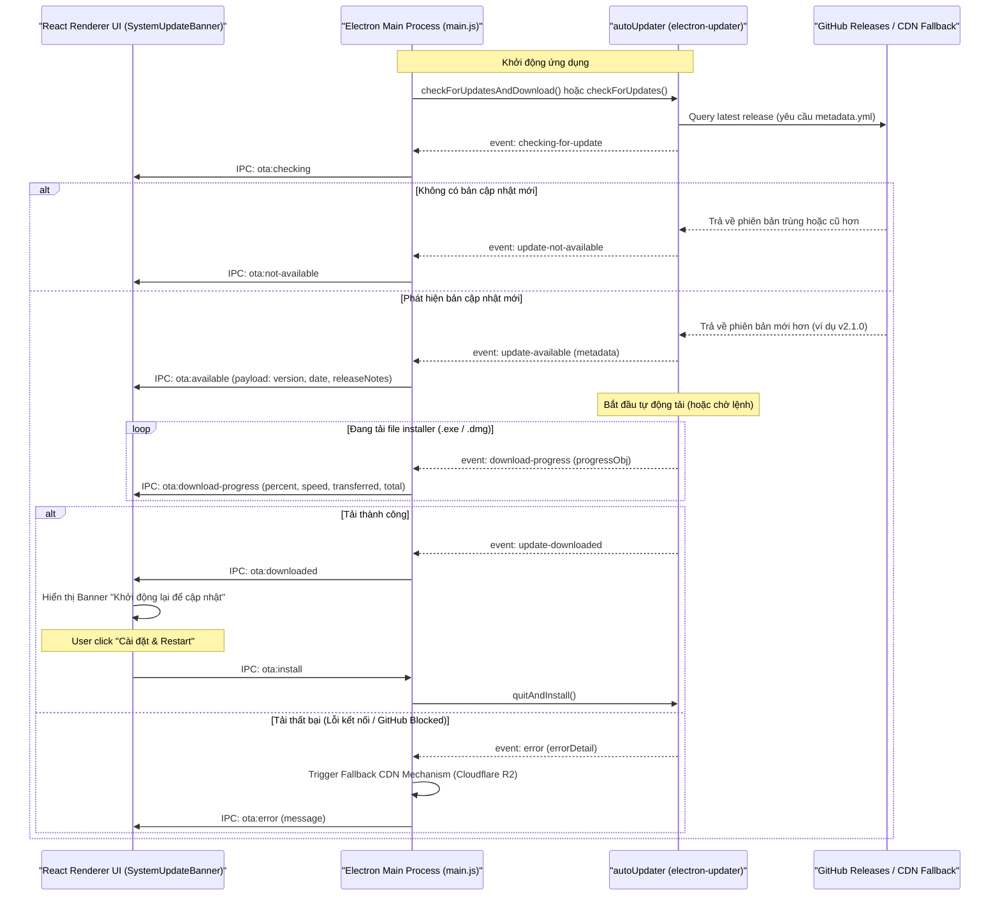
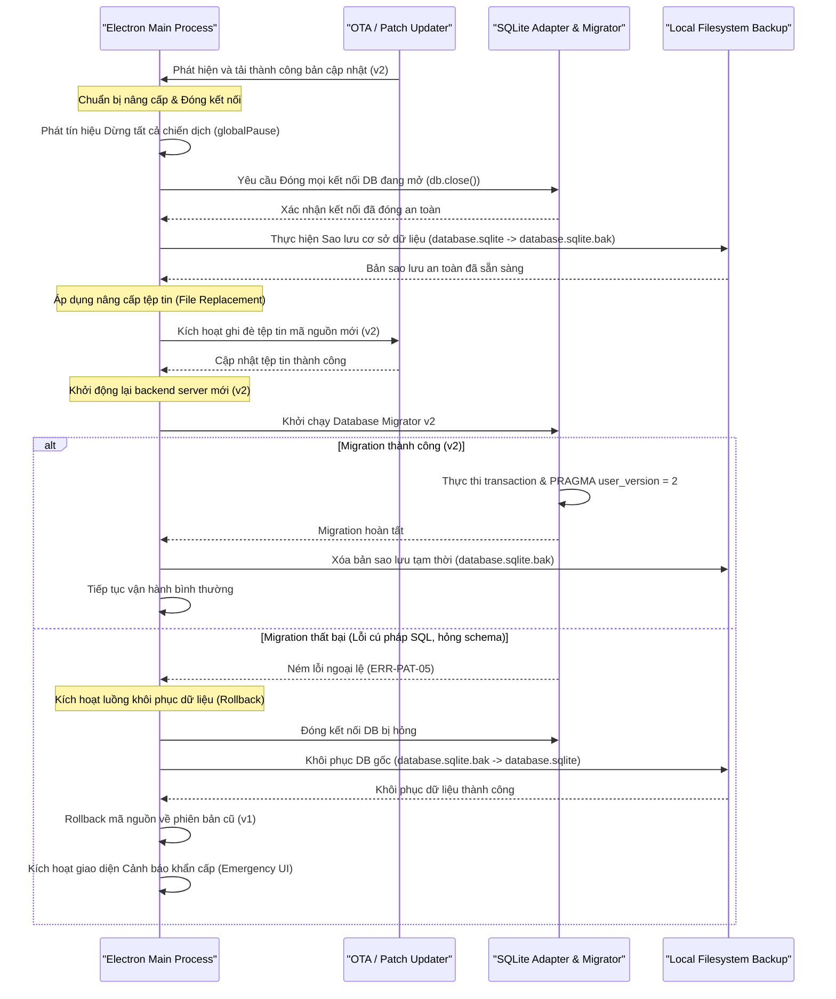

# 🖥️ Hermes FacePost-Group — Spec 10: Windows Desktop Packaging, Auto-Updater & Remote Config

**File:** `facepost_10_desktop_packaging.md`  
**Version:** 1.0.0  
**Ngày tạo:** 2026-06-16  
**Liên quan:** [Spec 01](./facepost_01_chrome_extension.md) · [Spec 03](./facepost_03_dashboard_app.md) · [Spec 07](./facepost_07_dashboard_ui.md) · [Spec 09](./facepost_09_hybrid_extension.md)

---

## 🚨 CRITICAL WARNINGS — ĐỌC TRƯỚC KHI IMPLEMENT

> [!IMPORTANT]
> **Khóa bảo mật IPC (Inter-Process Communication):** Tuyệt đối không bật `nodeIntegration: true` hoặc tắt `contextIsolation` trong `BrowserWindow` của Renderer Process. Mọi giao tiếp giữa Renderer (giao diện React) và Main Process phải đi qua Context Bridge trong `preload.js` với các API được định nghĩa rõ ràng. Điều này ngăn chặn việc chạy mã độc từ UI trong môi trường Node.js có đặc quyền hệ thống.

> [!WARNING]
> **Quản lý Vòng đời Server Nền (Background Server Lifecycle):** Khi khởi chạy ứng dụng Electron, Express server và WebSocket server (Spec 03) phải được khởi chạy dưới dạng một mô-đun tích hợp bên trong Main Process hoặc tiến trình phụ được quản lý chặt chẽ. Khi ứng dụng Electron thoát, tất cả các tiến trình con (bao gồm cả các trình duyệt Chrome do `chrome_launcher.js` khởi chạy) phải được kill sạch để tránh tạo ra tiến trình rác (zombie processes).

---

## 1. Tổng Quan Kiến Trúc Desktop App

### 1.1 Kiến trúc Electron Wrapper (Chromium + Node.js Runtime)

Hệ thống **Hermes FacePost-Group** sử dụng framework **Electron** để đóng gói toàn bộ giải pháp thành một ứng dụng Desktop chạy trên hệ điều hành Windows. Kiến trúc này đóng vai trò là một "vỏ bọc" (wrapper) tích hợp hai thành phần cốt lõi:
1. **Chromium Engine:** Chịu trách nhiệm render giao diện đồ họa (Dashboard UI) hiển thị cho người dùng cuối với đầy đủ khả năng hỗ trợ HTML5, CSS3 (bao gồm cả neon theme) và React.
2. **Node.js Runtime:** Cung cấp môi trường thực thi phía server, cho phép ứng dụng truy cập trực tiếp vào hệ thống tệp tin (Local Filesystem) để đọc/ghi cơ sở dữ liệu SQLite, khởi chạy các ứng dụng con (spawn subprocess như Chrome), và duy trì kết nối mạng thông qua WebSocket Server cục bộ.

Sơ đồ phân tầng kiến trúc của Desktop App:

```
┌─────────────────────────────────────────────────────────────────────────┐
│                           HERMES DESKTOP APP                            │
├────────────────────────────────────┬────────────────────────────────────┤
│         RENDERER PROCESS           │            MAIN PROCESS            │
│       (Giao diện người dùng)       │       (Môi trường Node.js)         │
├────────────────────────────────────┼────────────────────────────────────┤
│  • Dashboard UI (React/Vite)       │  • Khởi tạo ứng dụng & Cửa sổ      │
│  • Live Agent Grid                 │  • System Tray (Minimize to Tray)  │
│  • Account Health Status           │  • Express & WebSocket Server      │
│  • Realtime Logs Rendering         │  • Local SQLite Database Engine    │
│  • Chrome Launcher Controller      │  • Auto-Updater & Remote Config    │
└──────────────────┬─────────────────┴──────────────────┬─────────────────┘
                   │                                    │
                   │           IPC Context Bridge       │
                   └────────────────────────────────────┘
```

---

### 1.2 Vai trò của Main Process và Renderer Process

Sự phân chia vai trò rõ ràng giữa hai tiến trình là yếu tố cốt lõi đảm bảo tính bảo mật và hiệu năng của hệ thống:

| Đặc tính | Main Process (Tiến trình chính) | Renderer Process (Tiến trình hiển thị) |
| :--- | :--- | :--- |
| **Môi trường chạy** | Node.js Runtime hoàn chỉnh | Chromium (Vùng an toàn - Sandbox) |
| **Số lượng** | Duy nhất một tiến trình cho mỗi ứng dụng | Một hoặc nhiều tiến trình (tương ứng với mỗi cửa sổ) |
| **Quyền truy cập OS** | Đầy đủ quyền (đọc/ghi tệp, gọi lệnh hệ thống, mạng) | Bị giới hạn nghiêm ngặt, không có quyền truy cập OS trực tiếp |
| **Nhiệm vụ chính** | - Quản lý vòng đời ứng dụng (khởi tạo, thoát).<br>- Tạo và quản lý các cửa sổ `BrowserWindow`.<br>- Tích hợp System Tray và Menu thông qua `tray.js`.<br>- Khởi động Express/WebSocket backend server.<br>- Thực hiện IPC listeners nhận yêu cầu từ UI. | - Render giao diện người dùng (Dashboard UI).<br>- Xử lý các sự kiện click, nhập liệu từ người dùng.<br>- Gửi yêu cầu dữ liệu thông qua HTTP/WS đến local backend.<br>- Gửi yêu cầu hệ thống (như mở Chrome, đổi proxy) qua IPC. |
| **IPC Bridge** | Lắng nghe qua `ipcMain.on` và `ipcMain.handle` | Gọi yêu cầu qua `window.electronAPI` (do `preload.js` cung cấp) |

---

### 1.3 Tích hợp System Tray (Khay Hệ Thống)

Để hệ thống hoạt động ổn định như một dịch vụ chạy ngầm điều phối các tài khoản Facebook, ứng dụng cần hỗ trợ tính năng System Tray. Khi người dùng nhấn nút đóng cửa sổ (X), ứng dụng không tắt hoàn toàn mà chỉ ẩn cửa sổ xuống khay hệ thống nhằm đảm bảo các chiến dịch đăng bài (Campaigns) không bị gián đoạn.

#### Cơ chế hoạt động:
* **Minimize to Tray:** Lắng nghe sự kiện `close` của `BrowserWindow`. Thay vì hủy cửa sổ (`destroy`), ứng dụng sẽ gọi sự kiện ẩn (`hide()`) và hiển thị thông báo bong bóng (ballon notification) ở góc màn hình.
* **Restore from Tray:** Nhấp đúp (Double-click) vào biểu tượng Tray sẽ gọi cửa sổ hiển thị trở lại (`show()`) và đưa lên tiêu điểm (`focus()`).
* **Tray Menu:** Nhấp chuột phải hiển thị danh sách các lối tắt điều khiển nhanh (được triển khai chi tiết ở `tray.js`).

---

### 1.4 Giao tiếp WebSocket với Chrome Extension

Cốt lõi của hệ thống tự động hóa Hermes là kết nối WebSocket thời gian thực giữa **Local Backend Server** (chạy bên trong Desktop App) và **Chrome Extension** (chạy trên trình duyệt Chrome được launcher mở ra).

Sơ đồ luồng giao tiếp:

```
┌───────────────────────────┐                  ┌───────────────────────────┐
│     CHROME EXTENSION      │                  │     LOCAL BACKEND SERVER  │
│  (Ghost / Diplomat Mode)  │                  │   (Chạy ngầm trong App)   │
└─────────────┬─────────────┘                  └─────────────┬─────────────┘
              │                                              │
              │  [1] WS Connection (ws://localhost:8765/ws)  │
              ├─────────────────────────────────────────────>│
              │                                              │
              │  [2] HELLO Handshake (HMAC + mode + ext_id)  │
              ├─────────────────────────────────────────────>│
              │                                              │
              │  [3] WELCOME (Trả về list features được cấp) │
              │<─────────────────────────────────────────────┤
              │                                              │
              │  [4] Gửi lệnh tự động (Ví dụ: CLICK_ELEMENT) │
              │<─────────────────────────────────────────────┤ (Chỉ áp dụng với
              │                                              │  Ghost Mode)
              │  [5] Phản hồi kết quả / Gửi ảnh chụp màn hình│
              ├─────────────────────────────────────────────>│
              │                                              │
```

* **CWS Diplomat Extension (Spec 09):** Kết nối ở chế độ `SAFE`. Chỉ được phép gửi dữ liệu đồng bộ nhóm Facebook (Sync Groups) về server. Mọi lệnh điều khiển tự động (CLICK_ELEMENT, TYPE_TEXT, v.v.) từ server gửi xuống sẽ bị chặn ngay tại `wsServer.js` (Error: `ERR-HYB-02`).
* **GitHub Ghost Extension (Spec 01/09):** Kết nối ở chế độ `AGENTIC_OS`. Yêu cầu xác thực chữ ký HMAC-SHA256 bảo mật sử dụng `authSecret` lưu trữ tại máy cục bộ. Sau khi handshake thành công, server cấp toàn quyền điều khiển tự động (full agentic power), cho phép truyền nhận dữ liệu nhạy cảm (DOM nén, screenshots, và các lệnh mô phỏng hành vi chuột Bezier).

---

## 2. Cấu Trúc Thư Mục Electron Project

Ứng dụng desktop được cấu trúc tập trung dưới thư mục `hermes-desktop/`. Thư mục này tích hợp cả mã nguồn chạy ứng dụng Electron, thư mục server cục bộ (chạy Express/SQLite) và thư mục lưu trữ static files của giao diện Dashboard React.

### 2.1 File Tree dưới `hermes-desktop/`

```
hermes-desktop/
├── package.json                   # Cấu hình dự án, dependencies và build scripts
├── electron-builder.yml           # Cấu hình đóng gói ứng dụng bằng electron-builder
├── main.js                        # File chạy chính của Electron (Main Process)
├── preload.js                     # Secure bridge trung gian giữa Main và Renderer
├── tray.js                        # Quản lý khởi tạo và sự kiện cho System Tray
├── assets/                        # Thư mục lưu trữ tài nguyên tĩnh của ứng dụng
│   ├── app-icon.ico               # Icon ứng dụng trên Windows (.ico)
│   ├── app-icon.png               # Icon ứng dụng định dạng PNG
│   └── tray-icon.png              # Icon hiển thị trên System Tray (16x16 / 32x32)
├── server/                        # Backend Server (Được symlink từ dự án dashboard)
│   ├── package.json               # Dependencies của server (express, sqlite3, ws)
│   ├── server.js                  # Điểm khởi chạy Express & WebSocket Server (thay thế index.js cũ)
│   ├── db.js                      # Kết nối và quản trị database SQLite
│   ├── schema.sql                 # File định nghĩa cấu trúc bảng SQLite
│   ├── campaign_manager.js        # Điều phối các chiến dịch đăng bài
│   ├── proxy_rotator.js           # Xử lý xoay vòng proxy
│   └── websocket/
│       └── wsServer.js            # WebSocket server tiếp nhận kết nối từ Extension
├── build/                         # Thư mục Dashboard UI (React/Vite đã build static, thống nhất từ client/dist)
│   ├── index.html                 # Điểm vào ứng dụng phía giao diện khách
│   └── assets/                    # Các bundle file Javascript và CSS của React App
│       ├── index-c7a8b9.js
│       └── index-e3f4a5.css
└── extension/                     # Bản Ghost Extension đóng gói kèm để load unpacked
    ├── manifest.json              # File manifest của Ghost Extension (Spec 09)
    ├── background.js              # Service Worker của Ghost Extension
    ├── offscreen.html             # Offscreen Document host
    ├── offscreen.js               # Quản lý kết nối WS của Extension
    ├── content.js                 # DOM manipulator hoạt động trên tab Facebook
    └── ...
```

### 2.2 Liên kết Symlinks và Tích hợp Tài nguyên

1. **Tích hợp Server (`server/`):** Để tránh trùng lặp mã nguồn giữa dự án Backend độc lập và ứng dụng Desktop, thư mục `server/` trong môi trường phát triển được cấu hình dạng **Symbolic Link (Symlink)** trỏ thẳng tới thư mục gốc của dự án `dashboard/`. Trong giai đoạn đóng gói (`npm run dist`), `electron-builder` sẽ giải quyết liên kết tượng trưng này và sao chép toàn bộ tệp vật lý vào thư mục lưu trữ ứng dụng (`app.asar`).
2. **Tài nguyên Client tĩnh (`build/`):** React Dashboard UI được phát triển độc lập trong một thư mục frontend riêng biệt. Khi phát hành ứng dụng, lập trình viên sẽ thực thi build dự án React thành tệp tĩnh (`html`, `css`, `js`), sau đó copy toàn bộ thư mục `dist/` kết quả vào `hermes-desktop/build/`. Electron sẽ tải tệp tĩnh này trực tiếp thông qua cơ chế `mainWindow.loadFile()`.
3. **Đóng gói Extension (`extension/`):** Bản Ghost Extension được tích hợp trực tiếp vào tệp lưu trữ ứng dụng. Khi khởi chạy trình duyệt Chrome để bắt đầu tự động hóa đăng bài, launcher (`chrome_launcher.js`) sẽ trích xuất đường dẫn tuyệt đối của thư mục `extension/` này từ file `.asar` (hoặc copy ra thư mục tạm nếu Chrome cần ghi đè) và truyền tham số `--load-extension` vào Chrome CLI flags. Điều này giúp hệ thống hoạt động tự động mà không yêu cầu người dùng phải tự tải extension thủ công trên Internet.

---

## 3. Main Process (`main.js`)

Main Process của Electron (`main.js`) đóng vai trò là xương sống điều phối toàn bộ ứng dụng desktop. Nó chịu trách nhiệm quản lý vòng đời ứng dụng, khởi tạo giao diện người dùng (Renderer Process), vận hành Express server dưới dạng tiến trình con (Child Process), duy trì System Tray và thiết lập cấu hình tự động khởi chạy cùng Windows (Auto-launch).

### 3.1 Cấu hình BrowserWindow & Tải Client React

Renderer Process hiển thị giao diện React được đóng gói trong thư mục tĩnh. Nhằm tối ưu hóa bảo mật, `BrowserWindow` được cấu hình nghiêm ngặt với `contextIsolation: true` và `nodeIntegration: false`, giao tiếp với Main Process chỉ thông qua một file `preload.js` được định nghĩa trước.

```javascript
// main.js - Khởi tạo BrowserWindow và tải client
const { app, BrowserWindow, ipcMain, dialog } = require('electron');
const path = require('path');
const url = require('url');
const crypto = require('crypto');
const { createTray, destroyTray } = require('./tray');

let mainWindow = null;
let expressProcess = null;
let isQuitting = false;
let uiAuthToken = null;

// Sinh token xác thực WebSocket ngẫu nhiên cho phiên này
function generateUiAuthToken() {
  uiAuthToken = crypto.randomBytes(32).toString('hex');
  return uiAuthToken;
}

function createMainWindow() {
  mainWindow = new BrowserWindow({
    width: 1280,
    height: 800,
    minWidth: 1024,
    minHeight: 768,
    show: false, // Tránh hiện tượng nháy trắng khi khởi tạo
    webPreferences: {
      nodeIntegration: false,
      contextIsolation: true,
      sandbox: true,
      preload: path.join(__dirname, 'preload.js')
    },
    icon: path.join(__dirname, 'assets', 'app-icon.png')
  });

  // Tải React Client Build
  if (app.isPackaged) {
    mainWindow.loadURL(
      url.format({
        pathname: path.join(__dirname, 'build', 'index.html'),
        protocol: 'file:',
        slashes: true
      })
    );
  } else {
    // Trong môi trường Development, kết nối tới React Dev Server
    mainWindow.loadURL('http://localhost:3001');
    mainWindow.webContents.openDevTools();
  }

  mainWindow.once('ready-to-show', () => {
    mainWindow.show();
  });

  mainWindow.on('close', (event) => {
    // Thay vì thoát hoàn toàn, ẩn vào khay hệ thống
    if (!isQuitting) {
      event.preventDefault();
      mainWindow.hide();
    }
    return false;
  });
}
```

---

### 3.2 Vận hành Express Server dưới dạng Child Process

Express server đóng vai trò backend quản trị cơ sở dữ liệu SQLite cục bộ, xử lý logic chiến dịch và giao tiếp WebSocket. Để không làm nghẽn Main Process (đơn luồng), Express server được khởi chạy độc lập như một `Child Process` qua hàm `spawn` từ Node.js.

> [!IMPORTANT]
> Trong môi trường production đã đóng gói, Node.js không được đảm bảo cài sẵn trên hệ điều hành của máy client. Do đó, Main Process sẽ sử dụng chính file thực thi Electron (`process.execPath`) với biến môi trường `ELECTRON_RUN_AS_NODE: '1'` để vận hành file JavaScript của Express Server (`server/server.js`). Kỹ thuật này giúp tái sử dụng V8 Engine bên trong Electron mà không cần bất kỳ dependency ngoại vi nào.

```javascript
// main.js - Vận hành Express Server dưới dạng Child Process
const { spawn } = require('child_process');
const fs = require('fs');

function startExpressServer() {
  const isPackaged = app.isPackaged;
  const userDataPath = app.getPath('userData'); // C:\Users\<Username>\AppData\Roaming\Hermes FacePost-Group
  
  // Tạo thư mục logs nếu chưa tồn tại
  const logDir = path.join(userDataPath, 'logs');
  if (!fs.existsSync(logDir)) {
    fs.mkdirSync(logDir, { recursive: true });
  }
  
  const logFile = path.join(logDir, 'express.log');
  const logStream = fs.createWriteStream(logFile, { flags: 'a' });

  // Định nghĩa đường dẫn thực thi server
  let serverPath;
  if (isPackaged) {
    // Trong môi trường production, server được trích xuất ra thư mục app.asar.unpacked
    serverPath = path.join(process.resourcesPath, 'app.asar.unpacked', 'server', 'server.js');
  } else {
    // Trong môi trường development
    serverPath = path.join(__dirname, 'server', 'server.js');
  }

  // Cấu hình biến môi trường riêng biệt cho Express Server
  const env = {
    ...process.env,
    PORT: '8765',
    NODE_ENV: isPackaged ? 'production' : 'development',
    APPDATA_DIR: userDataPath,
    DATABASE_PATH: path.join(userDataPath, 'database.sqlite'), // Thống nhất tên file DB
    LOGS_PATH: logDir,
    UI_AUTH_TOKEN: uiAuthToken, // Truyền token bảo mật ngẫu nhiên
    ELECTRON_RUN_AS_NODE: '1' // Buộc Electron thực thi file JS như Node.js process
  };

  logStream.write(`[Electron Main] Khởi chạy Express Server tại: ${serverPath}\n`);

  // Spawn tiến trình con
  expressProcess = spawn(process.execPath, [serverPath], {
    env,
    stdio: ['ignore', logStream, logStream] // Chuyển hướng stdout & stderr trực tiếp vào file express.log
  });

  expressProcess.on('error', (err) => {
    logStream.write(`[Electron Main] LỖI KHỞI CHẠY EXPRESS SERVER: ${err.message}\n`);
    dialog.showErrorBox('Express Server Error', 'Không thể khởi động Express Server: ' + err.message);
  });

  expressProcess.on('exit', (code, signal) => {
    logStream.write(`[Electron Main] Express Server thoát với Code: ${code}, Signal: ${signal}\n`);
    // Tự động khôi phục tiến trình (Self-healing) nếu Express crash ngoài ý muốn (loại trừ trường hợp exit code 99 để chạy bản vá module)
    if (!isQuitting) {
      if (code === 99) {
        logStream.write(`[Electron Main] Express Server thoát với mã 99 (Yêu cầu khởi chạy lại sau bản vá). Đang tiến hành khởi chạy lại...\n`);
      } else {
        logStream.write(`[Electron Main] Đang khởi động lại Express Server sau sự cố crash...\n`);
      }
      setTimeout(startExpressServer, 2000);
    }
  });
}
```

---

### 3.3 Tự khởi chạy cùng Windows (Auto-launch) qua Windows Registry

Ứng dụng cung cấp cấu hình tự khởi chạy khi khởi động hệ điều hành Windows để đảm bảo hệ thống luôn trực chiến. Electron cung cấp API native thông qua `app.setLoginItemSettings`. Dưới đây là cách triển khai hoàn chỉnh.

```javascript
// main.js - Tự động khởi chạy cùng Windows & điều khiển ứng dụng
function setupAutoLaunch(enabled) {
  if (process.platform !== 'win32' || !app.isPackaged) {
    return;
  }

  try {
    app.setLoginItemSettings({
      openAtLogin: enabled,
      path: process.execPath,
      args: [
        '--hidden' // Tham số báo cho Main Process khởi động ẩn trực tiếp vào tray
      ]
    });
  } catch (err) {
    console.error('Không thể cấu hình Auto-Launch registry:', err);
  }
}

// Xử lý tham số '--hidden' khi chạy ứng dụng
app.whenReady().then(() => {
  generateUiAuthToken();
  startExpressServer();
  
  const shouldStartHidden = process.argv.includes('--hidden');
  
  createMainWindow();
  createTray(mainWindow); // Sử dụng module tray.js tách biệt
  
  if (shouldStartHidden && mainWindow) {
    mainWindow.hide(); // Ẩn ngay khi khởi động cùng Win
  }
});

// Lắng nghe sự kiện IPC từ Renderer (UI) yêu cầu tắt toàn bộ ứng dụng
ipcMain.on('force-quit-app', () => {
  isQuitting = true;
  app.quit();
});

// Đợi tín hiệu điều khiển auto-launch từ UI
ipcMain.on('settings:set-auto-launch', (event, enabled) => {
  setupAutoLaunch(enabled);
});

// Trả về token bảo mật cho UI qua preload
ipcMain.on('get-ui-token', (event) => {
  event.returnValue = uiAuthToken;
});

// Phơi bày đường dẫn App path cho preload
ipcMain.on('get-app-path', (event) => {
  event.returnValue = app.getPath('userData');
});

// Đảm bảo dừng Express Server trước khi thoát ứng dụng
app.on('before-quit', () => {
  isQuitting = true;
  destroyTray();
  if (expressProcess) {
    expressProcess.kill();
  }
});

app.on('window-all-closed', () => {
  if (process.platform !== 'darwin') {
    app.quit();
  }
});
```

---

## 4. Installer & Build Configuration (`electron-builder`)

Việc đóng gói và phân phối ứng dụng desktop được thực hiện thông qua `electron-builder`. Quy trình này bao gồm việc nén các file JavaScript, tối ưu hóa ASAR và cấu hình bộ cài đặt Windows NSIS (Nullsoft Scriptable Install System).

### 4.1 Cấu hình `electron-builder.yml`

```yaml
# electron-builder.yml
appId: com.hermes.facepost.group
productName: Hermes FacePost-Group
copyright: Copyright © 2026 Hermes Group

directories:
  output: dist
  buildResources: build

# Chỉ định các tài nguyên sẽ đóng gói
files:
  - build/**/*
  - main.js
  - preload.js
  - tray.js
  - package.json

# Đưa thư mục server và thư viện better-sqlite3 ra ngoài ASAR do chứa các file binary C++ compiled
extraResources:
  - from: server/
    to: server
    filter:
      - "**/*"
      - "!database.sqlite"
      - "!logs/**/*"
  - from: node_modules/better-sqlite3/
    to: node_modules/better-sqlite3
    filter:
      - "**/*"

# Cấu hình nén ASAR nhưng loại trừ các file thực thi nhị phân
asar: true
asarUnpack:
  - "**/node_modules/better-sqlite3/**/*"

# Cấu hình đóng gói cho Windows
win:
  target:
    - target: nsis
      arch:
        - x64
  icon: assets/app-icon.ico
  publish:
    - provider: github
      owner: hermes-empire
      repo: facepost-desktop
      vPrefixedTagName: true
      private: true

# Cấu hình trình cài đặt NSIS
nsis:
  oneClick: false                           # Tắt chế độ cài đặt 1-click để hiển thị giao diện tùy chọn cho người dùng
  allowToChangeInstallationDirectory: true  # Cho phép người dùng tùy chỉnh đường dẫn cài đặt
  allowElevation: true                      # Yêu cầu quyền Admin khi cài đặt để thiết lập Registry chính xác
  shortcutName: "Hermes FacePost-Group"      # Tên Shortcut trên màn hình Desktop và Start Menu
  createDesktopShortcut: always             # Luôn tạo shortcut ngoài Desktop
  createStartMenuShortcut: true             # Tạo shortcut trong Start Menu
  installerIcon: assets/installer.ico
  uninstallerIcon: assets/uninstaller.ico
  uninstallDisplayName: "Hermes FacePost-Group (Uninstall)"
  installationDirectoryString: "$LOCALAPPDATA\\Programs\\Hermes" # Đường dẫn mặc định (không yêu cầu quyền admin cấp cao nhất)
  include: build/installer.nsh              # Custom NSIS script để can thiệp vào logic gỡ cài đặt
  runAfterFinish: true                      # Cho phép chạy ứng dụng ngay sau khi kết thúc cài đặt
```

---

### 4.2 Xử lý Logic Cleanup khi Gỡ Cài Đặt (SQLite Preservation vs Removal)

Khi người dùng gỡ cài đặt ứng dụng, hệ thống cần xử lý khôn ngoan để bảo vệ dữ liệu công việc của họ. Ta sử dụng custom NSIS script thông qua file `build/installer.nsh` được tích hợp vào tiến trình gỡ cài đặt của NSIS. Người dùng sẽ được hỏi thông qua hộp thoại:
- Chọn **Yes** (Xóa sạch): Xóa toàn bộ thư mục dữ liệu bao gồm Database SQLite (`database.sqlite`), cấu hình cấu trúc nhóm và file log hoạt động để trả lại sạch sẽ bộ nhớ hệ thống.
- Chọn **No** (Giữ lại): Giữ nguyên cơ sở dữ liệu và cấu hình tại thư mục `%APPDATA%/Hermes FacePost-Group` để khi cài đặt bản mới hoặc nâng cấp ứng dụng, người dùng không bị mất dữ liệu phiên làm việc.

Tạo file `build/installer.nsh` với nội dung sau:

```nsis
; build/installer.nsh
; Định nghĩa macro can thiệp tiến trình Uninstaller của NSIS

!macro customUnInstall
  ; Hiển thị hộp thoại Yes/No cho người dùng xác nhận
  MessageBox MB_YESNO|MB_ICONQUESTION "Bạn có muốn xóa sạch toàn bộ cơ sở dữ liệu chiến dịch (SQLite) và tệp tin log của ứng dụng Hermes không? (Chọn YES để xóa toàn bộ, chọn NO để bảo toàn dữ liệu cho phiên cài đặt sau)" IDNO keepData
    ; Thực hiện xóa sạch nếu chọn YES
    DetailPrint "Đang dọn dẹp thư mục cấu hình và Database tại AppData..."
    RMDir /r "$APPDATA\Hermes FacePost-Group"
    Goto done

  keepData:
    ; Chỉ xóa thư mục binary của chương trình cài đặt, giữ lại folder chứa dữ liệu ở AppData Roaming
    DetailPrint "Đã bảo toàn thư mục dữ liệu SQLite và cấu hình tại: $APPDATA\Hermes FacePost-Group"

  done:
!macroend
```

---

### 4.3 Tách biệt module khay hệ thống (`tray.js`)

Để đảm bảo kiến trúc sạch sẽ và mô-đun hóa, logic System Tray được tách ra khỏi `main.js` và cài đặt trong tệp `tray.js` như sau:

```javascript
// tray.js
const { Tray, Menu, app, ipcMain } = require('electron');
const path = require('path');

let tray = null;

function createTray(mainWindow) {
  const iconPath = app.isPackaged
    ? path.join(process.resourcesPath, 'app.asar', 'assets', 'app-icon.ico') 
    : path.join(__dirname, 'assets', 'app-icon.ico');

  tray = new Tray(iconPath);
  
  const trayMenu = Menu.buildFromTemplate([
    { 
      label: 'Mở Dashboard', 
      click: () => {
        if (mainWindow) {
          mainWindow.show();
          mainWindow.focus();
        }
      } 
    },
    { type: 'separator' },
    {
      label: 'Dừng Tất Cả Trình Duyệt',
      click: () => {
        // Gửi lệnh đóng các trình duyệt chrome con
        if (mainWindow && mainWindow.webContents) {
          mainWindow.webContents.send('agent:stop-all-browsers');
        }
      }
    },
    { type: 'separator' },
    { 
      label: 'Thoát Hoàn Toàn', 
      click: () => {
        app.isQuiting = true;
        // Gửi sự kiện cho main process force quit
        ipcMain.emit('force-quit-app');
      } 
    }
  ]);

  tray.setToolTip('Hermes FacePost Manager');
  tray.setContextMenu(trayMenu);

  tray.on('double-click', () => {
    if (mainWindow) {
      mainWindow.show();
      mainWindow.focus();
    }
  });
}

function destroyTray() {
  if (tray) {
    tray.destroy();
    tray = null;
  }
}

module.exports = {
  createTray,
  destroyTray
};
```

---

### 4.4 Build Scripts & Native Modules Recompilation (`better-sqlite3`)

Vì ứng dụng sử dụng SQLite (`better-sqlite3`) - một module Node.js dạng native (được biên dịch từ mã nguồn C++), ta bắt buộc phải biên dịch lại (rebuild) module này tương ứng với phiên bản Node.js/V8 được nhúng bên trong Electron đang sử dụng.

Dưới đây là file `package.json` cấu hình đầy đủ và duy nhất các npm scripts để tự động hóa toàn bộ quy trình: xây dựng React build, biên dịch lại native module bằng `electron-rebuild` và đóng gói bộ cài qua `electron-builder`.

```json
{
  "name": "hermes-facepost-desktop",
  "version": "1.0.0",
  "description": "Ứng dụng Desktop quản trị chiến dịch đăng bài tự động Hermes",
  "main": "main.js",
  "scripts": {
    "clean": "rimraf build dist",
    "react:build": "vite build --outDir build",
    "build": "npm run react:build",
    "rebuild:sqlite": "electron-rebuild -f -w better-sqlite3",
    "prepack": "npm run clean && npm run build && npm run rebuild:sqlite",
    "dist": "electron-builder build --windows --config electron-builder.yml",
    "pack": "electron-builder --dir"
  },
  "dependencies": {
    "better-sqlite3": "^9.4.3",
    "express": "^4.19.2",
    "ws": "^8.16.0",
    "axios": "^1.7.2",
    "adm-zip": "^0.5.12",
    "electron-log": "^5.1.5"
  },
  "devDependencies": {
    "electron": "^30.0.1",
    "electron-builder": "^24.13.3",
    "electron-rebuild": "^3.2.9",
    "rimraf": "^5.0.5",
    "vite": "^5.2.11"
  }
}
```

---

## 5. Auto-Updater OTA (electron-updater)

Cơ chế cập nhật OTA (Over-The-Air) toàn phần chịu trách nhiệm kiểm tra, tải về và cài đặt các bản cập nhật lớn của ứng dụng desktop thông qua thư viện `electron-updater`.

### 5.1 Quy trình Map Event của Updater

Vòng đời kiểm tra và tải bản cập nhật của `electron-updater` được theo dõi thông qua các sự kiện (events). Dưới đây là sơ đồ luồng ánh xạ sự kiện từ Main Process sang Renderer Process (React UI):



---

### 5.2 Hiện thực mã nguồn cập nhật trong `main.js`

Dưới đây là mã nguồn tích hợp `electron-updater` trong file `main.js` của Electron Main Process, bao gồm xử lý lỗi kết nối và cơ chế chuyển đổi CDN động sang Cloudflare R2:

```javascript
// Thêm vào main.js các cấu hình cập nhật
const { autoUpdater } = require('electron-updater');
const log = require('electron-log');

autoUpdater.logger = log;
autoUpdater.logger.transports.file.level = 'info';

let isFallbackActive = false;
const CLOUDFLARE_R2_CDN_URL = 'https://cdn.hermes-facepost.io/updates/';

autoUpdater.autoDownload = true;
autoUpdater.autoInstallOnAppQuit = true;

function sendUpdateStatus(channel, payload = {}) {
  if (mainWindow && mainWindow.webContents) {
    mainWindow.webContents.send(channel, payload);
  }
}

autoUpdater.on('checking-for-update', () => {
  log.info('Đang kiểm tra bản cập nhật mới...');
  sendUpdateStatus('ota:checking');
});

autoUpdater.on('update-available', (info) => {
  log.info('Phát hiện bản cập nhật mới:', info.version);
  sendUpdateStatus('ota:available', {
    version: info.version,
    releaseDate: info.releaseDate,
    releaseNotes: info.releaseNotes || 'Không có mô tả chi tiết.'
  });
});

autoUpdater.on('update-not-available', (info) => {
  log.info('Ứng dụng hiện tại đã là bản mới nhất.');
  sendUpdateStatus('ota:not-available', {
    version: info.version
  });
});

autoUpdater.on('error', (err) => {
  log.error('Lỗi updater:', err.toString());
  if (!isFallbackActive && (err.message.includes('github') || err.message.includes('ERR_CONNECTION_TIMED_OUT') || err.message.includes('status code 404'))) {
    log.warn('Không thể kết nối tới GitHub Releases. Kích hoạt cơ chế Fallback CDN qua Cloudflare R2...');
    activateFallbackCDN();
  } else {
    sendUpdateStatus('ota:error', {
      message: isFallbackActive 
        ? 'Lỗi tải xuống từ máy chủ dự phòng CDN Cloudflare R2.' 
        : `Lỗi kết nối GitHub Releases: ${err.message}`
    });
  }
});

autoUpdater.on('download-progress', (progressObj) => {
  sendUpdateStatus('ota:download-progress', {
    percent: Math.round(progressObj.percent),
    bytesPerSecond: progressObj.bytesPerSecond,
    transferred: progressObj.transferred,
    total: progressObj.total
  });
});

autoUpdater.on('update-downloaded', (info) => {
  log.info('Tải bản cập nhật hoàn tất. Sẵn sàng cài đặt.');
  sendUpdateStatus('ota:downloaded', {
    version: info.version
  });
});

function activateFallbackCDN() {
  isFallbackActive = true;
  autoUpdater.setFeedURL({
    provider: 'generic',
    url: CLOUDFLARE_R2_CDN_URL
  });
  log.info(`Đã đổi Feed URL sang CDN: ${CLOUDFLARE_R2_CDN_URL}`);
  autoUpdater.checkForUpdates().catch(err => {
    log.error('Lỗi khi quét cập nhật trên Fallback CDN R2:', err);
    sendUpdateStatus('ota:error', {
      message: 'Không thể kết nối với cả máy chủ chính và máy chủ dự phòng Cloudflare R2.'
    });
  });
}

// IPC triggers
ipcMain.on('ota:check-trigger', () => {
  autoUpdater.checkForUpdates().catch(err => {
    log.error('Lỗi kích hoạt kiểm tra cập nhật:', err);
  });
});

ipcMain.on('ota:install-trigger', () => {
  log.info('Nhận lệnh cài đặt từ Renderer. Tiến hành khởi động lại ứng dụng...');
  autoUpdater.quitAndInstall();
});

// Tự động quét cập nhật sau 5s khởi tạo
app.whenReady().then(() => {
  setTimeout(() => {
    autoUpdater.checkForUpdates().catch(err => {
      log.error('Không thể quét cập nhật tự động lúc khởi tạo:', err);
    });
  }, 5000);
});
```

---

### 5.3 Giao tiếp IPC & Tích hợp UI Component `SystemUpdateBanner`

#### 5.3.1 Cấu hình trong `preload.js`

Để đảm bảo bảo mật theo nguyên lý Context Isolation, các API cập nhật và giao tiếp native chỉ được truyền qua cầu nối `preload.js` dưới dạng các function kiểm soát:

```javascript
// preload.js
const { contextBridge, ipcRenderer } = require('electron');

contextBridge.exposeInMainWorld('electronAPI', {
  // Nhận token bảo mật của UI
  getUiToken: () => ipcRenderer.sendSync('get-ui-token'),
  
  // Quản lý khởi động cùng Windows
  setAutoLaunch: (enabled) => ipcRenderer.send('settings:set-auto-launch', enabled),

  // Giao tiếp điều khiển native Chrome window
  focusChromeWindow: (accountId) => ipcRenderer.send('agent:focus-chrome', accountId),

  // Đăng ký nhận sự kiện cập nhật hệ thống
  onUpdateStatus: (callback) => {
    ipcRenderer.on('ota:checking', (event, data) => callback('checking', data));
    ipcRenderer.on('ota:available', (event, data) => callback('available', data));
    ipcRenderer.on('ota:not-available', (event, data) => callback('not-available', data));
    ipcRenderer.on('ota:download-progress', (event, data) => callback('progress', data));
    ipcRenderer.on('ota:downloaded', (event, data) => callback('downloaded', data));
    ipcRenderer.on('ota:error', (event, data) => callback('error', data));

    return () => {
      ipcRenderer.removeAllListeners('ota:checking');
      ipcRenderer.removeAllListeners('ota:available');
      ipcRenderer.removeAllListeners('ota:not-available');
      ipcRenderer.removeAllListeners('ota:download-progress');
      ipcRenderer.removeAllListeners('ota:downloaded');
      ipcRenderer.removeAllListeners('ota:error');
    };
  },
  triggerUpdateCheck: () => ipcRenderer.send('ota:check-trigger'),
  triggerInstall: () => ipcRenderer.send('ota:install-trigger')
});
```

---

## 6. Modular Patch Update (Cập nhật bản vá dạng Module)

### 6.1 Triết lý & Logic Patch-based Update

Hệ thống thiết kế cơ chế **Cập nhật bản vá dạng Module (Modular Patch Update)** để chỉ thay thế các folder cụ thể (`extension/`, `client/`, `server/`) thay vì bắt người dùng tải installer 100MB cho thay đổi nhỏ.

---

### 6.2 Cấu trúc Schema `update-manifest.json`

File `update-manifest.json` được định nghĩa theo chuẩn JSON Schema Draft-07 dưới đây để bảo mật định dạng dữ liệu truyền tải.

#### 6.2.1 JSON Schema của Manifest (`update-manifest-schema.json`)

```json
{
  "$schema": "http://json-schema.org/draft-07/schema#",
  "title": "HermesModularPatchManifest",
  "type": "object",
  "required": ["version", "releaseDate", "minAppVersion", "modules"],
  "additionalProperties": false,
  "properties": {
    "version": { "type": "string" },
    "releaseDate": { "type": "string", "format": "date-time" },
    "minAppVersion": { "type": "string" },
    "modules": {
      "type": "object",
      "required": ["extension", "client", "server"],
      "additionalProperties": false,
      "properties": {
        "extension": { "$ref": "#/definitions/moduleUpdateInfo" },
        "client": { "$ref": "#/definitions/moduleUpdateInfo" },
        "server": { "$ref": "#/definitions/moduleUpdateInfo" }
      }
    }
  },
  "definitions": {
    "moduleUpdateInfo": {
      "type": "object",
      "required": ["version", "sha256", "packageUrl", "size"],
      "additionalProperties": false,
      "properties": {
        "version": { "type": "string" },
        "sha256": { "type": "string", "pattern": "^[a-fA-F0-9]{64}$" },
        "packageUrl": { "type": "string", "format": "uri" },
        "size": { "type": "integer", "minimum": 0 }
      }
    }
  }
}
```

---

### 6.3 Cơ chế Hash Check (SHA-256) cho các Module

Để xác định module cục bộ có cần cập nhật hay không, ứng dụng thực hiện so sánh mã băm thông qua script `dirHasher.js` được tích hợp trong thư viện phụ trợ của ứng dụng.

---

### 6.4 Script Cập nhật File-Level & Quy tắc Loại trừ

Bản cập nhật patch **tuyệt đối không** được ghi đè lên các tệp tin cấu hình môi trường, cơ sở dữ liệu sqlite, hoặc cache cục bộ.

#### 6.4.1 Script `patchUpdater.js`

```javascript
// src/main/patchUpdater.js
const fs = require('fs');
const path = require('path');
const https = require('https');
const crypto = require('crypto');
const admZip = require('adm-zip'); 
const log = require('electron-log');

const APP_PATH = path.join(__dirname, '../..'); 
const METADATA_FILE = path.join(APP_PATH, 'modules.json');

const BLACKLISTED_FILES = [
  '.env',
  'database.sqlite',
  'database.sqlite-journal',
  'database.sqlite-wal',
  'modules.json',
  'config.json'
];

const BLACKLISTED_DIRS = [
  'node_modules',
  'logs',
  'cache',
  '.git'
];

function downloadFile(url, destPath) {
  return new Promise((resolve, reject) => {
    const file = fs.createWriteStream(destPath);
    https.get(url, (response) => {
      if (response.statusCode !== 200) {
        reject(new Error(`Tải file thất bại, HTTP status: ${response.statusCode}`));
        return;
      }
      response.pipe(file);
      file.on('finish', () => file.close(() => resolve()));
    }).on('error', (err) => {
      fs.unlink(destPath, () => {}); 
      reject(err);
    });
  });
}

function getFileSHA256(filePath) {
  return new Promise((resolve, reject) => {
    const hash = crypto.createHash('sha256');
    const stream = fs.createReadStream(filePath);
    stream.on('data', (data) => hash.update(data));
    stream.on('end', () => resolve(hash.digest('hex')));
    stream.on('error', (err) => reject(err));
  });
}

function loadLocalMetadata() {
  if (!fs.existsSync(METADATA_FILE)) {
    const initialMetadata = {
      version: '2.0.0',
      modules: {
        extension: { version: '2.0.0', sha256: '' },
        client: { version: '2.0.0', sha256: '' },
        server: { version: '2.0.0', sha256: '' }
      }
    };
    fs.writeFileSync(METADATA_FILE, JSON.stringify(initialMetadata, null, 2), 'utf-8');
    return initialMetadata;
  }
  
  try {
    return JSON.parse(fs.readFileSync(METADATA_FILE, 'utf-8'));
  } catch (e) {
    log.error('Lỗi phân tích cú pháp modules.json. Reset file.');
    return {
      version: '2.0.0',
      modules: {
        extension: { version: '2.0.0', sha256: '' },
        client: { version: '2.0.0', sha256: '' },
        server: { version: '2.0.0', sha256: '' }
      }
    };
  }
}

function updateLocalMetadata(metadata) {
  fs.writeFileSync(METADATA_FILE, JSON.stringify(metadata, null, 2), 'utf-8');
}

function extractPatch(zipPath, targetDir) {
  return new Promise((resolve, reject) => {
    try {
      const zip = new admZip(zipPath);
      const zipEntries = zip.getEntries();
      
      if (!fs.existsSync(targetDir)) {
        fs.mkdirSync(targetDir, { recursive: true });
      }

      zipEntries.forEach((entry) => {
        const entryName = entry.entryName;
        const targetFilePath = path.join(targetDir, entryName);
        
        const baseName = path.basename(entryName);
        if (BLACKLISTED_FILES.includes(baseName)) {
          return;
        }

        const isPathInBlacklistDir = BLACKLISTED_DIRS.some(dir => {
          return entryName.startsWith(dir + '/') || entryName.split('/')[0] === dir;
        });

        if (isPathInBlacklistDir) {
          return;
        }

        if (entry.isDirectory) {
          if (!fs.existsSync(targetFilePath)) {
            fs.mkdirSync(targetFilePath, { recursive: true });
          }
        } else {
          const content = entry.getData();
          const parentDir = path.dirname(targetFilePath);
          if (!fs.existsSync(parentDir)) {
            fs.mkdirSync(parentDir, { recursive: true });
          }
          fs.writeFileSync(targetFilePath, content);
        }
      });
      resolve();
    } catch (err) {
      reject(err);
    }
  });
}

async function performModularPatchUpdate(manifestUrl) {
  log.info(`Bắt đầu truy vấn tệp cập nhật bản vá: ${manifestUrl}`);
  
  const tempManifestPath = path.join(APP_PATH, 'temp_manifest.json');
  
  try {
    await downloadFile(manifestUrl, tempManifestPath);
    const remoteManifest = JSON.parse(fs.readFileSync(tempManifestPath, 'utf-8'));
    fs.unlinkSync(tempManifestPath); 

    const localMetadata = loadLocalMetadata();
    const modulesToUpdate = [];
    const moduleNames = ['extension', 'client', 'server'];

    for (const modName of moduleNames) {
      const remoteMod = remoteManifest.modules[modName];
      const localMod = localMetadata.modules[modName];

      if (remoteMod && (remoteMod.version !== localMod.version || remoteMod.sha256 !== localMod.sha256)) {
        modulesToUpdate.push({
          name: modName,
          remoteInfo: remoteMod
        });
      }
    }

    if (modulesToUpdate.length === 0) {
      log.info('Tất cả các module cục bộ đã là bản vá mới nhất.');
      return { success: true, updated: false };
    }

    log.info(`Phát hiện ${modulesToUpdate.length} module cần cập nhật bản vá.`);

    for (const mod of modulesToUpdate) {
      const { name, remoteInfo } = mod;
      log.info(`Tiến hành cập nhật module [${name}] lên phiên bản ${remoteInfo.version}...`);

      const zipDestPath = path.join(APP_PATH, `patch_${name}_temp.zip`);
      const targetDir = path.join(APP_PATH, name);
      const backupDir = path.join(APP_PATH, `${name}_old_backup`);

      await downloadFile(remoteInfo.packageUrl, zipDestPath);

      const downloadedHash = await getFileSHA256(zipDestPath);
      if (downloadedHash !== remoteInfo.sha256) {
        throw new Error(`Mã băm SHA-256 của file zip tải về không khớp cấu hình! Tải về: ${downloadedHash}, Cấu hình: ${remoteInfo.sha256}`);
      }

      if (fs.existsSync(targetDir)) {
        if (fs.existsSync(backupDir)) {
          fs.rmSync(backupDir, { recursive: true, force: true });
        }
        fs.renameSync(targetDir, backupDir);
      }

      try {
        await extractPatch(zipDestPath, targetDir);
        log.info(`Giải nén bản vá thành công cho module: [${name}]`);

        if (fs.existsSync(backupDir)) {
          fs.rmSync(backupDir, { recursive: true, force: true });
        }
        fs.unlinkSync(zipDestPath); 

        localMetadata.modules[name].version = remoteInfo.version;
        localMetadata.modules[name].sha256 = remoteInfo.sha256;
        localMetadata.version = remoteManifest.version;
        updateLocalMetadata(localMetadata);

      } catch (extractErr) {
        log.error(`Lỗi giải nén module [${name}]. Tiến hành khôi phục sao lưu (Rollback)...`, extractErr);
        if (fs.existsSync(backupDir)) {
          if (fs.existsSync(targetDir)) {
            fs.rmSync(targetDir, { recursive: true, force: true });
          }
          fs.renameSync(backupDir, targetDir);
        }
        if (fs.existsSync(zipDestPath)) {
          fs.unlinkSync(zipDestPath);
        }
        throw extractErr;
      }
    }

    log.info('Quá trình cập nhật các module hoàn tất thành công. Khởi chạy lại Express server để hoàn tất cập nhật.');
    process.exit(99); // Exit với mã 99 để Main process spawn lại Express
    return { success: true, updated: true };

  } catch (err) {
    log.error('Lỗi tổng quan quá trình cập nhật bản vá:', err);
    if (fs.existsSync(tempManifestPath)) {
      fs.unlinkSync(tempManifestPath);
    }
    return { success: false, error: err.message };
  }
}

module.exports = { performModularPatchUpdate };
```

---

### 6.5 Phối hợp Đồng bộ giữa OTA/Patch Updater và Database Migrator

Khi ứng dụng Desktop thực hiện nâng cấp thông qua trình cập nhật nhị phân (OTA) hoặc bản vá phân đoạn (Modular Patch Update), có nguy cơ xảy ra lỗi xung đột ghi dữ liệu hoặc hỏng cấu trúc cơ sở dữ liệu nếu không quản lý chặt chẽ vòng đời của kết nối SQLite. Thiết kế dưới đây định nghĩa luồng tương tác và cơ chế bảo vệ dữ liệu khách hàng.

#### 6.5.1 Sơ đồ Phối hợp Hoạt động (OTA - DB Migrator Flow)



#### 6.5.2 Chi tiết các Bước trong Luồng An toàn

1. **Đóng kết nối & Dừng Tiến trình (Graceful Shutdown & Lock Control):**
   - Trước khi bất kỳ tệp tin nào được ghi đè hoặc ứng dụng được khởi động lại để cập nhật, Main Process gọi lệnh `CampaignManager.globalPause()` (Spec 03) để chuyển tất cả các chiến dịch đang chạy về trạng thái `PAUSED` và dừng ghi vào DB.
   - Gọi phương thức đóng kết nối SQLite: `db.close()`. Bước này giải phóng toàn bộ lock ghi/đọc, đảm bảo các file phụ trợ của SQLite như WAL (`.sqlite-wal`) và Journal (`.sqlite-journal`) được commit hoàn toàn và xóa sạch khỏi đĩa cứng, gom tất cả dữ liệu chưa commit vào tệp `.sqlite` chính.

2. **Cơ chế Sao lưu Tạm thời (Pre-Update Database Snapshot):**
   - Main Process thực hiện sao chép đồng bộ tệp cơ sở dữ liệu chính từ đường dẫn dữ liệu người dùng (`appDataDir/database.sqlite`) sang tệp sao lưu tạm thời (`appDataDir/database.sqlite.bak`).
   - Quá trình nâng cấp chỉ được phép tiếp tục nếu thao tác sao lưu thành công 100%.

3. **Thực thi Bản vá & Khởi tạo Migration:**
   - Ứng dụng tiến hành ghi đè mã nguồn mới hoặc chạy trình cài đặt mới.
   - Khi server Node.js backend khởi động lại, SQLite Adapter kết nối lại với file `database.sqlite` gốc và chạy `runMigrations()` như mô tả ở Spec 03.
   - Các câu lệnh SQL thay đổi schema (ví dụ: `ALTER TABLE`, `CREATE TABLE`) được thực thi độc quyền ghi bằng `IMMEDIATE transaction`.

4. **Kịch bản Khôi phục khi Gặp Sự cố (Automatic Database Recovery):**
   - Nếu quá trình chạy di cư (`runMigrations()`) thất bại tại bất kỳ tệp SQL nào:
     - `migrationRunner.js` ném lỗi ngoại lệ và làm sập tiến trình khởi chạy server (Fail-Fast).
     - Main Process bắt được sự kiện thoát tiến trình Express Server với lỗi di cư sẽ tự động chặn việc mở giao diện sử dụng bình thường.
     - Hệ thống thực hiện đóng kết nối DB hỏng, xóa file `database.sqlite` bị lỗi cấu trúc, và đổi tên file sao lưu `database.sqlite.bak` ngược lại thành `database.sqlite` để khôi phục trạng thái ban đầu của dữ liệu người dùng.
     - Sau khi khôi phục dữ liệu thành công, hệ thống sẽ tự động rollback phiên bản mã nguồn của các thư mục module (nếu là Patch Update) về bản cũ dựa trên bản lưu trước đó (`_old_backup`).
     - Hiển thị hộp thoại khẩn cấp `EmergencyEscalationGateway` trên UI để thông báo cho người dùng và gửi báo cáo lỗi kỹ thuật về máy chủ trung tâm.

---

## 7. Remote Config Service

### 7.1 Ví dụ JSON Cấu hình từ xa (Remote Config JSON Example)

Tất cả các phản hồi từ máy chủ Remote Config phải tuân thủ cấu trúc mẫu dưới đây:

```json
{
  "llm_settings": {
    "primary": {
      "provider": "openai",
      "model": "gpt-4o",
      "api_endpoint": "https://api.openai.com/v1/chat/completions",
      "timeout_ms": 15000
    },
    "fallback": {
      "provider": "anthropic",
      "model": "claude-3-5-sonnet-20241022",
      "api_endpoint": "https://api.anthropic.com/v1/messages",
      "timeout_ms": 20000
    }
  },
  "feature_flags": {
    "content_engine_v2": true,
    "maintenance_mode": false,
    "scheduler_v2": true,
    "enable_auto_update": true,
    "experimental_facebook_api": false
  },
  "announcements": {
    "id": "announcement_2026_06_16_01",
    "title": "Bảo trì Hệ thống Định kỳ",
    "message": "Hệ thống sẽ tiến hành bảo trì API đăng bài vào lúc 02:00 AM đến 04:00 AM ngày 20/06/2026 (Giờ Việt Nam). Vui lòng không lên lịch đăng bài trong khung giờ này.",
    "type": "warning",
    "show_until": "2026-06-20T04:00:00Z",
    "action_url": "https://hermes-post.com/status"
  },
  "client_settings": {
    "sync_interval_ms": 3600000,
    "min_supported_version": "1.0.0",
    "max_payload_size_kb": 2048
  }
}
```

### 7.2 Giải pháp Lưu trữ Cấu hình (Hosting Options)

Hỗ trợ 2 phương pháp lưu trữ cấu hình:
1. **GitHub Pages Static JSON (Free):** Dành cho cấu hình tĩnh không phân chia version client.
2. **Cloudflare Workers với Workers KV (Free 100K req/ngày):** Cho phép kiểm tra Header `X-App-Version`, `X-App-Platform` để trả cấu hình tương thích động.

---

### 7.3 Logic Đồng bộ Client & Cơ chế Dự phòng (Client Poll & Fallback Logic)

Trong Electron Main Process, `RemoteConfigService.js` chịu trách nhiệm đồng bộ cấu hình, lưu cache SQLite và khôi phục khi ngoại tuyến.

```javascript
// RemoteConfigService.js
const axios = require('axios');
const sqlite3 = require('better-sqlite3');
const path = require('path');
const { app } = require('electron');

class RemoteConfigService {
  constructor() {
    const dbPath = path.join(app.getPath('userData'), 'database.sqlite'); // Dùng chung file database
    this.db = new sqlite3(dbPath);
    this.initializeDatabase();
    
    this.configUrl = "https://config.hermes-post.workers.dev"; 
    this.pollTimer = null;
    
    this.defaultConfig = {
      llm_settings: {
        primary: { provider: "openai", model: "gpt-4o", api_endpoint: "https://api.openai.com/v1/chat/completions", timeout_ms: 15000 },
        fallback: { provider: "anthropic", model: "claude-3-5-sonnet-20241022", api_endpoint: "https://api.anthropic.com/v1/messages", timeout_ms: 20000 }
      },
      feature_flags: { content_engine_v2: false, maintenance_mode: false, scheduler_v2: false, enable_auto_update: false },
      announcements: null,
      client_settings: { sync_interval_ms: 3600000, min_supported_version: "1.0.0" }
    };
    
    this.currentConfig = { ...this.defaultConfig };
  }

  initializeDatabase() {
    this.db.prepare(`
      CREATE TABLE IF NOT EXISTS system_settings (
        key TEXT PRIMARY KEY,
        value TEXT,
        updated_at TIMESTAMP DEFAULT CURRENT_TIMESTAMP
      )
    `).run();
  }

  async fetchRemoteConfig() {
    try {
      const response = await axios.get(this.configUrl, {
        headers: {
          'X-App-Version': app.getVersion(),
          'X-App-Platform': process.platform
        },
        timeout: 10000 
      });

      if (response.status === 200 && response.data) {
        this.currentConfig = response.data;
        this.cacheConfigToLocal(response.data);
        return this.currentConfig;
      }
    } catch (error) {
      const cached = this.getCachedConfigFromLocal();
      if (cached) {
        this.currentConfig = cached;
      } else {
        this.currentConfig = this.defaultConfig;
      }
      return this.currentConfig;
    }
  }

  cacheConfigToLocal(config) {
    const stmt = this.db.prepare('INSERT OR REPLACE INTO system_settings (key, value, updated_at) VALUES (?, ?, CURRENT_TIMESTAMP)');
    stmt.run('remote_config', JSON.stringify(config));
  }

  getCachedConfigFromLocal() {
    try {
      const row = this.db.prepare('SELECT value FROM system_settings WHERE key = ?').get('remote_config');
      if (row && row.value) {
        return JSON.parse(row.value);
      }
    } catch (err) {
      console.error("[RemoteConfig] Lỗi truy vấn SQLite Cache:", err);
    }
    return null;
  }

  startPolling() {
    if (this.pollTimer) clearInterval(this.pollTimer);
    const interval = this.currentConfig.client_settings?.sync_interval_ms || 3600000;
    this.pollTimer = setInterval(async () => {
      await this.fetchRemoteConfig();
    }, interval);
  }

  stopPolling() {
    if (this.pollTimer) clearInterval(this.pollTimer);
  }

  getCurrentConfig() {
    return this.currentConfig;
  }
}

module.exports = new RemoteConfigService();
```

---

## 8. Code Signing & Windows SmartScreen

### 8.1 Thực tế về Windows SmartScreen và Chứng chỉ Authenticode
* EV Certificate ($350-700/năm) cho độ uy tín tức thì.
* OV Certificate ($100-250/năm) yêu cầu tích lũy lượt tải để SmartScreen tin tưởng.

### 8.2 Hướng dẫn Từng Bước Bypass SmartScreen trong Giai đoạn Beta
1. Tải `Hermes_Setup.exe`.
2. Chạy file → Hộp thoại Defender chặn.
3. Click vào **"More info"** dưới dòng tiêu đề cảnh báo.
4. Click nút **"Run anyway"** ở góc phải để cài đặt.

### 8.3 Thiết lập Ký Mã Nguồn Miễn phí Qua SignPath.io cho Dự án Open-Source
Đăng ký qua SignPath, xác minh mã nguồn mở trên GitHub, và sử dụng GitHub Actions workflow để ký tự động.

---

## 9. CI/CD Pipeline (GitHub Actions)

### 9.1 Quy trình Biên dịch Module Native SQLite
Pipeline sử dụng môi trường `windows-2022` để chạy `electron-rebuild` đảm bảo biên dịch native module tương thích với nền tảng Windows đích.

### 9.2 File Cấu hình GitHub Actions Hoàn chỉnh (`.github/workflows/release.yml`)

```yaml
name: Production Release Build

on:
  push:
    tags:
      - 'v*' 

permissions:
  contents: write

jobs:
  build_and_release:
    name: Compile and Package App (Windows x64)
    runs-on: windows-2022

    steps:
      - name: Checkout Source Code
        uses: actions/checkout@v4
        with:
          submodules: recursive

      - name: Setup Node.js Environment
        uses: actions/setup-node@v4
        with:
          node-version: 20.11.0
          cache: 'npm'

      - name: Install Node.js Dependencies
        run: |
          npm ci
        env:
          npm_config_build_from_source: true

      - name: Compile and Bundle Frontend Assets (React build)
        run: |
          npm run build
        env:
          NODE_ENV: production

      - name: Rebuild Native SQLite Modules for Electron
        run: |
          npx electron-rebuild -f -w better-sqlite3
        shell: bash

      - name: Execute Electron-Builder to Package Application
        run: |
          npx electron-builder --windows --config electron-builder.yml
        env:
          GITHUB_TOKEN: ${{ secrets.GITHUB_TOKEN }}

      - name: Publish Artifacts to GitHub Releases
        uses: softprops/action-gh-release@v2
        with:
          tag_name: ${{ github.ref_name }}
          name: Release ${{ github.ref_name }}
          body: "Automated production build for release ${{ github.ref_name }}."
          draft: false
          prerelease: false
          files: |
            dist/*.exe
            dist/*.blockmap
            dist/latest.yml
        env:
          GITHUB_TOKEN: ${{ secrets.GITHUB_TOKEN }}
```

---

## 10. Phụ Lục: Error Codes Module OTA & Patch

| Code | Phân Hệ | Mô Tả Lỗi | Nơi Phát Sinh | Phương Pháp Tự Phục Hồi |
| :--- | :--- | :--- | :--- | :--- |
| `ERR-OTA-01` | autoUpdater | Gặp lỗi bắt tay mạng / GitHub API timeout | `main.js` | Tự động chuyển vùng feed URL sang Cloudflare R2 CDN gương soi |
| `ERR-OTA-02` | autoUpdater | Không tìm thấy tệp tin cập nhật (404) | `main.js` | Báo cáo lỗi lên giao diện `SystemUpdateBanner` để user thử lại thủ công |
| `ERR-OTA-03` | autoUpdater | Bản vá đã tải bị hỏng checksum hoặc lỗi ghi file disk | `main.js` | Hủy file tải lỗi, yêu cầu quét lại cập nhật từ đầu |
| `ERR-PAT-01` | patchUpdater | Tải file zip patch lỗi giữa chừng | `patchUpdater.js` | Hủy tiến trình tải, xóa tệp zip temp |
| `ERR-PAT-02` | patchUpdater | Mã băm SHA-256 của file zip patch tải về bị sai lệch | `patchUpdater.js` | Xóa ngay file zip bị hỏng, ghi log báo cáo máy chủ và dừng tiến trình cập nhật để chống mã độc ghi đè |
| `ERR-PAT-03` | patchUpdater | Giải nén ZIP hoặc ghi đè thư mục lỗi | `patchUpdater.js` | **Cơ chế Rollback & Leo thang:** Đóng/hủy giải nén, khôi phục lại thư mục cũ từ thư mục backup `_old_backup`. Nếu rollback thất bại, trigger `ERR-ESC-24` chuyển FSM về `ESCALATING_HUMAN` để Người dùng duyệt khôi phục thủ công. |
| `ERR-PAT-04` | patchUpdater | Không tìm thấy hoặc lỗi phân tích cú pháp `update-manifest.json` | `patchUpdater.js` | Ghi đè file `modules.json` mặc định và thử lại ở chu kỳ tiếp theo |
| `ERR-PAT-05` | dbMigrations | Lỗi cú pháp SQL hoặc cấu trúc DB khi chạy migration | `db.js` | **Cơ chế Rollback & Phê duyệt:** Rollback transaction của tệp SQL lỗi. Tự động kiểm tra tính toàn vẹn của DB. Nếu hỏng cấu trúc nặng, trigger `ERR-ESC-24` chuyển sang `ESCALATING_HUMAN` và gọi UI kích hoạt `<EmergencyEscalationGateway />` để Người dùng bấm chọn khôi phục bản sao lưu (backup restore). |


---

## Cảnh báo An ninh & Lỗ hổng Kiến trúc

### 🔴 LỖ HỔNG CRITICAL
1. **[SEC-10-01] Lỗ hổng Zip Slip (Directory Traversal) trong Modular Patch Update:**
   - *Rủi ro:* Script `patchUpdater.js` khi giải nén gói cập nhật module (tệp `.zip` vá) bằng `adm-zip` sử dụng trực tiếp thuộc tính `entryName` của tệp nén để ghi file bằng `path.join(targetDir, entryName)`. Kẻ tấn công có thể tiêm mã độc vào máy chủ cập nhật (hoặc tấn công DNS/MITM để giả mạo manifest) và phân phối một tệp zip chứa các đường dẫn tương đối dạng `../../../../Windows/System32/` hoặc `../../AppData/Roaming/Microsoft/Windows/Start Menu/Programs/Startup/` để ghi đè file hệ thống hoặc tự động chạy mã độc (RCE - Remote Code Execution).
   - *Yêu cầu Remediation:* Trước khi giải nén hoặc ghi bất kỳ file nào từ tệp zip patch, bắt buộc phải giải phóng đường dẫn tuyệt đối bằng `path.resolve(targetDir, entryName)` và kiểm tra xem kết quả có bắt đầu bằng đường dẫn thư mục đích hợp lệ hay không: `resolvedPath.startsWith(path.resolve(targetDir) + path.sep)`. Nếu không khớp, từ chối giải nén ngay lập tức và ném lỗi `ERR-PAT-02`.

### 🟠 LỖ HỔNG HIGH
1. **[SEC-10-02] Rò rỉ GitHub Personal Access Token (PAT) trong gói Electron ASAR:**
   - *Rủi ro:* Để kiểm tra và tải cập nhật tự động từ GitHub Private Repository, nếu nhúng trực tiếp GitHub PAT vào cấu hình hoặc mã nguồn Javascript chạy ở phía Client-side (mã nguồn ứng dụng Electron), người dùng cuối có thể dễ dàng sử dụng các công cụ trích xuất ASAR (`asar extract app.asar ./extracted_code`) để lấy mã PAT này. Điều này làm lộ toàn bộ mã nguồn của các kho lưu trữ riêng tư liên quan đến tài khoản PAT đó.
   - *Yêu cầu Remediation:* Nghiêm cấm tuyệt đối việc nhúng GitHub PAT vào mã nguồn phân phối. Phải sử dụng một Cloudflare Workers làm cổng trung gian (Update Proxy Gateway). Electron Client sẽ truy vấn đến Cloudflare Workers mà không cần token. Cloudflare Workers sẽ kiểm tra phiên bản và tự động thêm GitHub PAT vào tiêu đề request trước khi gọi sang GitHub API để lấy thông tin release.
2. **[SEC-10-03] CORS và Cross-Site WebSocket Hijacking (CSWSH) đối với Local Express & WS Server:**
   - *Rủi ro:* Express Server và WebSocket Server chạy nội bộ trên máy khách (cổng `8765`) để giao tiếp với Extension. Nếu không xác thực tiêu đề `Origin` và `Host` cho các kết nối WebSocket, một trang web độc hại bất kỳ mà người dùng đang mở trên trình duyệt thông thường có thể thực hiện kết nối WebSocket đến `ws://localhost:8765` để trích xuất dữ liệu nhạy cảm từ SQLite hoặc gửi lệnh điều khiển giả mạo bot.
   - *Yêu cầu Remediation:* Thiết lập CORS cho Express chỉ cho phép `origin` bắt đầu bằng `file://` của Electron hoặc `chrome-extension://` của Extension ID hợp lệ. Khi nâng cấp kết nối WebSocket (event `upgrade`), bắt buộc kiểm tra tiêu đề `Origin` của request, so khớp với whitelist Extension ID và yêu cầu kèm theo một mã token xác thực động `UI_AUTH_TOKEN` được sinh ngẫu nhiên khi khởi chạy ứng dụng.
3. **[SEC-10-04] Symlink Attack khi giải nén bản vá module:**
   - *Rủi ro:* Thư viện giải nén `adm-zip` mặc định có thể giải nén các liên kết tượng trưng (symlinks). Nếu tệp zip bản vá chứa các liên kết symlink chỉ ra ngoài thư mục ứng dụng (ví dụ liên kết trỏ đến file `.env` chứa API keys hoặc database SQLite), kẻ tấn công có thể đọc hoặc ghi đè dữ liệu nhạy cảm thông qua symlink đó.
   - *Yêu cầu Remediation:* Cấu hình giải nén loại bỏ việc hỗ trợ tạo symlink, hoặc quét tất cả file trong tệp zip trước khi giải nén để đảm bảo không chứa bất kỳ entry nào là symbolic link.
4. **[SEC-10-05] Rò rỉ thông tin cá nhân qua lỗi chuyển hướng log Express:**
   - *Rủi ro:* Khi chuyển hướng stdio và stderr của Express subprocess về tệp log cục bộ (`appData/logs/express.log`), việc ghi nhật ký quá chi tiết mà không lọc (sanitize) các tham số nhạy cảm như API Keys, Cookies tài khoản Facebook, mật khẩu backup của user sẽ làm rò rỉ thông tin đăng nhập trong file text trần trên ổ đĩa.
   - *Yêu cầu Remediation:* Triển khai một bộ lọc (Log Sanitizer) ở cấp độ Express Server để tự động ẩn (mask) các chuỗi nhạy cảm trước khi ghi vào log file.

---

*Spec 10 — Windows Desktop Packaging, Auto-Updater & Remote Config | Version 2.0.0 | 2026-06-17*  
*Tác giả: Hermes FacePost-Group Design Team*  
*Review: Trước khi implement, đọc kỹ Spec 03 (Database), Spec 07 (Electron Context Bridge) và Spec 09 (Hybrid WS).*
