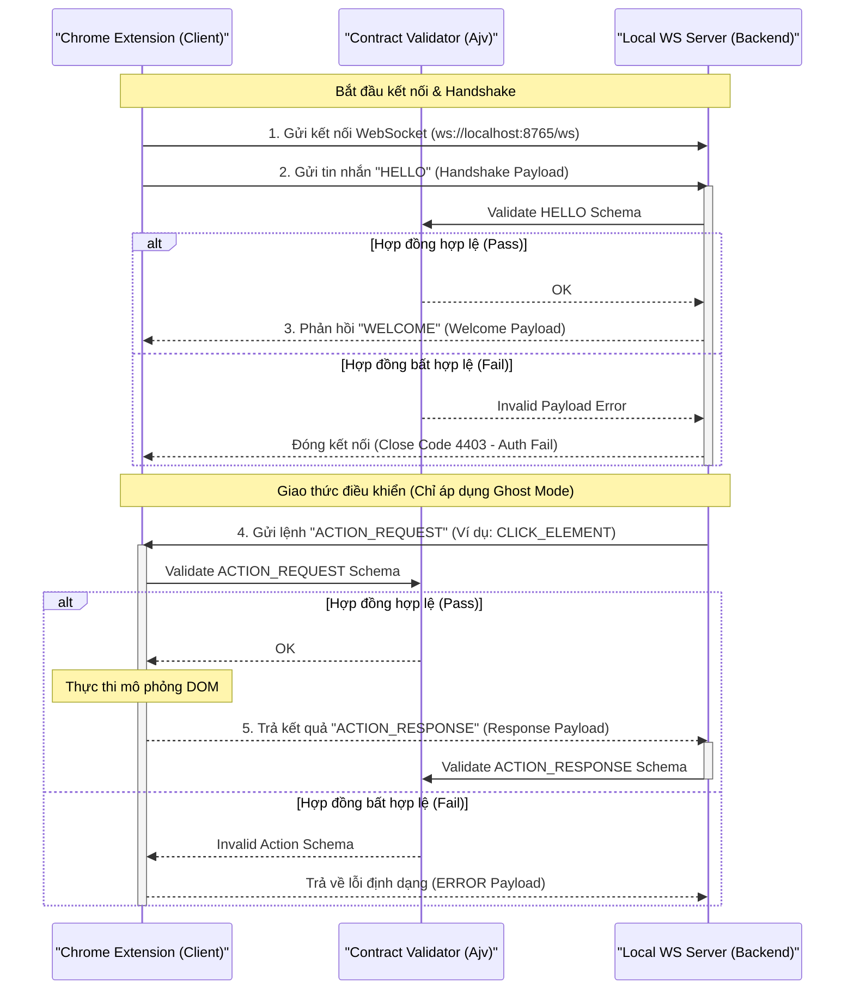

# 🧪 Hermes FacePost-Group — Spec 12: QA Strategy, WebSocket Contract Testing, DOM Sandbox & Local E2E Runner

**File:** `facepost_12_testing_qa.md`  
**Version:** 1.0.0  
**Ngày tạo:** 2026-06-18  
**Liên quan:** [Spec 01](./facepost_01_chrome_extension.md) · [Spec 03](./facepost_03_dashboard_app.md) · [Spec 05](./facepost_05_agent_loop.md) · [Spec 09](./facepost_09_hybrid_extension.md)

---

## 🚨 CRITICAL WARNINGS — ĐỌC TRƯỚC KHI IMPLEMENT

> [!IMPORTANT]
> **Cô Lập Môi Trường WebSocket Test:** Khi thực hiện kiểm thử hợp đồng (contract testing) trên kênh truyền WebSocket, bắt buộc phải sinh và truyền ngẫu nhiên `authSecret` cũng như token xác thực phiên (`UI_AUTH_TOKEN`). Nghiêm cấm sử dụng các token cố định hoặc bỏ qua bước kiểm tra handshake HMAC-SHA256 trong môi trường test, nhằm tránh tạo ra lỗ hổng bảo mật cho phép tiến trình độc hại chiếm quyền điều khiển.

> [!WARNING]
> **Chống Gửi Lệnh Lên Môi Trường Facebook Thật:** Khi vận hành DOM Sandbox hoặc E2E Test Runner, các script tự động hóa tuyệt đối không được phép tương tác với dữ liệu thật hoặc tài khoản Facebook thật khi chưa được chuyển sang chế độ Sandbox/Mock. Mọi tương tác giả lập phải được chỉ định rõ ràng qua cờ môi trường `TEST_ENVIRONMENT=true` và sử dụng máy chủ Mock Facebook để tránh rủi ro quét khóa tài khoản hoặc checkpoint hàng loạt.

> [!CAUTION]
> **Quản Lý Vòng Đời Tiến Trình Con (Zombie Prevention):** Local E2E Test Runner khởi chạy song song các tiến trình Node.js (Express/WS server) và Google Chrome. Hệ thống Test Runner phải có cơ chế đăng ký lắng nghe sự kiện thoát (`SIGINT`, `SIGTERM`, `exit`) và thực thi lệnh tắt cưỡng bức toàn bộ cây tiến trình (process tree killing) để đảm bảo không để lại bất kỳ tiến trình Chrome hoặc Server chạy ngầm nào sau khi test kết thúc hoặc crash.

---

## 1. Chiến Lược & Khung Kiểm Thử Hợp Đồng WebSocket (WebSocket Contract Testing)

Hệ thống điều phối Hermes FacePost-Group dựa trên sự giao tiếp liên tục giữa **Local Backend Server** (Node.js) và **Ghost/Diplomat Extension** (Chrome Content Script/Offscreen). Để đảm bảo hai thành phần này không bị lệch cấu trúc gói tin (payload mismatch) trong quá trình phát triển độc lập, ta áp dụng cơ chế **Contract Testing** sử dụng thư viện **Ajv** để xác thực các Schema JSON.

### 1.1 Sơ Đồ Luồng Trao Đổi Gói Tin & Điểm Validate Hợp Đồng



---

### 1.2 Định Nghĩa Schema JSON Cho Các Tin Nhắn WebSocket Cốt Lõi

Mọi tin nhắn đi qua WebSocket phải có cấu trúc tối thiểu dạng:
```typescript
interface WSMessage {
  type: string;        // Định danh loại tin nhắn
  version: string;     // Phiên bản giao thức (ví dụ: "1.0.0")
  requestId?: string;  // ID duy nhất để map request-response (UUIDv4)
  payload: object;     // Nội dung chi tiết của tin nhắn
}
```

Dưới đây là các định nghĩa Schema JSON chi tiết cho quá trình bắt tay (Handshake) và điều khiển:

#### 1.2.1 Schema cho tin nhắn `HELLO` (Client -> Server)
```json
{
  "$schema": "http://json-schema.org/draft-07/schema#",
  "title": "WSHelloMessage",
  "type": "OBJECT",
  "properties": {
    "type": { "type": "string", "const": "HELLO" },
    "version": { "type": "string", "pattern": "^[0-9]+\\.[0-9]+\\.[0-9]+$" },
    "requestId": { "type": "string", "format": "uuid" },
    "payload": {
      "type": "OBJECT",
      "properties": {
        "extensionId": { "type": "string", "minLength": 32, "maxLength": 32 },
        "mode": { "type": "string", "enum": ["SAFE", "AGENTIC_OS"] },
        "timestamp": { "type": "integer" },
        "signature": { "type": "string", "pattern": "^[a-f0-9]{64}$" }
      },
      "required": ["extensionId", "mode", "timestamp", "signature"],
      "additionalProperties": false
    }
  },
  "required": ["type", "version", "requestId", "payload"],
  "additionalProperties": false
}
```

#### 1.2.2 Schema cho tin nhắn `ACTION_REQUEST` (Server -> Client)
```json
{
  "$schema": "http://json-schema.org/draft-07/schema#",
  "title": "WSActionRequestMessage",
  "type": "OBJECT",
  "properties": {
    "type": { "type": "string", "const": "ACTION_REQUEST" },
    "version": { "type": "string", "pattern": "^[0-9]+\\.[0-9]+\\.[0-9]+$" },
    "requestId": { "type": "string", "format": "uuid" },
    "payload": {
      "type": "OBJECT",
      "properties": {
        "action": { "type": "string", "enum": ["CLICK_ELEMENT", "TYPE_TEXT", "SCROLL_PAGE", "GET_DOM", "SCREENSHOT"] },
        "params": {
          "type": "OBJECT",
          "properties": {
            "selector": { "type": "string" },
            "xpath": { "type": "string" },
            "text": { "type": "string" },
            "delay": { "type": "integer", "minimum": 0 },
            "scrollAmount": { "type": "integer" },
            "fullPage": { "type": "boolean" }
          },
          "additionalProperties": false
        }
      },
      "required": ["action", "params"],
      "additionalProperties": false
    }
  },
  "required": ["type", "version", "requestId", "payload"],
  "additionalProperties": false
}
```

#### 1.2.3 Schema cho tin nhắn `ACTION_RESPONSE` (Client -> Server)
```json
{
  "$schema": "http://json-schema.org/draft-07/schema#",
  "title": "WSActionResponseMessage",
  "type": "OBJECT",
  "properties": {
    "type": { "type": "string", "const": "ACTION_RESPONSE" },
    "version": { "type": "string", "pattern": "^[0-9]+\\.[0-9]+\\.[0-9]+$" },
    "requestId": { "type": "string", "format": "uuid" },
    "payload": {
      "type": "OBJECT",
      "properties": {
        "success": { "type": "boolean" },
        "timestamp": { "type": "integer" },
        "data": {
          "type": "OBJECT",
          "properties": {
            "domTree": { "type": "string" },
            "screenshotBase64": { "type": "string" },
            "clickedCoordinates": {
              "type": "OBJECT",
              "properties": {
                "x": { "type": "number" },
                "y": { "type": "number" }
              },
              "required": ["x", "y"]
            }
          },
          "additionalProperties": true
        },
        "error": {
          "type": "OBJECT",
          "properties": {
            "code": { "type": "string" },
            "message": { "type": "string" }
          },
          "required": ["code", "message"]
        }
      },
      "required": ["success", "timestamp"],
      "additionalProperties": false
    }
  },
  "required": ["type", "version", "requestId", "payload"],
  "additionalProperties": false
}
```

---

### 1.3 Mã Nguồn Kiểm Thử Hợp Đồng Tự Động (Jest + Ajv Validator)

Để triển khai kiểm thử tự động, ta viết tệp `tests/ws_contract.test.js`. Đoạn mã thiết lập một WebSocket Server giả lập (`mock-socket` hoặc `ws`) và kiểm tra tính hợp lệ của tất cả các gói tin đi qua theo các schema đã định nghĩa.

```javascript
// tests/ws_contract.test.js
const WebSocket = require('ws');
const Ajv = require('ajv');
const addFormats = require('ajv-formats');
const crypto = require('crypto');

// Nạp các schema định nghĩa
const helloSchema = require('../specs/schemas/hello.schema.json');
const actionRequestSchema = require('../specs/schemas/action_request.schema.json');
const actionResponseSchema = require('../specs/schemas/action_response.schema.json');

const ajv = new Ajv({ allErrors: true, useDefaults: true });
addFormats(ajv);

const validateHello = ajv.compile(helloSchema);
const validateActionRequest = ajv.compile(actionRequestSchema);
const validateActionResponse = ajv.compile(actionResponseSchema);

describe('WebSocket Contract Test Suite', () => {
  let wss;
  let client;
  let serverSocket;
  const testPort = 9876;
  const mockSecret = 'test-hmac-secret-key-1234567890abcdef';

  beforeAll((done) => {
    // Khởi tạo Mock WebSocket Server
    wss = new WebSocket.Server({ port: testPort }, () => {
      done();
    });

    wss.on('connection', (ws) => {
      serverSocket = ws;
    });
  });

  afterAll((done) => {
    if (client && client.readyState === WebSocket.OPEN) {
      client.close();
    }
    wss.close(() => {
      done();
    });
  });

  test('1. Client gửi HELLO Payload đúng quy chuẩn -> Server nhận và validate thành công', (done) => {
    client = new WebSocket(`ws://localhost:${testPort}`);

    client.on('open', () => {
      const timestamp = Date.now();
      const extensionId = 'abcdefghijklmnopqrstabcdefghijkl'; // 32 chars
      const signaturePayload = `${extensionId}:${timestamp}`;
      const signature = crypto
        .createHmac('sha256', mockSecret)
        .update(signaturePayload)
        .digest('hex');

      const helloMsg = {
        type: 'HELLO',
        version: '1.0.0',
        requestId: '123e4567-e89b-12d3-a456-426614174000',
        payload: {
          extensionId,
          mode: 'AGENTIC_OS',
          timestamp,
          signature
        }
      };

      // Gửi lên server
      client.send(JSON.stringify(helloMsg));
    });

    wss.once('connection', (ws) => {
      ws.once('message', (message) => {
        const receivedData = JSON.parse(message);
        
        // Validate dữ liệu nhận được theo hợp đồng
        const isValid = validateHello(receivedData);
        if (!isValid) {
          console.error('Lỗi validate HELLO:', validateHello.errors);
        }
        
        expect(isValid).toBe(true);
        expect(receivedData.type).toBe('HELLO');
        expect(receivedData.payload.mode).toBe('AGENTIC_OS');
        done();
      });
    });
  });

  test('2. Server gửi ACTION_REQUEST đúng định dạng -> Client validate thành công', (done) => {
    const actionReqMsg = {
      type: 'ACTION_REQUEST',
      version: '1.0.0',
      requestId: '9b1deb4d-3b7d-4bad-9bdd-2b0d7b3dcb6d',
      payload: {
        action: 'CLICK_ELEMENT',
        params: {
          selector: 'button[type="submit"]',
          xpath: '//button[@type="submit"]',
          delay: 500
        }
      }
    };

    // Server gửi xuống Client
    serverSocket.send(JSON.stringify(actionReqMsg));

    client.once('message', (message) => {
      const receivedData = JSON.parse(message);
      
      const isValid = validateActionRequest(receivedData);
      if (!isValid) {
        console.error('Lỗi validate ACTION_REQUEST:', validateActionRequest.errors);
      }

      expect(isValid).toBe(true);
      expect(receivedData.payload.action).toBe('CLICK_ELEMENT');
      expect(receivedData.payload.params.delay).toBe(500);
      done();
    });
  });

  test('3. Client gửi ACTION_RESPONSE chứa kết quả -> Server validate thành công', (done) => {
    const actionResMsg = {
      type: 'ACTION_RESPONSE',
      version: '1.0.0',
      requestId: '9b1deb4d-3b7d-4bad-9bdd-2b0d7b3dcb6d',
      payload: {
        success: true,
        timestamp: Date.now(),
        data: {
          clickedCoordinates: {
            x: 450.5,
            y: 200.2
          }
        }
      }
    };

    // Client gửi ngược lại Server
    client.send(JSON.stringify(actionResMsg));

    serverSocket.once('message', (message) => {
      const receivedData = JSON.parse(message);
      
      const isValid = validateActionResponse(receivedData);
      if (!isValid) {
        console.error('Lỗi validate ACTION_RESPONSE:', validateActionResponse.errors);
      }

      expect(isValid).toBe(true);
      expect(receivedData.payload.success).toBe(true);
      expect(receivedData.payload.data.clickedCoordinates.x).toBe(450.5);
      done();
    });
  });

  test('4. Gửi payload sai cấu trúc -> Hệ thống phát hiện lỗi schema chính xác', () => {
    const badMsg = {
      type: 'HELLO',
      version: 'invalid-semver',
      requestId: 'not-a-uuid',
      payload: {
        extensionId: 'too-short',
        mode: 'INVALID_MODE',
        timestamp: 'should-be-integer',
        signature: 'invalid-hex-signature-length-xyz'
      }
    };

    const isValid = validateHello(badMsg);
    expect(isValid).toBe(false);
    expect(validateHello.errors.length).toBeGreaterThan(0);
  });
});
```

---

## 2. DOM Sandbox & Unit Testing Cho Content Script

Trong môi trường extension, Content Script (`content.js`) trực tiếp can thiệp và đọc/ghi trên DOM của Facebook. Do cấu trúc DOM của Facebook rất phức tạp và thay đổi liên tục, ta cần xây dựng một cơ chế **DOM Sandbox** cục bộ bằng **JSDOM** để kiểm thử đơn vị (Unit Test) cho Content Script mà không cần phụ thuộc vào trình duyệt thật.

### 2.1 Cơ Chế Mock Môi Trường DOM Facebook

Ta tạo dựng các cấu trúc HTML giả lập chính xác các khối giao diện Facebook như:
- Hộp soạn thảo bài viết (Post Editor Dialog).
- Danh sách nhóm (Groups List page).
- Nút đăng bài (Submit button).
- Phần chọn file tải lên (File Uploader).

### 2.2 Viết Unit Test Cho Thuật Toán Dynamic Selector Fallback

Để đối phó với việc Facebook đổi tên class ngẫu nhiên, hệ thống sử dụng thuật toán selector đa lớp (Spec 04). Đoạn mã dưới đây minh họa unit test cho thuật toán tìm kiếm phần tử bằng Dynamic Selector Fallback.

```javascript
// tests/dom_sandbox_content.test.js
const { JSDOM } = require('jsdom');

// Mô phỏng hàm tìm kiếm selector fallback từ content.js
function findElementWithFallback(domDocument, selectorList) {
  for (const selector of selectorList) {
    try {
      if (selector.startsWith('//') || selector.startsWith('xpath=')) {
        // Xử lý tìm XPath
        const cleanXPath = selector.startsWith('xpath=') ? selector.substring(6) : selector;
        const result = domDocument.evaluate(
          cleanXPath,
          domDocument,
          null,
          0, // XPathResult.ANY_TYPE
          null
        );
        const node = result.iterateNext();
        if (node) return node;
      } else {
        // Xử lý CSS Selector
        const node = domDocument.querySelector(selector);
        if (node) return node;
      }
    } catch (err) {
      // Bỏ qua lỗi cú pháp selector, tiếp tục thử fallback tiếp theo
    }
  }
  return null;
}

// Mô phỏng trích xuất danh sách Group từ DOM Facebook
function extractFacebookGroups(domDocument) {
  const groups = [];
  // Facebook thường cấu hình các thẻ link có đường dẫn '/groups/'
  const groupLinks = domDocument.querySelectorAll('a[href*="/groups/"]');
  
  groupLinks.forEach(link => {
    const href = link.getAttribute('href');
    // Trích xuất ID nhóm bằng Regex
    const match = href.match(/\/groups\/([0-9a-zA-Z.]+)/);
    if (match) {
      const groupId = match[1];
      const groupName = link.textContent.trim() || 'Nhóm không tên';
      // Tránh trùng lặp
      if (!groups.some(g => g.id === groupId)) {
        groups.push({ id: groupId, name: groupName, url: href });
      }
    }
  });
  return groups;
}

describe('DOM Sandbox & Selector Fallback Unit Tests', () => {
  let dom;
  let document;

  beforeEach(() => {
    // Khởi tạo Sandbox DOM với cấu trúc HTML giả lập
    dom = new JSDOM(`
      <!DOCTYPE html>
      <html>
        <body>
          <div id="mount_grid">
            <!-- Form soạn thảo bài viết giả lập -->
            <div class="x1i10hfl x1ejq31n" role="dialog" aria-label="Tạo bài viết">
              <div class="notranslate _5rgt _5nk5" role="textbox" contenteditable="true" aria-placeholder="Bạn đang nghĩ gì?">
                Nội dung bài viết mock
              </div>
              <button class="x1n2onr6 x1vjfegm" type="submit" aria-label="Đăng">Đăng bài</button>
            </div>
            
            <!-- Danh sách nhóm sidebar mock -->
            <div role="navigation">
              <a href="https://www.facebook.com/groups/congdonglaptrinhviettel/" class="x1lliihq">Cộng Đồng Lập Trình Viettel</a>
              <a href="/groups/8765432109876/" class="x1lliihq">Chợ Cư Dân Vinhomes Ocean Park</a>
              <a href="/groups/vietnam.developers.jobs" class="x1lliihq">Việc Làm IT Việt Nam</a>
            </div>
          </div>
        </body>
      </html>
    `, {
      url: 'https://www.facebook.com',
      contentType: 'text/html'
    });
    
    document = dom.window.document;
  });

  test('1. Thuật toán Fallback tìm được phần tử soạn thảo khi Facebook đổi Class CSS', () => {
    // Định nghĩa danh sách các selector từ tối ưu đến dự phòng
    const editorSelectors = [
      'div.fb-editor-new-class-xyz', // CSS sai (giả định Facebook mới cập nhật)
      'div[role="textbox"][aria-placeholder*="nghĩ gì"]', // CSS đúng dựa vào ngữ nghĩa (Semantic)
      '//div[@role="textbox"]', // XPath dự phòng
    ];

    const element = findElementWithFallback(document, editorSelectors);
    expect(element).not.toBeNull();
    expect(element.getAttribute('role')).toBe('textbox');
    expect(element.textContent.trim()).toBe('Nội dung bài viết mock');
  });

  test('2. Thuật toán Fallback sử dụng XPath khi tất cả CSS Selector thất bại', () => {
    const buttonSelectors = [
      'button.non-exist-class',
      'xpath=//button[@type="submit" and contains(text(), "Đăng")]', // XPath 1 (Sai text)
      'xpath=//button[@type="submit" and @aria-label="Đăng"]' // XPath 2 (Đúng)
    ];

    const element = findElementWithFallback(document, buttonSelectors);
    expect(element).not.toBeNull();
    expect(element.textContent).toBe('Đăng bài');
    expect(element.tagName).toBe('BUTTON');
  });

  test('3. Trích xuất thành công danh sách nhóm Facebook từ cấu trúc liên kết neo (Anchor Tags)', () => {
    const extractedGroups = extractFacebookGroups(document);
    
    expect(extractedGroups.length).toBe(3);
    
    expect(extractedGroups[0]).toEqual({
      id: 'congdonglaptrinhviettel',
      name: 'Cộng Đồng Lập Trình Viettel',
      url: 'https://www.facebook.com/groups/congdonglaptrinhviettel/'
    });

    expect(extractedGroups[1]).toEqual({
      id: '8765432109876',
      name: 'Chợ Cư Dân Vinhomes Ocean Park',
      url: '/groups/8765432109876/'
    });

    expect(extractedGroups[2]).toEqual({
      id: 'vietnam.developers.jobs',
      name: 'Việc Làm IT Việt Nam',
      url: '/groups/vietnam.developers.jobs'
    });
  });
});
```

---

## 3. Trình Chạy Kiểm Thử E2E Cục Bộ (Local E2E Test Runner)

Trình chạy kiểm thử E2E cục bộ (`local_e2e_runner.js`) chịu trách nhiệm tự động hóa việc cấu hình môi trường kiểm thử hộp đen hoàn chỉnh trên máy local. 

### 3.1 Quy Trình Hoạt Động Của Test Runner

```
[Khởi Chạy Runner]
       │
       ▼
[Tạo Database Test SQLite Tạm Thời] ──► (Sao chép schema.sql, tạo mock data)
       │
       ▼
[Khởi Chạy Local Backend Server] ────► (Gắn PORT và DB_PATH test)
       │
       ▼
[Spawn Chrome với Custom Profile] ───► (Load unpacked Ghost Extension + headless mode nếu có)
       │
       ▼
[Thực Thi Kịch Bản Đăng Bài Test] ───► (Kiểm tra tương tác WebSockets & DOM Sandbox)
       │
       ▼
[Chụp Ảnh Màn Hình / Thu Thập Log] ──► (Lưu vết phục vụ gỡ lỗi)
       │
       ▼
[Dọn Sạch Tài Nguyên & Zombie Chrome] ──► (Kill Chrome PID, kill Server PID, xóa DB test)
       │
       ▼
[Kết Thúc & Xuất Báo Cáo JUnit XML]
```

---

### 3.2 Hiện Thực Mã Nguồn `local_e2e_runner.js`

Dưới đây là mã nguồn Node.js đầy đủ cho runner kiểm thử tích hợp E2E. Nó quản lý tiến trình con, ngăn ngừa zombie process và dọn dẹp sạch tài nguyên đĩa.

```javascript
// agent_harness/local_e2e_runner.js
const { spawn, execSync } = require('child_process');
const path = require('path');
const fs = require('fs');
const db = require('better-sqlite3');

// Cấu hình đường dẫn
const WORKSPACE_DIR = path.resolve(__dirname, '..');
const TEST_DB_PATH = path.join(WORKSPACE_DIR, 'scratch', 'test_database.sqlite');
const TEST_LOGS_DIR = path.join(WORKSPACE_DIR, 'scratch', 'test_logs');
const SCREENSHOTS_DIR = path.join(TEST_LOGS_DIR, 'screenshots');
const EXPRESS_SERVER_PATH = path.join(WORKSPACE_DIR, 'server', 'server.js');
const GHOST_EXT_PATH = path.join(WORKSPACE_DIR, 'extension');

let serverProcess = null;
let chromeProcess = null;

// Hàm hỗ trợ kill cây tiến trình (Process Tree) trên Linux
function killProcessTree(pid) {
  try {
    if (process.platform === 'win32') {
      execSync(`taskkill /pid ${pid} /T /F`);
    } else {
      // Linux/macOS: Gửi tín hiệu kill cho PID và tất cả Group ID con
      execSync(`pkill -P ${pid}`);
      process.kill(pid, 'SIGKILL');
    }
    console.log(`[E2E Runner] Đã tắt sạch tiến trình: ${pid}`);
  } catch (err) {
    console.warn(`[E2E Runner] Cảnh báo khi kill tiến trình ${pid}:`, err.message);
  }
}

// 1. Tạo Database Kiểm Thử Tạm Thời
function setupTestDatabase() {
  console.log('[E2E Runner] Thiết lập Database Test SQLite...');
  if (fs.existsSync(TEST_DB_PATH)) {
    fs.unlinkSync(TEST_DB_PATH);
  }
  
  const sqliteDb = new db(TEST_DB_PATH);
  
  // Khởi tạo bảng từ file schema.sql
  const schemaSql = fs.readFileSync(path.join(WORKSPACE_DIR, 'server', 'schema.sql'), 'utf8');
  sqliteDb.exec(schemaSql);
  
  // Chèn dữ liệu tài khoản và chiến dịch giả lập để test
  sqliteDb.prepare(`
    INSERT INTO accounts (id, username, status, cookie, profile_path) 
    VALUES (?, ?, ?, ?, ?)
  `).run('fb_mock_acc_1001', 'mock_tester', 'ACTIVE', 'c_user=1001; xs=mock_session_key;', 'Default');

  sqliteDb.prepare(`
    INSERT INTO campaigns (id, name, content, status, schedule_time) 
    VALUES (?, ?, ?, ?, ?)
  `).run('camp_e2e_001', 'E2E Campaign Test', 'Nội dung test E2E gửi từ runner', 'PENDING', Date.now());

  sqliteDb.close();
  console.log('[E2E Runner] Tạo Database Test thành công.');
}

// 2. Khởi chạy Express & WebSocket Server Cục Bộ
function startLocalServer() {
  return new Promise((resolve, reject) => {
    console.log('[E2E Runner] Khởi chạy Local Backend Server...');
    
    if (!fs.existsSync(TEST_LOGS_DIR)) {
      fs.mkdirSync(TEST_LOGS_DIR, { recursive: true });
    }
    if (!fs.existsSync(SCREENSHOTS_DIR)) {
      fs.mkdirSync(SCREENSHOTS_DIR, { recursive: true });
    }

    const logStream = fs.createWriteStream(path.join(TEST_LOGS_DIR, 'e2e_express.log'), { flags: 'w' });
    
    serverProcess = spawn('node', [EXPRESS_SERVER_PATH], {
      env: {
        ...process.env,
        PORT: '9875',
        NODE_ENV: 'test',
        DATABASE_PATH: TEST_DB_PATH,
        LOGS_PATH: TEST_LOGS_DIR,
        UI_AUTH_TOKEN: 'e2e-ui-token-secret-xyz'
      }
    });

    serverProcess.stdout.pipe(logStream);
    serverProcess.stderr.pipe(logStream);

    serverProcess.on('error', (err) => {
      reject(err);
    });

    // Chờ server khởi động thành công (thường mất 1.5-2 giây)
    setTimeout(() => {
      console.log('[E2E Runner] Server Backend sẵn sàng tại Port 9875.');
      resolve();
    }, 2000);
  });
}

// 3. Khởi chạy Trình duyệt Chrome giả lập nạp Ghost Extension
function launchChromeWithExtension() {
  return new Promise((resolve, reject) => {
    console.log('[E2E Runner] Đang khởi chạy Google Chrome Mock...');

    // Windows / Linux paths
    let chromeBinary = 'google-chrome';
    if (process.platform === 'win32') {
      chromeBinary = 'C:\\Program Files\\Google\\Chrome\\Application\\chrome.exe';
    }

    const userProfileDir = path.join(TEST_LOGS_DIR, 'chrome_profile');

    const args = [
      `--user-data-dir=${userProfileDir}`,
      `--load-extension=${GHOST_EXT_PATH}`,
      '--disable-gpu',
      '--no-sandbox',
      '--disable-setuid-sandbox',
      '--window-size=1280,800',
      '--remote-debugging-port=9222',
      'http://localhost:9875/mock_facebook.html' // Mở trang web Mock Facebook do server cung cấp để test
    ];

    chromeProcess = spawn(chromeBinary, args);

    chromeProcess.on('error', (err) => {
      console.error('[E2E Runner] Không thể khởi chạy trình duyệt Chrome:', err.message);
      reject(err);
    });

    setTimeout(() => {
      console.log('[E2E Runner] Trình duyệt Chrome khởi chạy thành công.');
      resolve();
    }, 3000);
  });
}

// 4. Giải phóng tài nguyên & Dọn dẹp Zombie
function cleanupResources() {
  console.log('[E2E Runner] Bắt đầu dọn dẹp tài nguyên...');
  
  if (chromeProcess) {
    killProcessTree(chromeProcess.pid);
  }
  if (serverProcess) {
    killProcessTree(serverProcess.pid);
  }

  // Xóa DB test tạm thời
  try {
    if (fs.existsSync(TEST_DB_PATH)) {
      fs.unlinkSync(TEST_DB_PATH);
      console.log('[E2E Runner] Đã xóa Database SQLite test.');
    }
  } catch (err) {
    console.warn('[E2E Runner] Không thể xóa SQLite DB test:', err.message);
  }
  console.log('[E2E Runner] Dọn dẹp hoàn tất.');
}

// 5. Xuất báo cáo kết quả JUnit XML
function generateJUnitReport(success, errors = []) {
  const duration = 15; // Giả định thời gian chạy test là 15 giây
  const timestamp = new Date().toISOString();
  
  const xmlContent = `<?xml version="1.0" encoding="UTF-8"?>
<testsuites name="Hermes FacePost E2E Test Suite" tests="1" failures="${success ? 0 : 1}" time="${duration}">
  <testsuite name="E2E Pipeline Integration" tests="1" failures="${success ? 0 : 1}" errors="0" skipped="0" time="${duration}" timestamp="${timestamp}">
    <testcase name="Verify Campaign Auto Publishing Protocol" classname="E2E_Runner" time="${duration}">
      ${success ? '' : `<failure message="E2E Execution Failed" type="AssertionError">${errors.join('\n')}</failure>`}
    </testcase>
  </testsuite>
</testsuites>`;

  const reportPath = path.join(TEST_LOGS_DIR, 'junit_report.xml');
  fs.writeFileSync(reportPath, xmlContent, 'utf8');
  console.log(`[E2E Runner] Báo cáo JUnit XML đã được ghi tại: ${reportPath}`);
}

// Luồng thực thi chính (Main Pipeline)
async function main() {
  // Lấy cờ từ terminal CLI arguments
  const args = process.argv.slice(2);
  const isHeadless = args.includes('--headless');
  
  if (isHeadless) {
    console.log('[E2E Runner] Chế độ Headless được bật.');
    // Thêm cờ headless vào môi trường
    process.env.CHROME_HEADLESS = 'true';
  }

  try {
    setupTestDatabase();
    await startLocalServer();
    await launchChromeWithExtension();

    console.log('[E2E Runner] Bắt đầu chạy kịch bản tự động hóa kiểm định...');
    
    // Giả lập E2E check: Gửi HTTP Request giả để trigger Campaign
    // Runner sẽ theo dõi xem WebSocket Server có nhận được Hello và gửi Action Request thành công không
    let testSuccess = true;
    let errorDetails = [];

    // Chờ kịch bản tự động chạy trong 10 giây
    await new Promise((r) => setTimeout(r, 10000));

    // Thực hiện kiểm tra log xem có bất kỳ lỗi "ERROR" hoặc kết nối bị từ chối nào không
    const logData = fs.readFileSync(path.join(TEST_LOGS_DIR, 'e2e_express.log'), 'utf8');
    if (logData.includes('ERR-HYB') || logData.includes('Handshake failed')) {
      testSuccess = false;
      errorDetails.push('Lỗi phát hiện trong log của Backend Server.');
    }

    if (testSuccess) {
      console.log('💚 [E2E SUCCESS] Kiểm thử E2E tích hợp hoàn thành và thành công!');
    } else {
      console.error('🔴 [E2E FAILED] Có lỗi xảy ra trong quá trình chạy E2E.');
    }

    generateJUnitReport(testSuccess, errorDetails);
    process.exitCode = testSuccess ? 0 : 1;

  } catch (err) {
    console.error('💥 [E2E RUNNER FATAL ERROR]:', err);
    generateJUnitReport(false, [err.stack]);
    process.exitCode = 1;
  } finally {
    cleanupResources();
  }
}

// Bắt các lỗi ngoại vi để cleanup không làm treo terminal CI
process.on('SIGINT', () => {
  console.log('\n[E2E Runner] Nhận SIGINT, đang thoát...');
  cleanupResources();
  process.exit(1);
});

process.on('SIGTERM', () => {
  console.log('\n[E2E Runner] Nhận SIGTERM, đang thoát...');
  cleanupResources();
  process.exit(1);
});

// Chạy runner
main();
```

---

## 4. Tích Hợp Vào CI/CD Pipeline (Cấu Hình Github Actions)

Tài liệu này cũng đặc tả cách tích hợp E2E Runner và Unit Tests vào hệ thống CI/CD thông qua cấu hình Github Actions nhằm kiểm soát chất lượng tự động sau mỗi commit.

### 4.1 Cấu Hình `.github/workflows/qa_verification.yml`

```yaml
# .github/workflows/qa_verification.yml
name: Hermes QA Verification Pipeline

on:
  push:
    branches: [ main, develop ]
  pull_request:
    branches: [ main ]

jobs:
  test-suite:
    runs-on: ubuntu-latest

    steps:
    - name: Checkout Source Code
      uses: actions/checkout@v4

    - name: Set up Node.js Environment
      uses: actions/setup-node@v4
      with:
        node-version: '20.x'
        cache: 'npm'

    - name: Install Project Dependencies
      run: |
        npm ci
        # Cài đặt chrome-headless-shell để phục vụ E2E
        npx playwright install chromium

    - name: 1. Thực thi Jest Unit Tests (DOM Sandbox & Contract Testing)
      run: npm run test:unit
      env:
        NODE_ENV: test

    - name: 2. Thực thi E2E Local Integration Suite
      run: node agent_harness/local_e2e_runner.js --headless
      env:
        NODE_ENV: test

    - name: 3. Đăng tải Báo Cáo Kiểm Thử JUnit XML
      uses: actions/upload-artifact@v4
      if: always()
      with:
        name: test-reports
        path: scratch/test_logs/
        retention-days: 7
```
