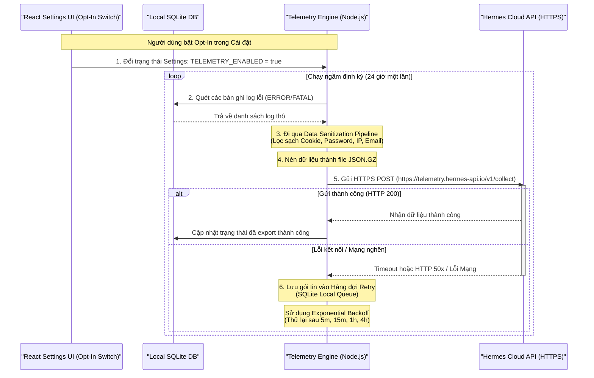

# 📊 Hermes FacePost-Group — Spec 13: Local SQLite Error Diagnostics & Anonymous Telemetry Export

**File:** `facepost_13_telemetry_diagnostics.md`  
**Version:** 1.0.0  
**Ngày tạo:** 2026-06-18  
**Liên quan:** [Spec 03](./facepost_03_dashboard_app.md) · [Spec 05](./facepost_05_agent_loop.md) · [Spec 06](./facepost_06_checkpoint_handler.md) · [Spec 10](./facepost_10_desktop_packaging.md)

---

## 🚨 CRITICAL WARNINGS — ĐỌC TRƯỚC KHI IMPLEMENT

> [!IMPORTANT]
> **Tuyệt Đối Bảo Vệ Thông Tin Định Danh PII (Personally Identifiable Information):** Nghiêm cấm ghi lại các thông tin nhạy cảm của người dùng bao gồm: Cookie Facebook đầy đủ, Access Token, mật khẩu tài khoản, email cá nhân hoặc số điện thoại vào cơ sở dữ liệu telemetry cục bộ cũng như tệp tin log. Trước khi bất kỳ gói tin telemetry nào được xuất đi (Export), dữ liệu bắt buộc phải đi qua bộ lọc làm sạch (Sanitization Pipeline) để che dấu (masking) hoặc xóa bỏ 100% các chuỗi ký tự khớp với cấu trúc nhạy cảm.

> [!WARNING]
> **Kiểm Soát Dung Lượng Cơ Sở Dữ Liệu SQLite Cục Bộ:** Do SQLite lưu trữ dữ liệu trực tiếp trên đĩa cứng của người dùng cuối, việc ghi log lỗi liên tục (đặc biệt là ghi vết DOM snapshot hoặc mã lỗi vòng lặp) có nguy cơ làm cạn kiệt không gian đĩa cứng. Hệ thống bắt buộc phải áp dụng cơ chế tự động giới hạn kích thước SQLite (Log Rotation & Auto-cleanup) và thực hiện dọn dẹp phân mảnh đĩa vật lý bằng lệnh `VACUUM` định kỳ.

---

## 1. Thiết Kế Cơ Sở Dữ Liệu Chẩn Đoán Lỗi Cục Bộ (SQLite Diagnostics Schema)

Hệ thống lưu trữ toàn bộ lịch sử lỗi hoạt động, trạng thái thực thi của Agent và các thông số đo đạc hiệu năng vào một tệp cơ sở dữ liệu SQLite cục bộ (`diagnostics.sqlite` hoặc tích hợp chung vào `database.sqlite` nhưng phân tách schema rõ ràng).

### 1.1 Sơ Đồ Quan Hệ Các Bảng Chẩn Đoán Lỗi (Entity-Relationship Diagram)

```
  ┌──────────────────────┐             ┌─────────────────────────────┐
  │     system_logs      │             │    agent_execution_logs     │
  ├──────────────────────┤             ├─────────────────────────────┤
  │ PK  id               ├─┐           │ PK  id                      │
  │     timestamp        │ │           │     run_id (UUID)           │
  │     level            │ │           │ FK  account_id              │
  │     module           │ │           │     step_name               │
  │     message          │ │           │     status (SUCCESS/FAIL)   │
  │     stack_trace      │ │           │     error_code              │
  │     context_data     │ │           │     dom_snapshot_path       │
  └──────────────────────┘ │           │     screenshot_path         │
                           │           │     timestamp               │
  ┌──────────────────────┐ │           └─────────────────────────────┘
  │   telemetry_events   │ │
  ├──────────────────────┤ │
  │ PK  id               │ │
  │     event_type       │ │
  │     duration_ms      │ │
  │     cpu_usage_pct    │ │
  │     memory_usage_mb  │ │
  │     success_rate     │ │
  │     timestamp        │ │
  └──────────────────────┘ │
                           │           ┌─────────────────────────────┐
                           └──────────►│       accounts (Ref)        │
                                       ├─────────────────────────────┤
                                       │ PK  id                      │
                                       │     username                │
                                       └─────────────────────────────┘
```

---

### 1.2 Chi Tiết Định Nghĩa SQLite Schema

Dưới đây là mã SQL hoàn chỉnh thiết lập cấu trúc các bảng chẩn đoán lỗi cục bộ, kèm các khóa ngoại và chỉ mục (Indexes) để tối ưu hóa hiệu năng truy vấn từ Dashboard UI.

```sql
-- schema_diagnostics.sql
-- Kích hoạt ràng buộc khóa ngoại trong SQLite
PRAGMA foreign_keys = ON;

-- 1. Bảng lưu log hệ thống chung (System Logs)
-- Phục vụ ghi nhận các sự cố crash của Express Server, WebSocket Server, lỗi khởi chạy Chrome
CREATE TABLE IF NOT EXISTS system_logs (
    id INTEGER PRIMARY KEY AUTOINCREMENT,
    timestamp INTEGER NOT NULL,          -- Epoch timestamp (miliseconds)
    level TEXT CHECK(level IN ('DEBUG', 'INFO', 'WARNING', 'ERROR', 'FATAL')) NOT NULL,
    module TEXT NOT NULL,                -- Ví dụ: 'EXPRESS_SERVER', 'WS_SERVER', 'CHROME_LAUNCHER'
    message TEXT NOT NULL,
    stack_trace TEXT,                    -- Nội dung chi tiết lỗi stack trace của JavaScript
    context_data TEXT                    -- Metadata lưu dạng JSON string
);

-- Chỉ mục hỗ trợ truy vấn log theo thời gian và mức độ lỗi nhanh chóng
CREATE INDEX IF NOT EXISTS idx_system_logs_time_level 
ON system_logs (timestamp, level);


-- 2. Bảng lưu log thực thi chi tiết của Agent tự động hóa (Agent Execution Logs)
-- Theo dõi từng bước nhấp chuột, nhập liệu trên giao diện Facebook
CREATE TABLE IF NOT EXISTS agent_execution_logs (
    id INTEGER PRIMARY KEY AUTOINCREMENT,
    run_id TEXT NOT NULL,                -- ID của phiên chạy chiến dịch (UUIDv4)
    account_id TEXT NOT NULL,            -- Khóa ngoại liên kết với bảng accounts
    step_name TEXT NOT NULL,             -- Ví dụ: 'CLICK_POST_BOX', 'INPUT_CONTENT', 'CLICK_SUBMIT'
    status TEXT CHECK(status IN ('SUCCESS', 'FAIL')) NOT NULL,
    error_code TEXT,                     -- Mã lỗi hệ thống định danh (ví dụ: 'ERR-DOM-01')
    dom_snapshot_path TEXT,              -- Đường dẫn tới file chứa DOM nén lúc lỗi xảy ra
    screenshot_path TEXT,                -- Đường dẫn tới file ảnh chụp màn hình lúc lỗi
    timestamp INTEGER NOT NULL,          -- Epoch timestamp (miliseconds)
    FOREIGN KEY(account_id) REFERENCES accounts(id) ON DELETE CASCADE
);

-- Chỉ mục hỗ trợ phân tích hiệu năng chạy Agent theo tài khoản
CREATE INDEX IF NOT EXISTS idx_agent_logs_run_acc 
ON agent_execution_logs (run_id, account_id);


-- 3. Bảng đo đạc các sự kiện hiệu năng (Telemetry Events)
-- Phục vụ đo đạc mức độ tiêu thụ tài nguyên phần cứng local
CREATE TABLE IF NOT EXISTS telemetry_events (
    id INTEGER PRIMARY KEY AUTOINCREMENT,
    event_type TEXT NOT NULL,            -- Ví dụ: 'PAGE_LOAD_TIME', 'API_RESPONSE', 'HARDWARE_METRICS'
    duration_ms INTEGER,                 -- Thời gian xử lý (nếu có)
    cpu_usage_pct REAL,                  -- % CPU sử dụng lúc đo
    memory_usage_mb REAL,                -- Lượng RAM sử dụng (MB)
    success_rate REAL,                   -- Tỷ lệ thành công (dành cho các tác vụ lặp lại)
    timestamp INTEGER NOT NULL
);

-- Chỉ mục để quét dữ liệu phân tích vẽ biểu đồ Dashboard
CREATE INDEX IF NOT EXISTS idx_telemetry_events_type_time 
ON telemetry_events (event_type, timestamp);
```

---

## 2. Cơ Chế Ghi Lỗi & Xoay Vòng Dữ Liệu (Log Rotation & Storage Management)

Để đảm bảo tệp tin SQLite cục bộ không phình to quá giới hạn dung lượng lưu trữ trên đĩa cứng của người dùng cuối, hệ thống bắt buộc phải thực thi cơ chế tự động dọn dẹp log (Log Rotation) định kỳ không đồng bộ.

### 2.1 Thuật Toán Xoay Vòng và Dọn Dẹp

1. **Giới Hạn Kích Thước Tối Đa:** Đặt ngưỡng dung lượng tối đa cho tệp DB (Ví dụ: `MAX_LOG_STORAGE_MB = 100`).
2. **Giới Hạn Thời Gian Lưu Trữ:** Tự động xóa các log cũ hơn `RETENTION_DAYS = 30`.
3. **Cơ Chế Giải Phóng Phân Mảnh (Vacuum):** SQLite không tự động trả lại không gian đĩa vật lý sau khi xóa dòng (`DELETE`). Hệ thống cần gọi lệnh `VACUUM` để sắp xếp lại dữ liệu và thu hồi dung lượng đĩa vật lý.

### 2.2 Hiện Thực Hàm Xoay Vòng Log Trong Node.js

```javascript
// server/storage_manager.js
const fs = require('fs');
const path = require('path');
const Database = require('better-sqlite3');

const MAX_LOG_STORAGE_MB = 100;
const RETENTION_DAYS = 30;

/**
 * Thực thi dọn dẹp log cũ theo thời gian lưu trữ tối đa
 * @param {Database} dbInstance - Đối tượng kết nối SQLite
 */
function cleanupExpiredLogs(dbInstance) {
  console.log('[Storage Manager] Bắt đầu quét log hết hạn...');
  const cutoffTimestamp = Date.now() - (RETENTION_DAYS * 24 * 60 * 60 * 1000);

  try {
    // 1. Xóa system logs cũ
    const systemStmt = dbInstance.prepare('DELETE FROM system_logs WHERE timestamp < ?');
    const systemResult = systemStmt.run(cutoffTimestamp);
    console.log(`[Storage Manager] Đã xóa ${systemResult.changes} dòng system_logs quá ${RETENTION_DAYS} ngày.`);

    // 2. Lấy danh sách dom và screenshot cần xóa để tránh rác ổ đĩa
    const agentStmt = dbInstance.prepare(`
      SELECT dom_snapshot_path, screenshot_path 
      FROM agent_execution_logs 
      WHERE timestamp < ?
    `);
    const expiredFiles = agentStmt.all(cutoffTimestamp);

    expiredFiles.forEach(file => {
      if (file.dom_snapshot_path && fs.existsSync(file.dom_snapshot_path)) {
        fs.unlinkSync(file.dom_snapshot_path);
      }
      if (file.screenshot_path && fs.existsSync(file.screenshot_path)) {
        fs.unlinkSync(file.screenshot_path);
      }
    });

    // Xóa bản ghi trong database
    const agentDeleteStmt = dbInstance.prepare('DELETE FROM agent_execution_logs WHERE timestamp < ?');
    const agentResult = agentDeleteStmt.run(cutoffTimestamp);
    console.log(`[Storage Manager] Đã xóa ${agentResult.changes} dòng agent_execution_logs hết hạn.`);

    // 3. Xóa telemetry events cũ
    const telemetryStmt = dbInstance.prepare('DELETE FROM telemetry_events WHERE timestamp < ?');
    const telemetryResult = telemetryStmt.run(cutoffTimestamp);
    console.log(`[Storage Manager] Đã xóa ${telemetryResult.changes} dòng telemetry_events hết hạn.`);

  } catch (err) {
    console.error('[Storage Manager] Lỗi khi dọn dẹp log hết hạn:', err.message);
  }
}

/**
 * Kiểm tra dung lượng file SQLite và chạy VACUUM nếu cần thiết
 * @param {string} dbPath - Đường dẫn vật lý tới tệp SQLite
 * @param {Database} dbInstance - Đối tượng kết nối SQLite
 */
function checkStorageAndVacuum(dbPath, dbInstance) {
  try {
    if (!fs.existsSync(dbPath)) return;

    const stats = fs.statSync(dbPath);
    const fileSizeMB = stats.size / (1024 * 1024);
    
    console.log(`[Storage Manager] Kích thước hiện tại của Database: ${fileSizeMB.toFixed(2)} MB`);

    if (fileSizeMB > MAX_LOG_STORAGE_MB) {
      console.warn(`[Storage Manager] Phát hiện dung lượng DB vượt ngưỡng ${MAX_LOG_STORAGE_MB}MB. Thực thi dọn dẹp khẩn cấp...`);
      
      // Xóa bớt 30% dữ liệu cũ nhất để hạ nhiệt dung lượng
      const limitTimestamp = Date.now() - (10 * 24 * 60 * 60 * 1000); // Rút ngắn retention còn 10 ngày
      dbInstance.prepare('DELETE FROM system_logs WHERE timestamp < ?').run(limitTimestamp);
      dbInstance.prepare('DELETE FROM agent_execution_logs WHERE timestamp < ?').run(limitTimestamp);
      dbInstance.prepare('DELETE FROM telemetry_events WHERE timestamp < ?').run(limitTimestamp);

      console.log('[Storage Manager] Đã dọn dẹp khẩn cấp dữ liệu cũ. Tiến hành thực thi VACUUM...');
      
      // Chạy VACUUM để giải phóng dung lượng vật lý trên đĩa
      dbInstance.pragma('vacuum');
      
      const newStats = fs.statSync(dbPath);
      console.log(`[Storage Manager] Đã VACUUM hoàn tất. Dung lượng mới: ${(newStats.size / (1024 * 1024)).toFixed(2)} MB`);
    }
  } catch (err) {
    console.error('[Storage Manager] Lỗi khi thực thi VACUUM:', err.message);
  }
}

module.exports = {
  cleanupExpiredLogs,
  checkStorageAndVacuum
};
```

---

## 3. Cơ Chế Export Telemetry Ẩn Danh Opt-In (Anonymous Telemetry Export)

Tính năng telemetry cho phép người dùng tùy chọn gửi (Opt-In) dữ liệu chẩn đoán về server trung tâm của Hermes để nhà phát triển nâng cấp thuật toán tự động hóa. Việc này đòi hỏi quy trình mã hóa bảo mật nghiêm ngặt và làm sạch dữ liệu.

### 3.1 Sơ Đồ Luồng Xử Lý & Hàng Đợi Gửi Telemetry (Retry Queue)



---

### 3.2 Pipeline Làm Sạch Dữ Liệu Nhạy Cảm (Data Sanitization Pipeline)

Trước khi đóng gói, telemetry engine sẽ chạy dữ liệu thô qua một bộ lọc biểu thức chính quy (Regex Pipeline) để xóa bỏ hoàn toàn thông tin định danh:

```javascript
// server/telemetry/sanitizer.js

// Các mẫu Regex phát hiện thông tin nhạy cảm
const SANITIZATION_PATTERNS = {
  // Phát hiện cookies (ví dụ: c_user=12345; xs=abcde123;)
  cookie: /c_user=[0-9]+;\s*xs=[^;\s"]+/gi,
  
  // Phát hiện authorization headers / access tokens
  bearerToken: /bearer\s+[a-zA-Z0-9_\-\.~+\/]+=*/gi,
  facebookAccessToken: /EAAB[a-zA-Z0-9]+/gi,
  
  // Phát hiện email
  email: /[a-zA-Z0-9._%+-]+@[a-zA-Z0-9.-]+\.[a-zA-Z]{2,}/gi,
  
  // Phát hiện số điện thoại (độ dài 9-11 số)
  phone: /(?:\+?84|0)(?:\d){9,10}/g,

  // Phát hiện cấu trúc JSON chứa password
  passwordJson: /"password"\s*:\s*"[^"]*"/gi
};

/**
 * Hàm làm sạch chuỗi văn bản (log message hoặc stack trace)
 * @param {string} rawText - Chuỗi thô cần làm sạch
 * @returns {string} Chuỗi an toàn đã được thay thế
 */
function sanitizeText(rawText) {
  if (!rawText) return '';
  let cleanText = rawText;

  // 1. Che giấu Cookie Facebook
  cleanText = cleanText.replace(SANITIZATION_PATTERNS.cookie, '[REDACTED_FB_COOKIE]');

  // 2. Che giấu Access Token
  cleanText = cleanText.replace(SANITIZATION_PATTERNS.bearerToken, '[REDACTED_BEARER_TOKEN]');
  cleanText = cleanText.replace(SANITIZATION_PATTERNS.facebookAccessToken, '[REDACTED_FB_ACCESS_TOKEN]');

  // 3. Che giấu Email và Số điện thoại
  cleanText = cleanText.replace(SANITIZATION_PATTERNS.email, '[REDACTED_EMAIL]');
  cleanText = cleanText.replace(SANITIZATION_PATTERNS.phone, '[REDACTED_PHONE]');

  // 4. Che giấu Password trong JSON payload
  cleanText = cleanText.replace(SANITIZATION_PATTERNS.passwordJson, '"password":"[REDACTED_PASSWORD]"');

  return cleanText;
}

module.exports = {
  sanitizeText
};
```

---

### 3.3 Đóng Gói Và Gửi Telemetry HTTPS An Toàn

Dưới đây là module chịu trách nhiệm quét SQLite, lọc dữ liệu, nén định dạng `.gz` và tải lên (Upload) an toàn thông qua HTTPS POST.

```javascript
// server/telemetry/exporter.js
const zlib = require('zlib');
const axios = require('axios');
const { sanitizeText } = require('./sanitizer');

const TELEMETRY_ENDPOINT = 'https://telemetry.hermes-api.io/v1/collect';

/**
 * Nén dữ liệu JSON thành buffer Gzip
 * @param {object} jsonData 
 * @returns {Promise<Buffer>}
 */
function compressData(jsonData) {
  return new Promise((resolve, reject) => {
    zlib.gzip(JSON.stringify(jsonData), (err, buffer) => {
      if (err) reject(err);
      else resolve(buffer);
    });
  });
}

/**
 * Thực thi đóng gói log lỗi và export ẩn danh
 * @param {Database} dbInstance - Đối tượng kết nối SQLite
 * @param {boolean} optInStatus - Cấu hình opt-in của người dùng
 */
async function exportTelemetry(dbInstance, optInStatus) {
  // 1. Kiểm tra cấu hình Opt-in của người dùng
  if (!optInStatus) {
    console.log('[Telemetry Exporter] Telemetry đang TẮT (Opt-out). Hủy xuất dữ liệu.');
    return;
  }

  console.log('[Telemetry Exporter] Đang trích xuất log chẩn đoán lỗi để xuất đi...');

  try {
    // 2. Quét các log lỗi trong 24 giờ qua
    const oneDayAgo = Date.now() - (24 * 60 * 60 * 1000);
    const rawLogs = dbInstance.prepare(`
      SELECT level, module, message, stack_trace, timestamp 
      FROM system_logs 
      WHERE timestamp > ? AND level IN ('ERROR', 'FATAL')
    `).all(oneDayAgo);

    if (rawLogs.length === 0) {
      console.log('[Telemetry Exporter] Không có log lỗi mới để xuất.');
      return;
    }

    // 3. Làm sạch dữ liệu nhạy cảm qua Pipeline
    const sanitizedLogs = rawLogs.map(log => ({
      level: log.level,
      module: log.module,
      message: sanitizeText(log.message),
      stack_trace: sanitizeText(log.stack_trace),
      timestamp: log.timestamp
    }));

    // Tạo gói tin Telemetry Payload ẩn danh
    const telemetryPayload = {
      appId: 'com.hermes.facepost.group',
      platform: process.platform,
      arch: process.arch,
      exportTimestamp: Date.now(),
      logs: sanitizedLogs
    };

    // 4. Nén gzip để giảm dung lượng mạng
    const compressedBuffer = await compressData(telemetryPayload);

    console.log(`[Telemetry Exporter] Đã nén gói tin thành công (${compressedBuffer.length} bytes). Gửi lên server...`);

    // 5. Gửi HTTPS POST với headers nén
    const response = await axios.post(TELEMETRY_ENDPOINT, compressedBuffer, {
      headers: {
        'Content-Encoding': 'gzip',
        'Content-Type': 'application/json',
        'X-Hermes-Signature': 'anonymous-telemetry-token'
      },
      timeout: 10000 // Timeout sau 10s tránh treo luồng
    });

    if (response.status === 200 || response.status === 201) {
      console.log('[Telemetry Exporter] Đã tải dữ liệu telemetry lên máy chủ chính thành công.');
    } else {
      throw new Error(`Máy chủ trả về HTTP Code: ${response.status}`);
    }

  } catch (err) {
    console.error('[Telemetry Exporter] Gửi telemetry thất bại:', err.message);
    // Ở đây có thể tích hợp lưu hàng đợi SQLite để gửi lại (Retry Queue) khi mạng ổn định
  }
}

module.exports = {
  exportTelemetry
};
```

---

## 4. Tích Hợp Vào Cài Đặt Dashboard UI

Giao diện Dashboard cung cấp một Banner cấu hình cho phép người dùng tùy chọn Bật/Tắt gửi log. 

### 4.1 UI Component Giao Diện Cấu Hình (React/Tailwind)

```jsx
// src/components/TelemetrySettings.jsx
import React, { useState, useEffect } from 'react';

export default function TelemetrySettings() {
  const [optIn, setOptIn] = useState(false);
  const [saving, setSaving] = useState(false);

  useEffect(() => {
    // Tải cấu hình từ Express server cục bộ lúc khởi tạo
    fetch('/api/settings/telemetry')
      .then(res => res.json())
      .then(data => setOptIn(data.telemetryEnabled))
      .catch(err => console.error('Không thể tải cài đặt telemetry:', err));
  }, []);

  const handleToggle = async (e) => {
    const newValue = e.target.checked;
    setOptIn(newValue);
    setSaving(true);

    try {
      const response = await fetch('/api/settings/telemetry', {
        method: 'POST',
        headers: { 'Content-Type': 'application/json' },
        body: JSON.stringify({ telemetryEnabled: newValue })
      });
      
      if (!response.ok) throw new Error('Save failed');
      console.log('Cập nhật cấu hình telemetry thành công.');
    } catch (err) {
      alert('Không thể lưu cài đặt: ' + err.message);
      setOptIn(!newValue); // Rollback state nếu lỗi
    } finally {
      setSaving(false);
    }
  };

  return (
    <div className="p-6 bg-slate-900 border border-slate-800 rounded-lg shadow-md max-w-2xl">
      <h3 className="text-xl font-semibold text-emerald-400 mb-2">📊 Báo Cáo Chẩn Đoán & Telemetry Ẩn Danh</h3>
      <p className="text-slate-300 text-sm mb-6 leading-relaxed">
        Bằng cách bật tính năng này, bạn đồng ý chia sẻ các báo cáo lỗi hệ thống cục bộ (ví dụ: lỗi tự động hóa DOM Facebook, lỗi kết nối proxy) để hỗ trợ đội ngũ kỹ thuật cải tiến hệ thống. Dữ liệu chia sẻ được <strong>lọc sạch và ẩn danh hóa hoàn toàn</strong>, không bao gồm cookies, mật khẩu, hay thông tin tài khoản Facebook cá nhân.
      </p>

      <div className="flex items-center justify-between p-4 bg-slate-950 rounded border border-slate-800">
        <div>
          <span className="text-white font-medium block">Đồng ý gửi báo cáo chẩn đoán</span>
          <span className="text-slate-400 text-xs">Dữ liệu sẽ được tự động làm sạch và nén trước khi truyền đi.</span>
        </div>
        <label className="relative inline-flex items-center cursor-pointer">
          <input 
            type="checkbox" 
            checked={optIn} 
            onChange={handleToggle}
            disabled={saving}
            className="sr-only peer" 
          />
          <div className="w-11 h-6 bg-slate-700 peer-focus:outline-none rounded-full peer peer-checked:after:translate-x-full peer-checked:after:border-white after:content-[''] after:absolute after:top-[2px] after:left-[2px] after:bg-white after:border-gray-300 after:border after:rounded-full after:h-5 after:w-5 after:transition-all peer-checked:bg-emerald-500"></div>
        </label>
      </div>
    </div>
  );
}
```
