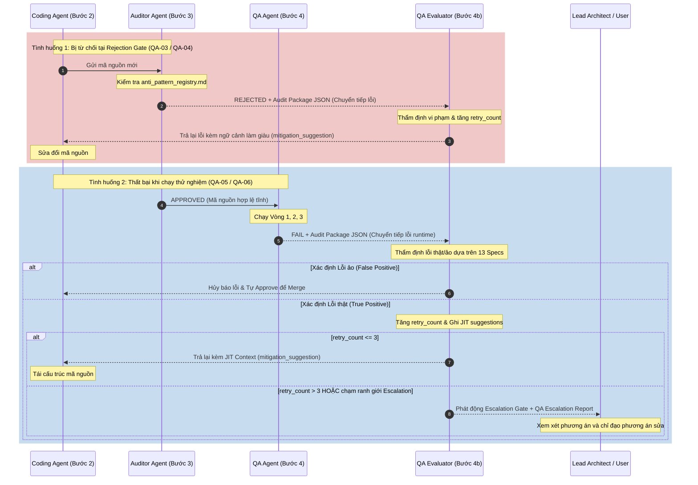

# 🔄 QUY TRÌNH LẮP RÁP PHẦN MỀM 4 BƯỚC (HERMES 4-STEP ASSEMBLY)

Quy trình lắp ráp phần mềm 4 bước là bộ khung vận hành cốt lõi giúp điều phối, tích hợp và kiểm soát chất lượng mã nguồn được sinh ra bởi các AI Coding Agents trong hệ thống Hermes. Quy trình này bảo vệ hệ thống khỏi lỗi cú pháp, vi phạm thiết kế, và các anti-patterns bảo mật.

Hệ thống tích hợp chặt chẽ **6 Cổng kiểm thử chất lượng (QA Checkpoints từ QA-01 đến QA-06)** xuyên suốt từ khâu phân tách nhiệm vụ đến khi chạy thực tế trên trình duyệt, kết hợp với cơ chế nén ngữ cảnh tự động và vòng lặp sửa lỗi an toàn.

---

## 1. SƠ ĐỒ PHÂN VAI VÀ TÍCH HỢP MÃ NGUỒN TÍCH HỢP QA GATES

Dưới đây là sơ đồ tổng quan thể hiện sự phối hợp chặt chẽ giữa các vai trò Agent, các bước phát triển và vị trí chốt chặn của 6 QA Checkpoints:

```
                   ┌────────────────────────────────────────────────────────┐
                   │ INPUT: Yêu cầu tính năng / Báo cáo lỗi / Specs dự án   │
                   └────────────────────────────────────────────────────────┘
                                                │
                                                ▼
+----------------------------------------------------------------------------------------------+
| BƯỚC 1: CONTEXT INJECTION & TASK BREAKDOWN (Lead Architect Agent)                            |
| - Đọc tài liệu specs hệ thống và facepost_00_shared_types.md                                  |
| - Bóc tách tính năng thành các micro-tasks độc lập và không chồng chéo                       |
| - Thiết kế chữ ký hàm (signature) và hợp đồng dữ liệu đầu ra (output contract)               |
+----------------------------------------------------------------------------------------------+
                                                │
                                                ▼ [QA-01: Context Integrity Check]
                                                │
                                                ├───────────────────────┐
                                                ▼                       ▼
+----------------------------------------------------------------------------------------------+
| BƯỚC 2: CODE ISOLATION GENERATION (Feature Coding Agents)                                    |
| - ext_worker        : Phát triển Chrome Extension (Background / Content scripts)             |
| - backend_worker    : Xây dựng Dashboard App API & SQLite database logic                     |
| - network_worker    : Cấu hình Proxy routing & Anti-detection layers                         |
| - Nguyên tắc cách ly: Chỉ đọc spec được phân bổ + Spec 00 (Không import chéo trái phép)       |
+----------------------------------------------------------------------------------------------+
                                                │
                                                ▼ [QA-02: Syntax Check] & [QA-03: Isolation Gate]
                                                │
                                                ▼
+----------------------------------------------------------------------------------------------+
| BƯỚC 3: REJECTION GATE & QUALITY REVIEW (Anti-Pattern Auditor Agent)                         |
| - Quét tĩnh (Static scan) mã nguồn dựa trên anti_pattern_registry.md                         |
| - Phát hiện lỗi CRITICAL -> REJECT lập tức (Zero tolerance)                                  |
| - Phát hiện lỗi HIGH/MEDIUM/LOW -> Gửi cảnh báo & gợi ý khắc phục                            |
+----------------------------------------------------------------------------------------------+
                                                │
                                                ▼ [QA-04: Static Anti-Pattern Gate]
                                                │
                             [APPROVED]         │         [REJECTED]
                    ┌──────────────────────────┴─────────────────────────┐
                    ▼                                                    │
+--------------------------------------------------------------------+   │
| BƯỚC 4: RUNTIME HARNESS & E2E VERIFICATION (Windows QA Agent)      |   │
| - Vòng 1: Xác thực cấu trúc dữ liệu tĩnh (JSON Schema, Protocols)  |   │
|           ↳ [QA-05: Schema Validation]                            |   │
| - Vòng 2: Chạy Sandbox Mock (Unit tests + DOM Fixtures)            |   │
| - Vòng 3: Chạy E2E thật trên trình duyệt Chrome hệ điều hành      |   │
|           ↳ [QA-06: E2E Stealth & Fingerprint Audit]               |   │
+--------------------------------------------------------------------+   │
                    │                                                    │
             [PASS] │                                            [FAIL]  │
                    ▼                                                    ▼
+──────────────────────────────────────+        +------------------------------------------------------+
| DONE                                 |        | BƯỚC 4b: QA VALIDATION GATE (QA Evaluator Agent)     |
| Tích hợp mã nguồn thành công         |        | - Thẩm định báo cáo lỗi thật/ảo (False Positive)     |
| và sẵn sàng phát hành.               |        | - Làm giàu ngữ cảnh sửa lỗi từ 13 Specs tương ứng   |
| - Kích hoạt nén ngữ cảnh (CCP)       |        | - Tăng retry_count (Tối đa 3 lần)                    |
+──────────────────────────────────────+        +------------------------------------------------------+
                                                                         |
                                                +────────────────────────┴──────────────────────+
                                                | [TRUE FAIL]                                   | [FALSE POSITIVE]
                                                | [retry_count <= 3?]                           | [APPROVE & MERGE]
                                                +──────────┬──────────+                          |
                                                | Có       | Không    |                          |
                                                v          v          v                          v
                                           +-----------+  +-----------+                    +------------+
                                           | BƯỚC 2    |  | ESCALATED |                    | DONE       |
                                           | Sửa lỗi   |  | HUMAN     |                    +------------+
                                           +-----------+  +-----------+
```

---

## 2. CHI TIẾT CÁC BƯỚC THỰC THI & QA CHECKPOINTS (STEP-BY-STEP SPECIFICATION)

### BƯỚC 1: CONTEXT INJECTION (Lead Architect Agent)
*   **Mô tả:** Đóng vai trò là tổng công trình sư điều phối toàn bộ luồng. Architect Agent tiếp nhận yêu cầu từ người dùng, nạp các tài liệu ngữ cảnh cần thiết và tạo ra các chỉ dẫn chi tiết cho các Coding Agents cấp dưới.
*   **Đầu vào (Input):** Yêu cầu tính năng mới (Feature Request) hoặc báo cáo lỗi (Bug Report) từ người dùng.
*   **Hành động của Agent (Agent Actions):**
    1.  Đọc tài liệu tổng quan kiến trúc và chỉ mục specs (`agent_harness/brain/master_context.md`).
    2.  Bắt buộc đọc file đặc tả chính (`specs/facepost_00_shared_types.md`).
    3.  Bóc tách yêu cầu thành các nhiệm vụ cô lập (micro-tasks) tương ứng với từng phân hệ.
    4.  Tạo ra danh sách các phiếu làm việc (`CodingTickets` - định dạng JSON) định nghĩa rõ ràng: file cần sửa, chữ ký hàm (`function_signature`), và ràng buộc đầu ra (`output_contract`).
*   **Điều kiện kiểm tra bắt buộc (Mandatory Checks):**
    *   [ ] Không được phân bổ các nhiệm vụ bị chồng chéo mã nguồn giữa các Agent.
    *   [ ] Đảm bảo các `CodingTickets` chứa đủ thông tin để Agent cấp dưới tự thực hiện mà không cần đọc chéo ngữ cảnh khác.
    *   [ ] **[GIT-GATE]** Xác minh thư mục dự án đã khởi tạo Git (`git init` hoặc `git clone`). Nếu chưa có `.git/`, Lead Architect phải khởi tạo trước khi cấp phát CodingTicket.
    *   [ ] **[SEC-GATE]** Xác minh `.gitignore` chuẩn hóa tồn tại tại root dự án (theo template trong `facepost_rules_of_project.md` Section 6) và không có file `.env` thật trong staged changes.
*   **🛡️ QA Checkpoint cuối giai đoạn:**
    *   **QA-01 (Context Integrity & Contract Alignment Check):** Xác thực cấu trúc của các `CodingTickets` sinh ra. Đảm bảo toàn bộ chữ ký hàm và kiểu dữ liệu đầu ra khớp 100% với `facepost_00_shared_types.md`. Nếu phát hiện mâu thuẫn hoặc thiếu kiểu dữ liệu, hệ thống tự động trả ticket về yêu cầu Architect sửa lại thiết kế.

---

### BƯỚC 2: CODE ISOLATION GENERATION (Feature Coding Agents)
*   **Mô tả:** Các Coding Agents chuyên biệt nhận nhiệm vụ riêng biệt và tiến hành viết mã nguồn trong môi trường cách ly (context isolation) để chống tràn ngữ cảnh và đảm bảo tính modular.
*   **Đầu vào (Input):** `CodingTicket` tương ứng được cấp phát từ Bước 1.
*   **Hành động của Agent (Agent Actions):**
    1.  Chỉ đọc tài liệu đặc tả (Spec) phân hệ mình phụ trách được chỉ định trong ticket.
    2.  Đọc các kiểu dữ liệu dùng chung liên quan tại `facepost_00_shared_types.md`.
    3.  Tiến hành viết mã nguồn giải quyết nhiệm vụ mà không tự ý sửa đổi các API, hàm của phân hệ khác.
    4.  Xuất mã nguồn ra tệp tin (không tự thực thi mã nguồn trực tiếp).
*   **Điều kiện kiểm tra bắt buộc (Mandatory Checks):**
    *   [ ] Tuân thủ tuyệt đối quy tắc human-like (giả lập thao tác người dùng bằng `human_simulator.js`).
    *   [ ] Không được phép tự tiện sử dụng các thư viện Node.js/SQLite phía Extension.
    *   [ ] Mọi cấu trúc dữ liệu đầu ra phải khớp chính xác với `output_contract`.
    *   [ ] Mỗi file code hoàn thành phải được commit riêng với message chuẩn semantic: `type(scope): description`.
*   **🛡️ QA Checkpoints cuối giai đoạn:**
    *   **QA-02 (Syntax & Language Compliance Check):** Chạy parser kiểm tra cú pháp mã nguồn (như ESLint hoặc TypeScript compiler) trước khi lưu file. Loại bỏ các lỗi syntax cơ bản như biến chưa khai báo, dấu ngoặc chưa đóng, hoặc sai kiểu dữ liệu tĩnh.
    *   **QA-03 (Security & Isolation Boundary Audit):** Quét tĩnh mã nguồn để phát hiện hành vi vi phạm ranh giới cách ly (ví dụ: extension content script import module node `fs` trái phép hoặc gọi API trực tiếp vào cơ sở dữ liệu backend thay vì thông qua WebSocket/API). Đồng thời kiểm tra không có hardcoded secrets (API keys, passwords, connection strings) trong source code và không có file `.env` thật trong Git staging area.

---

### BƯỚC 3: REJECTION GATE (Anti-Pattern Auditor Agent)
*   **Mô tả:** Đóng vai trò gác cổng kiểm tra chất lượng tĩnh. Auditor Agent sẽ đối chiếu mã nguồn mới sinh ra với bộ quy tắc chống anti-patterns để quyết định cho phép đi tiếp hay từ chối.
*   **Đầu vào (Input):** Mã nguồn mới được sinh ra từ Bước 2 và danh sách các anti-patterns tại `agent_harness/harness/anti_pattern_registry.md`.
*   **Hành động của Agent (Agent Actions):**
    1.  Thực hiện quét tĩnh (Static analysis) bằng regex/grep tìm kiếm dấu hiệu vi phạm thiết kế.
    2.  Phân loại lỗi dựa trên mức độ nghiêm trọng (CRITICAL, HIGH, MEDIUM, LOW).
    3.  Đưa ra kết quả đánh giá cuối cùng: `[APPROVED]` hoặc `[REJECTED]` kèm theo bằng chứng chi tiết.
*   **Điều kiện kiểm tra bắt buộc (Mandatory Checks):**
    *   [ ] Áp dụng chính sách không khoan nhượng (Zero tolerance) đối với lỗi `CRITICAL` (ví dụ: Nuốt lỗi, import chéo trái phép, cập nhật React state sai key). Bắt buộc phải `REJECT` lập tức.
*   **🛡️ QA Checkpoint cuối giai đoạn:**
    *   **QA-04 (Static Anti-Pattern Gate Check):** Đối chiếu triệt để mã nguồn với `anti_pattern_registry.md`. Nếu phát hiện bất kỳ vi phạm nào ở mức `CRITICAL` hoặc `HIGH`, hệ thống lập tức gắn trạng thái `REJECTED`, dừng quy trình và xuất gói tin lỗi `Audit Package JSON` chuyển sang Recovery Loop.

---

### BƯỚC 4: RUNTIME HARNESS (Windows QA Agent)
*   **Mô tả:** QA Agent đưa mã nguồn vào môi trường chạy thử nghiệm động (Dynamic analysis) thông qua 3 vòng kiểm tra nghiêm ngặt từ static schema đến chạy E2E thực tế trên trình duyệt.
*   **Đầu vào (Input):** Mã nguồn đã được thông qua (`APPROVED`) ở Bước 3.
*   **Hành động của Agent (Agent Actions):**
    1.  **Vòng 1 (Static Contract):** Xác thực định dạng JSON Schema của các thông điệp WebSocket và API.
    2.  **Vòng 2 (Mock Sandbox):** Chạy kiểm thử đơn vị (Unit tests) và giả lập DOM Facebook bằng các tệp fixture tĩnh.
    3.  **Vòng 3 (Windows Runtime E2E):** Khởi chạy trình duyệt Google Chrome thật qua Selenium/Puppeteer để chạy thử luồng tương tác thực tế trên Facebook.
*   **Điều kiện kiểm tra bắt buộc (Mandatory Checks):**
    *   [ ] Trình duyệt chạy thử nghiệm phải được cấu hình định tuyến qua proxy tương thích và không dính vết rò rỉ vân tay trình duyệt (Anti-detection).
    *   [ ] Mọi luồng kiểm thử E2E phải hoàn thành không có lỗi ném ra.
*   **🛡️ QA Checkpoints cuối giai đoạn:**
    *   **QA-05 (Dynamic Contract & Schema Validation Check):** Chạy bộ kiểm thử động tại Vòng 1. Kiểm tra cấu trúc WebSocket message và API payload thực tế sinh ra khi runtime đối chiếu với các file schema. Phát hiện các lỗi lệch trường hoặc sai kiểu dữ liệu thực tế.
    *   **QA-06 (E2E Stealth & Behavior Audit):** Kiểm tra độ an toàn chống phát hiện (stealth check) của Selenium/Puppeteer tại Vòng 3. Đảm bảo proxy routing hoạt động đúng, không có rò rỉ địa chỉ IP thật và các tham số vân tay trình duyệt (WebGL, Canvas, User-Agent) khớp hoàn toàn với cấu hình giả lập.

---

### BƯỚC 4b: QA VALIDATION GATE (QA Evaluator Agent)
*   **Mô tả:** Đóng vai trò làm Trọng tài thẩm định và Khử nhiễu lỗi. QA Evaluator đứng giữa QA Agent và Coding Agent nhằm ngăn chặn lỗi ảo, làm giàu ngữ cảnh trước khi trả lại lỗi và điều phối cơ chế leo thang khi chạm giới hạn.
*   **Đầu vào (Input):** `Audit Package JSON` ghi nhận lỗi runtime từ Bước 4 hoặc báo cáo reject từ Bước 3.
*   **Hành động của Agent (Agent Actions):**
    1.  **Thẩm định lỗi thật/ảo:** Đối chiếu báo cáo lỗi với 13 đặc tả kỹ thuật (Specs). Nếu xác định lỗi của QA Agent là do test suite cấu hình sai hoặc flaky test (lỗi ảo) -> Ghi nhãn `REJECT QA REPORT` và trực tiếp phê duyệt (`APPROVE`) để merge.
    2.  **Làm giàu ngữ cảnh (Context Enrichment):** Nếu xác định lỗi thật (True Positive), trích xuất spec tương ứng, mô tả rõ vi phạm phần nào và viết hướng dẫn khắc phục chi tiết vào trường `mitigation_suggestion` thay vì gửi raw log thô.
    3.  **Tăng retry count:** Đọc `retry_count` hiện tại từ package, tăng thêm 1 đơn vị.
    4.  **Phát động Escalation Gate:** Nếu `retry_count` vượt quá 3, hoặc phát hiện các điều kiện leo thang bắt buộc (Spec Gap, Spec Conflict, WS Protocol/DB Schema changes, Sandboxed browser crashes diện rộng) -> Chuyển trạng thái ticket sang `ESCALATED_HUMAN`, tạo `QA Escalation Report` và trình Lead Architect cùng User phê duyệt.
*   **Điều kiện kiểm tra bắt buộc (Mandatory Checks):**
    *   [ ] Không được tự ý sửa đổi code.
    *   [ ] Phải cập nhật chính xác `retry_count` vào JSON.
    *   [ ] Mọi báo cáo leo thang lên con người phải tuân thủ đúng định dạng mẫu quy định.

---

## 3. CƠ CHẾ NÉN NGỮ CẢNH (CONTEXT COMPRESSION PROTOCOL)

Nhằm mục đích ngăn chặn hiện tượng tràn cửa sổ ngữ cảnh (Context Window Overflow) của các tác tử cấp cao (Architect/Leader Agent), hệ thống thiết lập cơ chế nén ngữ cảnh tự động sau mỗi giai đoạn phát triển thành công.

### 3.1. Quy trình nén cuối tuần (Sprint End Compression)
1. Khi một tuần phát triển kết thúc và toàn bộ mã nguồn **vượt qua tất cả QA Gates (QA-01 đến QA-06)**, mô-đun `ContextCompressor` được kích hoạt.
2. Hệ thống thu thập toàn bộ lịch sử hội thoại, nhật ký sửa lỗi (Audit Logs) và mã nguồn thô trong tuần.
3. Tiến hành phân tích và tóm tắt thành một bản tin siêu dữ liệu cô đọng (Metadata Summary), ghi nhận:
   - Danh sách file và các hàm được chỉnh sửa/thêm mới.
   - Các quyết định thiết kế và thay đổi kiến trúc quan trọng.
   - Các lỗi nghiêm trọng đã được khắc phục kèm cách xử lý tương ứng.
4. Lưu bản tóm tắt này vào sổ cái `sprint_metadata_ledger.json` và lưu trữ (Archive) tệp ngữ cảnh thô vào thư mục lưu trữ nén của hệ thống.
5. Giải phóng active context của Leader Agent bằng cách xóa sạch chi tiết mã nguồn thô của tuần cũ, chỉ giữ lại bản Metadata Summary siêu nhẹ.

### 3.2. Cấu trúc Sổ cái Siêu Dữ Liệu (`sprint_metadata_ledger.json`)
```json
{
  "sprint_id": "sprint-2026-w25",
  "period": "2026-06-10 to 2026-06-16",
  "status": "ARCHIVED",
  "metadata_summary": {
    "architectural_decisions": "Tách biệt luồng SQLite DB ra khỏi Extension và chuyển qua Backend Dashboard App API. Giao tiếp qua WebSocket.",
    "modified_components": [
      {
        "file": "/src/background.js",
        "description": "Thêm WebSocket client kết nối Dashboard App. Hỗ trợ gửi tin nhắn tự động."
      }
    ],
    "resolved_bugs": [
      {
        "bug_id": "ERR-DOM-01",
        "fix_description": "Chuyển đổi click DOM trực tiếp sang sử dụng human_simulator.js."
      }
    ]
  },
  "archive_pointer": "/archive/sprint-2026-w25-raw-context.tar.gz"
}
```

### 3.3. Cơ chế JIT Hydration (Just-in-Time Context Hydration)
* Khi phát sinh lỗi hoặc yêu cầu chỉnh sửa liên quan đến một tính năng được phát triển ở tuần trước, hệ thống sẽ tự động quét sổ cái `sprint_metadata_ledger.json`.
* Dựa trên `modified_components` và `archive_pointer`, hệ thống giải nén đúng tệp ngữ cảnh thô cần thiết và tiêm (inject) vào context của Agent sửa lỗi hiện tại.
* Cơ chế này giúp bộ nhớ Agent luôn sạch sẽ, chỉ nạp dữ liệu chi tiết khi thực sự cần thiết (Just-in-Time).

---

## 4. VÒNG LẶP PHỤC HỒI LỖI TỰ ĐỘNG (AUTOMATED RECOVERY LOOP)

Cơ chế vòng lặp phục hồi đảm bảo rằng mọi lỗi phát hiện trong quá trình Audit (Bước 3) hoặc Chạy thử nghiệm (Bước 4) đều được chuyển hóa thành phản hồi kỹ thuật chuẩn hóa để tác tử lập trình (Coding Agent) sửa đổi một cách tự động và chính xác.



### 4.1. Cấu Trúc Gói Phản Hồi Lỗi (Audit Package JSON Schema)

Khi xảy ra lỗi tại bất kỳ QA Checkpoint nào, tác tử phát hiện lỗi có nhiệm vụ đóng gói một bản tin JSON phản hồi kỹ thuật theo định dạng chuẩn dưới đây:

```json
{
  "status": "REJECTED_BY_AUDITOR" | "FAILED_BY_QA" | "ESCALATED_HUMAN",
  "timestamp": "2026-06-16T05:13:00Z",
  "source_agent": "AntiPatternAuditor" | "WindowsQAAgent" | "QAEvaluator",
  "target_file": "/src/background.js",
  "retry_count": 1,
  "failures": [
    {
      "code": "ERR-DOM-01" | "ERR-STEALTH-02" | "ERR-SCHEMA-03",
      "severity": "CRITICAL" | "HIGH" | "MEDIUM" | "LOW",
      "line_number": 45,
      "character_offset": 12,
      "snippet": "const btn = document.querySelector('.posting-button'); btn.click();",
      "reason": "Vi phạm quy tắc giả lập hành vi human-like hoặc rò rỉ cấu hình vân tay proxy.",
      "mitigation_suggestion": "Thay thế dòng click() bằng await humanSimulator.click(page, '.posting-button');"
    }
  ],
  "runtime_context": {
    "node_version": "v18.16.0",
    "chrome_version": "120.0.6099.109",
    "traceback": "Error: Element not found at humanSimulator.click (/src/utils/human_simulator.js:12:9)"
  }
}
```

### 4.2. Quy Tắc Sửa Lỗi Tự Động Của Coding Agent
Khi nhận được gói `Audit Package JSON`, Coding Agent tại Bước 2 không được phép viết lại mã nguồn từ đầu. Agent phải:
1. Định vị chính xác tệp tin và số dòng chỉ định trong mảng `failures`.
2. Đọc kỹ mô tả `reason` để hiểu bản chất lỗi thiết kế hoặc lỗi logic.
3. Áp dụng giải pháp đề xuất tại cột `mitigation_suggestion`.
4. Xuất lại mã nguồn đã chỉnh sửa và đẩy lại lên Bước 3 để tái thẩm định.

### 4.3. Cơ Chế An Toàn & Kiểm Soát Vòng Lặp (Fault-Tolerant Controls)
Nhằm đảm bảo tính ổn định tối đa của hệ thống và tránh rơi vào các vòng lặp vô hạn do AI lặp lại lỗi cũ, Recovery Loop áp dụng các cơ chế kiểm soát nghiêm ngặt sau:

*   **Giới Hạn Thử Lại Tối Đa (Max Retries Limit):**
    - Hệ thống giới hạn tối đa **3 lần thử lại (Max Retries = 3)** cho mỗi ticket lỗi.
    - Với mỗi lần thử lại, số lượt thử (`retry_count`) được tăng thêm 1. Nếu `retry_count > 3` mà mã nguồn vẫn thất bại tại các cổng QA Checkpoints, hệ thống sẽ ngắt (Break Loop) ngay lập tức.
*   **Cổng Chuyển Tiếp Sự Cố (Escalation Gate):**
    - Khi đạt giới hạn thử lại tối đa mà lỗi không được khắc phục, hệ thống sẽ kích hoạt Escalation Gate.
    - Lúc này, ticket lỗi cùng toàn bộ lịch sử thử lại sẽ được chuyển tiếp cho Architect Agent để tái phân tích và điều chỉnh lại thiết kế hoặc chuyển cho con người (Human-in-the-loop) can thiệp trực tiếp.
*   **Cam Kết Không Ném Lỗi Hệ Thống (No-Throw Guarantee):**
    - Toàn bộ tiến trình thực thi của Recovery Loop được bao bọc bởi các khối bắt ngoại lệ (`try-catch`) ở mức nền tảng (Harness level).
    - Mọi lỗi phát sinh trong chính quá trình vận hành của Recovery Agent (ví dụ: mất kết nối WebSocket, lỗi parse JSON, hoặc file bị khóa) sẽ được bắt giữ, ghi lại nhật ký lỗi chi tiết và chuyển đổi trạng thái thành `GRACEFUL_DEGRADATION`. Hệ thống thoát an toàn mà không làm treo hay sập toàn bộ luồng chạy của Harness.

---

## 5. MA TRẬN PHÂN BỔ TRẠNG THÁI KHẨN CẤP (FSM MAINTENANCE PATH)

Hệ thống điều phối Apex Swarm v3.0 vận hành như một Máy trạng thái hữu hạn (FSM) tự phục hồi. Khi gặp sự cố nghiêm trọng, FSM sẽ chuyển sang các trạng thái bảo trì khẩn cấp dựa trên ma trận sau:

| Tình huống khẩn cấp | Trạng thái FSM | Cơ chế tự phục hồi tự động (Self-Repair / Circuit Breaker) |
|---|---|---|
| **Lỗi hệ thống nền tảng**<br>(SQLite hỏng / Cạn API Limit / Token expired) | `MAINTENANCE` | 1. Đóng băng (Freeze) toàn bộ các tiến trình AI đang chạy.<br>2. Tự động khôi phục DB từ bản backup stable gần nhất (`db_restore.sh`).<br>3. Xoay vòng (rotate) API Key dự phòng từ Vault an toàn. |
| **Bế tắc vận hành / Lỗi lặp**<br>(FSM Deadlock / Hotfix liên tục thất bại) | `ESCALATING_LEADER` | 1. Tự động thực hiện rollback mã nguồn của module bị lỗi về Git commit thành công liền trước (`git reset --hard <stable_sha>`).<br>2. Gửi tín hiệu reset trạng thái RAM Tree của context dispatcher.<br>3. Trả lại quyền chỉ đạo cho Lead Architect phân tách lại task. |
| **Rào cản nghiệp vụ phức tạp**<br>(Sửa thất bại 3 lần / Checkpoint Facebook cần xác thực sinh trắc học hoặc ảnh selfie) | `ESCALATING_HUMAN` | 1. Tạm dừng (Pause) luồng tự động, bảo lưu session trình duyệt.<br>2. Đẩy cảnh báo khẩn cấp và chụp ảnh màn hình visual evidence lên Dashboard.<br>3. Chờ Lão Công (User) nhấn nút duyệt phương án hoặc giải quyết thủ công. |

---

## 6. QUY CHẾ PHÒNG VỆ GIT BRANCH CÔ LẬP (GIT SANDBOX GATE)

Để đảm bảo mã nguồn của dự án chính luôn ở trạng thái sẵn sàng phát hành và không bị ô nhiễm bởi các đoạn code lỗi do AI tự sửa trong quá trình thử nghiệm, hệ thống Apex Swarm v3.0 áp dụng chính sách **Git Sandbox Gate**:

1. **Khởi tạo Sandbox:** Với mỗi `Coding Ticket` được cấp phát từ Lead Architect, hệ thống sẽ tự động tách một nhánh Git cô lập dạng `sandbox/task-<ticket_id>` từ commit stable gần nhất của nhánh chính:
   ```bash
   git checkout -b sandbox/task-TICKET-001 <stable_sha>
   ```
2. **Thao tác cô lập:** Toàn bộ tiến trình chỉnh sửa file, chạy linter kiểm tra AST tĩnh, áp dụng các khối Search-and-Replace (SAR) và chạy thử nghiệm động E2E đều phải thực thi độc quyền trên nhánh sandbox này.
3. **Chốt chặn Merge:** Nhánh sandbox chỉ được phép merge vào branch phát triển chính (`main` hoặc `develop`) sau khi nhận được trạng thái `APPROVED` tuyệt đối từ cả Auditor Agent (không còn lỗi `CRITICAL/HIGH`) và QA Evaluator (mọi bài test E2E đều pass).
4. **Cơ chế Rollback:** Nếu quá trình thử nghiệm thất bại hoặc đạt giới hạn thử lại 3 lần mà không thể sửa được, hệ thống sẽ tự động xóa nhánh sandbox này để trả codebase về trạng thái sạch sẽ ban đầu, ngăn chặn rò rỉ mã nguồn lỗi vào các nhánh chính:
   ```bash
   git checkout main
   git branch -D sandbox/task-TICKET-001
   ```
